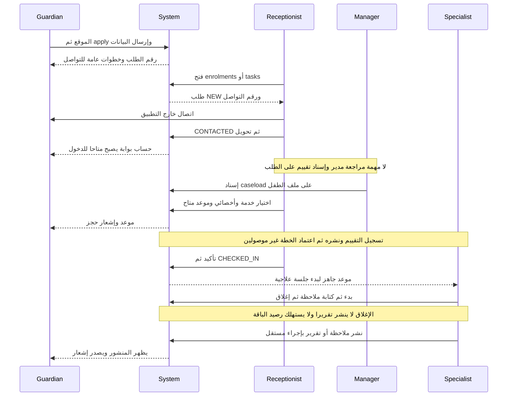
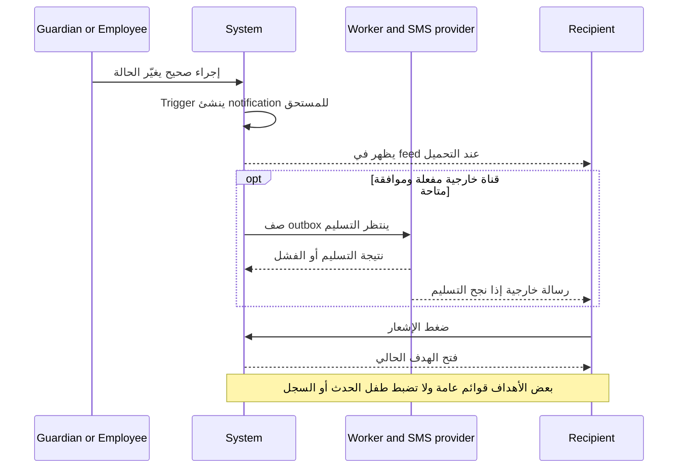

# الخريطة الرئيسية لكل الرحلات

2026-09-14 · وصف As-is من المصدر، مع الفجوات حتى رجوع النتيجة. [حدود المراجعة والأدوار](01-ACTORS-AND-ROLES.md). الخطوط في رسوم sequenceDiagram تمثل Swimlanes للجهات، والرسائل هي handoffs فعلية؛ الملاحظات تحدد أين ينقطع المسار.

## النظام كله في جدول واحد

| Journey | Trigger | Parent | Employee | Specialist | System | Final Result |
|---|---|---|---|---|---|---|
| A الالتحاق | قلق الأسرة/CTA الموقع | بيانات أربعة أقسام، إرسال | قراءة واتصال وتحويل | لا إسناد تقييم من الطلب | Application ثم طفل/أسرة/حساب بالتحويل | رقم طلب، ثم بوابة بعد التحويل؛ التقييم غير مكتمل |
| B التقييم إلى الخطة | اكتمال تقييم مطلوب | ينتظر التوصية والتكلفة | اعتماد وجدولة مطلوبان | إنشاء خطة/أهداف متاح، كتابة التقييم غير موصولة | assessment DB؛ plan DRAFT | اعتماد الخطة وتسليمها غير موصولين |
| C-A أونلاين باختيار أخصائي | يعرف التخصص | لا اختيار ذاتي متاح | يحجز يدويًا | دخول اللقاء من ops غير موصول | ONLINE appointment + meeting | بوابة دخول للأسرة فقط من ناحية UI |
| C-B أونلاين بتوجيه المدير | لا يعرف التخصص | الموقع يوجه للتواصل | لا consultation triage workflow | لا طلب موجه من المدير | لا consultation_requests في المسار الحالي | تواصل خارج دورة طلب استشارة رقمية |
| D المواعيد | طلب حجز/تغيير | يرى المواعيد ويطلب تغييرًا | يحجز ويؤكد ويحضر ويلغي ويسجل no-show | يبدأ بعد CHECKED_IN | تحقق توافر وحالات حقيقية | جدول مرئي؛ التغيير الموافق عليه لا ينفذ آليًا |
| E الجلسة والتقرير | حضور الطفل | ينتظر ويقرأ المنشور | يسجل الحضور/ينسق التالي | يبدأ ويكتب ويغلق وينشر بإجراءات منفصلة | Session غير Appointment؛ نشر مستقل | تقرير فقط إن نُشر، لا ضمان أثر بعد كل حضور |
| F الباقات | شراء عدد جلسات | يرى المستخدم/المتبقي والانتهاء | المخول يبيع باقة | يغلق جلسة | البيع يضيف رصيدًا؛ الاستهلاك بلا منادٍ | رقم متبقٍ لا يمكن الاعتماد عليه لدورة تشغيل كاملة |
| G الدفع بالحصة | حجز جلسة فردية | يستفسر/يدفع خارج البوابة | ينشئ فاتورة وبنودًا ويسجل تحصيلًا | جلسة بعد الحضور | لا ربط UI كامل بين الحجز/البند/الدفع | المال والموعد سجلان منفصلان |
| H إثبات الدفع | تحويل مالي للأسرة | لا Upload Proof | لا review queue | ينتظر التأكيد | لا دورة receipt REVIEW_PENDING | المسار المطلوب غير مبني |
| I الدخول والأسرة | رقم مسجل | OTP واختيار أكثر من طفل | التحويل يمنح حسابًا | — | RLS وربط guardian_children | دخول موصول؛ الاستكمال/الدمج جزئيان |
| J مراجعة التقدم | جلسات/قياسات دورية | أهداف وتقرير منشور | قرار تغيير/إنهاء غير منظم | قياسات ونشر تقرير | goals snapshot؛ لا review workflow | أرقام متاحة؛ Continue/Modify/Pause/Discharge غير مغلقة |
| K الإشعارات | حدث مهم | feed ثم فتح وجهة | feed ومهام مشتقة | إسناد/حجز + أعمال يومه | triggers + outbox + maintenance | بعض الأحداث موصولة، لا كل events أو السياق الصحيح |
| L البرنامج المنزلي | إسناد نشاط | ينفذ ويعلّم اليوم | — | يحدد النشاط والهدف | activity log | تسجيل التنفيذ؛ لا مهمة مراجعة ملزمة للأخصائي |
| M مراسلات الأسرة | سؤال/متابعة | يرسل ويقرأ داخل Requests | يقرأ ويرد في communications | بحسب صلاحية الوصول | رسائل وحالة قراءة وrequest_id | دورة رد حقيقية؛ لا SLA/تحويلها تلقائيًا لمهمة |
| N الموافقات والبث | رغبة مشاهدة الجلسة | يرى بثًا حيًا/رفضًا | يسجل موافقة حقيقية من ملف الطفل | جلسة نشطة | بوابة consent + token + expiry | البث موصول؛ switches البوابة ترفض الحفظ |
| O بيانات الأسرة والطفل | اتصال/إدخال بالمركز | بريد ومدينة وبعض القراءة | إنشاء/تعديل/ربط/بطاقة/صورة | يرى ملفات الحالات | RLS وcompleteness DB | منح حساب للإدخال المباشر واستكمال النواقص غير موصولين |
| P رضا الأسر | survey مستحق | يجيب أو يتخطى | المدير يراجع النتائج | — | cooldown وsummary | نتيجة إجمالية؛ لا journey إلزامية لمعالجة شكوى |
| Q جاهزية المركز | إضافة خدمة/أخصائي/غرفة | يرى كتالوج/ملف منشور | Admin يهيئ | موافقة ملفه المهني | موارد وصلاحيات وجدولة | شرط سابق للحجز؛ إجازات schedule blocks DB فقط |
| R الموقع والمحتوى | بحث عن المساعدة | خدمات/احتياجات/اتصال/apply | فريق مخول يحرر وينشر | ملف مهني وموافقة نشر | مصدر site + موارد CMS | دخول للرحلة؛ تطابق النشر الحي يحتاج تحققًا |
| S الحسابات والإعدادات والصحة | موظف جديد/تعطل | يتأثر بالخدمة | Admin حساب/دور/إعدادات وسجل | صلاحية مرتبطة بحسابه | auth/RLS/maintenance | إدارة موجودة، ليست إثباتًا لوصول SMS أو سلامة provider |
| T قائمة انتظار/تكرار حجز/إجازات | لا شاغر/جدول ثابت/غياب | يحتاج بديلًا | لا واجهة كاملة لهذه الأدوات | يؤثر على توافره | دوال/جداول موجودة | DB فقط؛ الكورسات مستبعدة سابقًا، لا نفرض توسيع النطاق |

## Swimlane رئيسية — المسار الحالي وحدود استمراره

المسار يرسم ما يمكن الوصول إليه، وليس توصية بتجاوز التقييم. التحويل الحالي ينشئ طفلًا قبل اكتمال workflow التقييم؛ `ENROLLED` لا يثبت بدء العلاج ولا دفعًا ولا موافقة سريرية.

## فهرس الرسوم التفصيلية

| Journey | Swimlane والخطوات المرتبطة بالشاشة |
|---|---|
| A / I / L / M / N | [03 ولي الأمر](03-PARENT-JOURNEYS.md) |
| D / T | [04 الاستقبال](04-RECEPTION-JOURNEYS.md) |
| B / Q / R / S | [05 المدير](05-MANAGER-JOURNEYS.md) |
| E / J / P | [06 الأخصائي](06-SPECIALIST-JOURNEYS.md) |
| F / G / H | [07 الدفع](07-PAYMENT-JOURNEYS.md) |
| C-A / C-B والدورة المشتركة | [08 الأونلاين](08-ONLINE-CONSULTATION-JOURNEY.md) |
| K | الرسم وجدول الأحداث أدناه |

## آلات الحالة — لا تخلط حالة الموعد بحالة الدفع أو النشر

| كيان | حالات مثبتة من المصدر | ما لا يجوز استنتاجه |
|---|---|---|
| Application | NEW، CONTACTED، ASSESSMENT_BOOKED، ENROLLED، REJECTED، DUPLICATE | CONTACTED لا يعني مراجعة مدير؛ ASSESSMENT_BOOKED يحتاج assessment_at |
| Appointment | BOOKED، CONFIRMED، CHECKED_IN، COMPLETED، CANCELLED، NO_SHOW | CONFIRMED ليس إثبات تحصيل في التنفيذ الحالي |
| Therapy session | IN_PROGRESS، COMPLETED، ABORTED | COMPLETED لا يثبت كتابة/نشر تقرير؛ ABORTED قد يقفل الموعد COMPLETED |
| Assessment | DRAFT، COMPLETED، PUBLISHED | حالات DB لا تكفي دون API وشاشة |
| Treatment plan | DRAFT، ACTIVE، COMPLETED، CANCELLED | لا PAUSED في هذه الآلة؛ لا تخلطها بحالة الطفل |
| Progress report | DRAFT، PUBLISHED | ليس Assessment Result ولا Session Status |
| Session note | INTERNAL/PARENT مع is_draft_flg وapproved_by | Visibility ليست مجرد نص badge |
| Invoice | DRAFT، ISSUED، PARTIALLY_PAID، PAID، CANCELLED | PAID لا يعني APPROVED لإيصال؛ الإيصال كيان مختلف |
| Child package | ACTIVE، EXHAUSTED، EXPIRED، CANCELLED في 0008 | PENDING_PAYMENT/FROZEN من المستهدف وليسا الدورة الموصولة الحالية |
| Payment plan template | DRAFT، ACTIVE، RETIRED في 0142 | نموذج السداد ليس الخطة العلاجية |
| Installment | PENDING، DUE، PAID، OVERDUE، CANCELLED، SUPERSEDED | ليس Receipt REVIEW_PENDING؛ AFTER_SESSIONS ينتظر layer B |
| Parent request | NEW، ACCEPTED، REJECTED؛ البوابة تحولها SUBMITTED/ACCEPTED/DECLINED | ACCEPTED لا ينفذ تغيير الموعد |
| Meeting | READY/CLOSED وقواعد صلاحية وتوقيت | READY لا يعني حضورًا ولا قبول دفع |
| Payment receipt | غير موجود في المسار | REVIEW_PENDING/APPROVED/REJECTED مستهدف فقط |

## K — الإشعارات وتسليم المسؤولية

| Event | من يستقبل ومتى؟ | الضغط الحالي | الحكم |
|---|---|---|---|
| APPOINTMENT_BOOKED | أولياء الطفل المرتبطون بحساب؛ عند INSERT BOOKED؛ الأخصائي عبر STAFF_APPOINTMENT_BOOKED | Parent `/schedule`؛ موظف بحسب inbox target | موجود؛ لا focus على الموعد ولا child switch في parent |
| APPOINTMENT_RESCHEDULED | الأسرة عند INSERT برابط rescheduled_from | `/schedule` | trigger موجود؛ الكاتب من الواجهة لا يرسل الرابط حاليًا |
| APPOINTMENT_CANCELLED | الأسرة عند انتقال CANCELLED مع السبب | `/schedule` | موجود؛ إخطار الأخصائي بالإلغاء غير موصول كحجزه |
| Confirmation | 0094 يضع إخطار التأكيد | قائمة المواعيد | التحقق من القناة والموافقة ضروري؛ ليس بوابة دفع |
| Payment received/approved/rejected | لا دورة إيصال ولا trigger موصول لإقرار مراجع | لا وجهة | JG-06؛ ظهور PAID بعد إعادة القراءة ليس إشعار قبول إثبات |
| INVOICE_ISSUED | الأسرة عند DRAFT → ISSUED | `/billing` | موجود؛ جدول مالي على مستوى الأسرة |
| Specialist assignment | الأخصائي صاحب user_id عند INSERT caseload | ملف الطفل في ops | موجود؛ تعيين أخصائي تقييم على Application غير موجود |
| APPOINTMENT_REMINDER | maintenance يفحص نافذة التذكير في إعدادات المركز | `/schedule` | قدرة موجودة؛ لم يُثبت تشغيل scheduler أو التسليم الحي |
| REPORT_PUBLISHED | الأسرة بعد نشر التقرير | `/reports/:id` | موجود؛ خطر header باسم الطفل المختار سابقًا JG-14 |
| NOTE_PUBLISHED | الأسرة بعد التحويل إلى PARENT | `/reports` ثم redirect إلى reports tab | وجهة لا تفتح notes tab؛ JG-14 |
| ASSESSMENT_PUBLISHED | DB عند النشر | link_kind ASSESSMENT بلا mapping مفيد | لا API/واجهة نشر؛ لا تُعدّ دورة مكتملة |
| Package near expiry | لا trigger موصول للإنذار المسبق في المسار المفحوص | لا وجهة | expire_packages يغير البيانات؛ ليس تذكير تجديد |
| New recommendation / plan approval | أكواد/مفاهيم جزئية دون دورة اعتماد موصولة | لا مهمة قرار كاملة | JG-04/JG-15 |
| New application / request | أكواد STAFF_ENROLMENT_NEW/STAFF_REQUEST_NEW مسموحة دون producer موصول | `/tasks` يكتشف الحالة بالقراءة | مهمة مشتقة لا تساوي إشعارًا مدفوعًا عند الحدث |
| Installment due/overdue | 0142: الأسرة + STAFF_INSTALLMENT_OVERDUE؛ maintenance للتواريخ | لا شاشة قسط متخصصة؛ mapping يحتاج توصيلًا | DB فقط في طبقة العرض؛ لا حجب جلسات نخترعه |
| Family message | قراءة دورية وحالة read داخل المحادثة | Requests/messages أو communications | دورة موجودة؛ لا موعد رد ملزم |

## سجل الأدلة المرجعي

كل ملف تفصيلي يذكر هذه الرموز لتجنب اعتماد النتيجة على أسماء الملفات فقط. المصدر الحاكم هو جسم الدالة/القالب، والتعليقات القديمة التي تناقضه تُستبعد.

| ID | المصدر المقروء | ما يثبته |
|---|---|---|
| E01 | [Portal routes](../../web/portal/src/app/app.routes.ts) + [Ops routes](../../web/ops/src/app/app.routes.ts) | الصفحات، redirects، الحراس |
| E02 | [Apply](../../web/portal/src/app/features/apply/apply.ts) + [قالبها](../../web/portal/src/app/features/apply/apply.html) | أربعة أقسام، payload، draft، لا OTP |
| E03 | [HTTP router](../../api/internal/http/server.go) | endpoints الفعلية؛ لا receipt/assessment/plan activation |
| E04 | [التحويل 0125](../../db/migrations/0125_convert_grants_portal.up.sql) | إنشاء الطفل ومنح الحساب ذريًا، اختيار guardian LIMIT 1 |
| E05 | [تاريخ التقييم 0110](../../db/migrations/0110_enrolment_assessment_sms.up.sql) + [Enrolment store](../../api/internal/store/enrolment.go) | assessment_at مطلوب لكن update لا يرسله |
| E06 | [Day specs](../../web/ops/src/app/core/ops/day-spec.ts) | الأفعال والحقول والشروط لكل قائمة تشغيل |
| E07 | [Scheduling 0005](../../db/migrations/0005_scheduling.up.sql) + [Operational writes](../../db/migrations/0016_operational_writes.up.sql) | حالات وحضور وبدء وإغلاق وتأكيد |
| E08 | [Clinical 0006](../../db/migrations/0006_plans_and_notes.up.sql) + [Assessment 0023](../../db/migrations/0023_assessments.up.sql) | نشر الملاحظة والتقرير والتقييم |
| E09 | [CRUD store](../../api/internal/store/crud.go) + [Resource spec](../../web/ops/src/app/core/resource/resource-spec.ts) | الخطط بلا status writer؛ حقول ref |
| E10 | [Billing 0008](../../db/migrations/0008_billing.up.sql) + [sell_package الأخير](../../db/migrations/0101_center_ownership_guards_2.up.sql) | البيع، الدفتر، الاستهلاك، الفاتورة |
| E11 | [Billing portal](../../web/portal/src/app/features/billing/billing.ts) | قراءة المال، callback يعرض toast فقط |
| E12 | [Meeting gate](../../db/migrations/0121_meeting_gate.up.sql) + [Consultation](../../web/portal/src/app/features/consultation/consultation.ts) | CONFIRMED شرط الدخول، صلاحية/توقيت/رفض |
| E13 | [Requests portal](../../web/portal/src/app/features/requests/requests.ts) + [decision DB](../../db/migrations/0099_center_ownership_guards.up.sql) | اختيار موعد، وقت بديل في note، قرار منفصل |
| E14 | [Task catalog](../../web/ops/src/app/core/tasks/task-catalog.ts) + [Tasks template](../../web/ops/src/app/features/tasks/tasks.html) | المهام الموصولة والاستثناءات والفشل الجزئي |
| E15 | [Dashboard](../../web/ops/src/app/features/dashboard/dashboard.html) | لوحة اليوم وترابط @else المتناقض |
| E16 | [Portal adapter](../../web/portal/src/app/core/api/http-portal-api.ts) + [Profile](../../web/portal/src/app/features/profile/profile.ts) | رفض setConsent؛ mapping الإشعار والحالات |
| E17 | [Notification triggers](../../db/migrations/0015_consents_and_notifications.up.sql) + [Staff](../../db/migrations/0089_staff_notifications.up.sql) + [SMS](../../db/migrations/0094_sms_delivery.up.sql) | producer والمستقبل والتذكير |
| E18 | [Plan/reschedule provenance](../../db/migrations/0088_plan_provenance_and_reschedule_link.up.sql) + [تصحيح الاعتماد](../../db/migrations/0090_plan_approval_stamp_fix.up.sql) | توقيع اعتماد ورابط بديل، لا workflow تلقائي |
| E19 | [Payment plans](../../db/migrations/0142_payment_plans.up.sql) + [سحب المعاملات](../../db/migrations/0138_withdraw_cancelled_package_params.up.sql) | OD-33، الأقساط، layer B غير مبنية |
| E20 | [Matching](../../db/migrations/0132_match_before_create.up.sql) + [OD-26](../../db/migrations/0137_owner_decisions_od26_od31.up.sql) + [Completeness](../../db/migrations/0133_record_completeness_from_rules.up.sql) | إمكانات DB لا UI |
| E21 | [Portal shell](../../web/portal/src/app/layout/shell/shell.html) + [Apply CSS](../../web/portal/src/app/features/apply/apply.css) | navigation responsive وقياسات CSS |
| E22 | [Child profile](../../web/ops/src/app/features/child/child-profile.html) + [Application detail model](../../web/ops/src/app/features/enrolment/enrolment-detail.model.ts) | CTA حقيقية وassessment placeholder |
| E23 | [Report editor](../../web/ops/src/app/features/report-editor/report-editor.ts) + [Concurrency](../../db/migrations/0141_report_draft_concurrency.up.sql) | حفظ/نشر وصراع مسودات |
| E24 | [Family messages](../../web/shared/src/ui/family-messages.ts) | المحادثات واحتفاظ المسودة وrequest_id |
| E25 | [Site](../../site/index.html) + [config](../../site/config.js) + [app](../../site/app.js) | apply/login وروابط الاستفسار |
| E26 | [RBAC seed](../../db/seed/0002_rbac.sql) | الأدوار والحقوق الافتراضية |
| E27 | [Resource template](../../web/ops/src/app/features/resource/resource-screen.html) | المراجع المعرّفة أصبحت select بالأسماء أثناء التسليم؛ session_id للقياس ما زال رقميًا والتصفية السياقية تحتاج استكمالًا |
| E28 | [Progress](../../web/portal/src/app/features/progress/progress.html) + [Reports](../../web/portal/src/app/features/reports/reports.html) | التقدم غير المقاس والمنشور فقط |
| E29 | [Auth handler](../../api/internal/http/auth_handlers.go) + [Login](../../web/portal/src/app/features/login/login.ts) | ENROLMENT_PENDING وNOT_REGISTERED |
| E30 | [المواصفة المالية](../business-analysis/11-FEAT-packages-pricing-makeup.md) + [الأونلاين](../business-analysis/09-FEAT-online-consultation.md) | قرارات/مستهدفات؛ ليست إثبات تنفيذ |

لم تُشغّل اختبارات القبول التي تنشئ بيانات، ولم تُستخدم نتائجها التاريخية كنجاح لهذه المراجعة. فحص التسليم نفسه يشمل وجود الملفات والروابط والرسوم وعدم تغيير المصدر.
