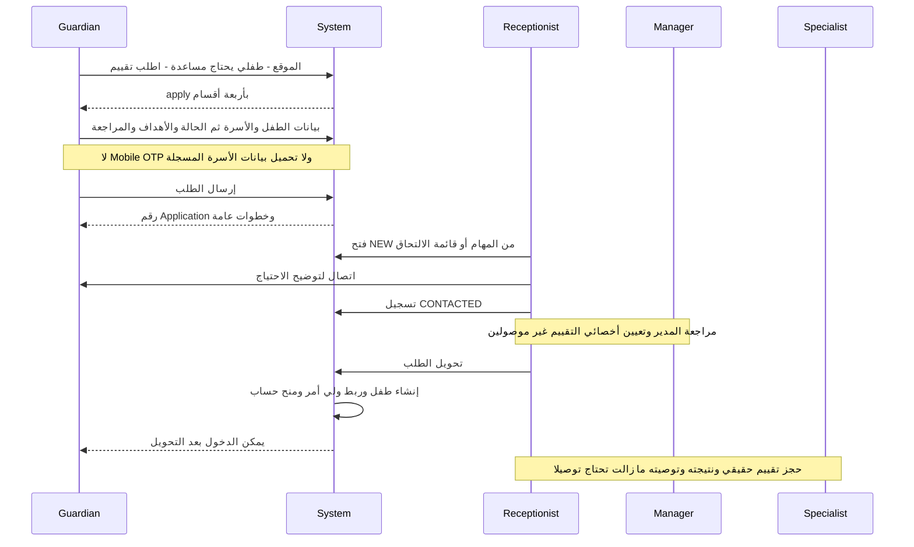
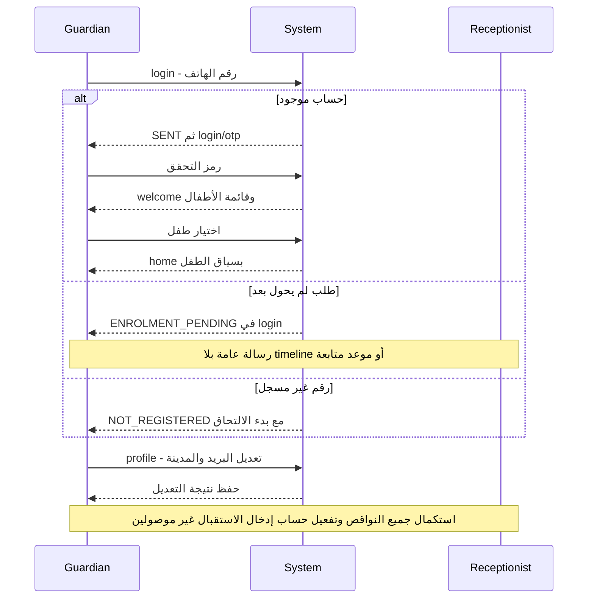
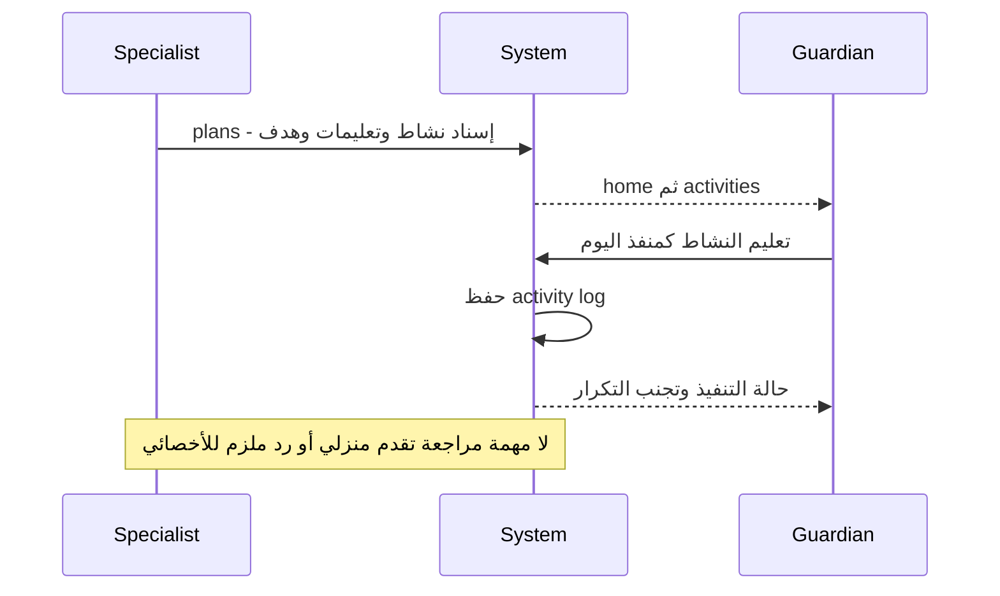
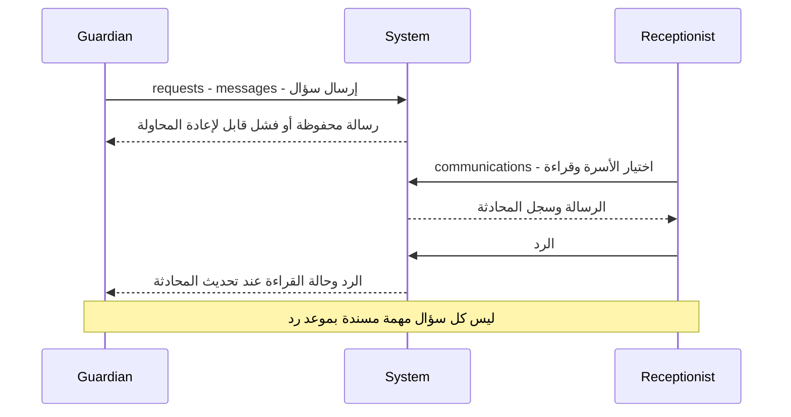
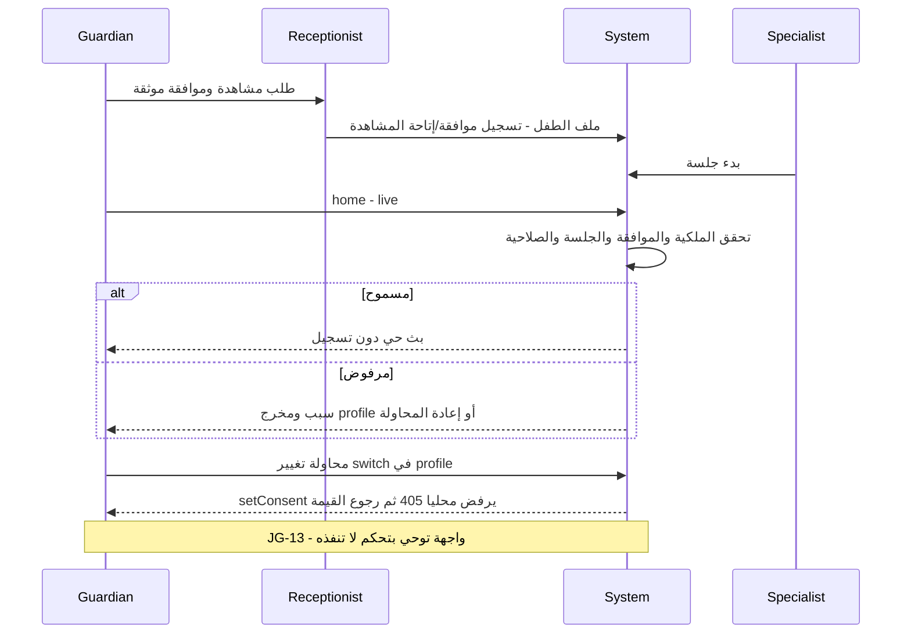

# رحلات ولي الأمر

الدليل E01–E05، E11–E13، E16، E20–E25، E28–E29 في [سجل الأدلة](02-MASTER-JOURNEY-MAP.md). «لا شاشة» تعني UX GAP، وليست خطوة تمت خارج نظرنا. هذه walkthrough من المصدر وليست جلسات اختبار مع أسر.

## A — من القلق إلى طلب الالتحاق



| Step | Actor | Action | Screen | CTA | Result | Next Actor |
|---|---|---|---|---|---|---|
| A01 | Guardian | وصف احتياج دون معرفة الخدمة | Site `#child-needs` / `#how` | اطلب تقييم لطفلك | انتقال `/apply` عبر config | Guardian |
| A02 | Guardian | إدخال الطفل والتواصل | `/apply` قسم البيانات | التالي | تحقق الاسم/الهاتف/الميلاد | Guardian |
| A03 | Guardian | وصف الحالة | `/apply` الحالة والزيارة | التالي | نص concern، اختيارات عامة غير تشخيصية | Guardian |
| A04 | Guardian | الأهداف والخدمات السابقة | `/apply` الأهداف | التالي | أهداف الأسرة محفوظة داخل نص previous_therapy | Guardian |
| A05 | Guardian | مراجعة البيانات والموافقة | `/apply` المراجعة | إرسال طلب الالتحاق | POST enrolments | System |
| A06 | System | إثبات استلام | نفس `/apply` success | طلب لطفل آخر / العودة للدخول | application_no؛ حذف المسودة المحلية | Guardian |
| A07 | System | OTP قبل المطابقة | لا شاشة في رحلة apply | لا CTA | UX GAP JG-01 | غير مسند |
| A08 | System/Guardian | مطابقة ولي الأمر والطفل | لا UI مرتبطة بدوال 0132 | لا CTA | DB فقط؛ conversion ينشئ طفلًا جديدًا | Reception/Manager مطلوب |
| A09 | Reception | فتح الطلب والاتصال | Ops `/tasks` → `/enrolments/:id` | اتصال ثم تسجيل التواصل | CONTACTED | Reception |
| A10 | Manager | مراجعة وتعيين أخصائي تقييم | تفاصيل الطلب: حقل متخصص بلا إسناد | لا CTA | UX GAP JG-02 | Reception منتظر |
| A11 | Reception | تحديد التقييم | قائمة الحالة تقترح ASSESSMENT_BOOKED | تغيير الحالة | تحتاج DB تاريخ assessment_at لا يرسله النموذج | متوقف JG-02 |
| A12 | Reception | إنشاء الملف | `/enrolments/:id` | تحويل الطلب | طفل + guardian link + حساب؛ معاملة ذرية | Guardian/Manager |
| A13 | Specialist | تقييم ونتيجة وتوصية | تبويب التقييم placeholder | لا CTA | UX GAP JG-03 | الأسرة تنتظر |

النموذج يوجه الأسرة لتصف ما تلاحظه بدل اختيار تشخيص؛ هذه نقطة قوة. ولكنه يجمع معلومات كثيرة قبل توثيق الهاتف. خيارات الأم/الذكر/لا حالة صحية/أول مرة لها قيم أولية؛ قد تُسجل كإجابات مقصودة دون اختيار. معلومات المرافق وأهداف الأسرة تُدمج في حقول نصية، فتصل للموظف قراءةً ولا تصبح أهدافًا سريرية أو matching inputs تلقائيًا.

«طلب لطفل آخر» يحافظ على بيانات أساسية للأسرة أثناء نفس الشاشة. أما عودة ولي أمر مسجل إلى apply فلا تحمل تحميلًا من حسابه ولا اختيارًا من أطفاله الحاليين. التوصية: التحقق ثم عرض الموجود وتعبئة الناقص، لا إعادة الاستمارة كاملة؛ عند التطابق الملتبس لا دمج آلي.

## I — الدخول، الأطفال، الملف الناقص



| Actor | Action | Screen | CTA | Result | Next Actor |
|---|---|---|---|---|---|
| Guardian | طلب OTP | `/login` | متابعة | SENT أو تفسير عدم وجود رمز | Guardian |
| Guardian | إدخال الرمز/إعادة البدء | `/login/otp` modal | تحقق / إعادة الإرسال بحسب النافذة | دخول أو خطأ/قفل/انتهاء | Guardian أو System |
| Guardian | اختيار أو تبديل طفل | `/welcome`؛ رابط تبديل الطفل في shell | بطاقة الطفل | ChildContextService ثم `/home` | Guardian |
| Guardian | بيانات ناقصة | `/profile` | حفظ البريد/المدينة فقط | حفظ جزئي؛ لا قائمة missing fields | Reception مطلوب |
| Reception | إنشاء أسرة بالمركز | Ops `/guardians` + `/children` | إضافة/ربط | بيانات لا تضمن account grant | Admin مطلوب JG-12 |
| Guardian | متابعة طلب لم يتحول | `/login` | لا CTA متابعة مفصلة | ENROLMENT_PENDING فقط | Reception |

الحماية من عرض طفل غير مملوك من مسؤولية RLS. لكن اختيار الطفل الصحيح بصريًا مسؤولية UX أيضًا؛ الإشعار يحمل childId ولا يستعمله `open()` لتبديل السياق. لا يجوز معالجة ذلك بإضعاف الحماية.

## الجدول والتقرير والمال — ماذا تستطيع الأسرة معرفته؟

| سؤال أول مرة | المسار الفعلي | الإجابة الحالية | الحكم |
|---|---|---|---|
| طفلي عنده تأخر كلام ولا أعرف الخدمة | الموقع → apply → اكتب ما تلاحظه | يستطيع وصف المشكلة دون اختيار أخصائي | PARTIALLY: التوجيه يتوقف عند انتظار الاتصال |
| قدمت طلبًا؛ ماذا أفعل؟ | success ثم login | رقم وخطوات عامة؛ pending عند الدخول | PARTIALLY: لا حالة خاصة بالطلب ولا زمن توقع |
| أين الموعد؟ | welcome → home أو schedule | وقت/خدمة/أخصائي/مكان وحالة | YES من المصدر بعد وجود الطفل والحجز |
| دفعت؛ هل قُبل؟ | billing | paidAmount وحالة الفاتورة بعد تسجيل الموظف | PARTIALLY: لا إثبات ولا review feedback |
| حضر طفلي؛ أين التقرير؟ | progress → reports/notes | المنشور فقط | PARTIALLY: لا موعد إصدار أو تنبيه أن التوثيق متأخر |
| كم جلسة باقية؟ | billing → packages | total − used | NO كإجابة موثوقة end-to-end حتى توصيل الاستهلاك |
| هل طفلي يتقدم؟ | progress | قياسات/هدف/آخر قياس وsnapshot التقرير | PARTIALLY: لا ملخص قرار مراجعة وموعده |

عرض الجدول لا يتيح حجزًا ذاتيًا. الموعد الحضوري غالبًا بطاقة غير قابلة للفتح؛ زر التغيير العام ينقل إلى requests، حيث يختار ولي الأمر الموعد. اختصار home يحمل الموعد مباشرةً. online row ينتقل إلى consultation حتى إن كان ماضيًا، فتأتي رسالة رفض الباب بدل summary؛ هذه نهاية غير مناسبة للموعد المكتمل.

## L — البرنامج المنزلي



| Actor | Action | Screen | CTA | Result | Next Actor |
|---|---|---|---|---|---|
| Specialist | إسناد برنامج | Ops `/plans` تبويب child-activities | إضافة / حفظ | child_activity | Guardian |
| Guardian | قراءة التعليمات والتنفيذ | `/activities` | تم التنفيذ | POST activity log | System |
| System | تحديث اليوم | نفس الشاشة | حالة منفذ/زر معطل | feedback محلي واضح | Specialist يحتاج مراجعة دورية |

## M — المراسلات والمتابعة



| Actor | Action | Screen | CTA | Result | Next Actor |
|---|---|---|---|---|---|
| Guardian | سؤال/استفسار | `/requests?tab=messages` | إرسال | family-message مع request_id لإعادة المحاولة | Reception |
| Reception | قراءة ورد | Ops `/communications` | إرسال | رد بنفس المحادثة | Guardian |
| System | استرجاع الرسائل | نفس السطحين | تحديث / أقدم | صفحات وحالة read | المستلم |

الرسائل ليست بديلًا عن تحويل RESCHEDULE إلى فعل جدولة. كما أن محادثة قبل تحويل الطلب لا تُفترض موجودة: التطبيق يستخدم guardian_id وأسرة لها سجل وصول.

## N — الموافقات والبث المباشر



| Actor | Action | Screen | CTA | Result | Next Actor |
|---|---|---|---|---|---|
| Staff مخول | تسجيل/سحب موافقة | Ops ملف الطفل → أولياء الأمور | منح/سحب | API consent + ربط المشاهدة بحسب الإجراء | Guardian |
| Guardian | فتح البث | `/home` → `/live` | مشاهدة مباشرة | pass محدود أو رفض | System |
| Guardian | تغيير موافقة | `/profile` | switch | فشل ثابت من HttpPortalApi.setConsent | Staff مطلوب لكن غير مسند |
| Guardian | إنهاء المشاهدة | `/live` | خروج | إغلاق window/token flow | System |

لا تسجيل ولا مشاهدة لاحقة؛ الاستشارة الثنائية `/consultation/:id` رحلة مختلفة. يجب ألا يعاد توجيه الأسرة من رفض الموافقة إلى switches لا تعمل.

## Timeline مقترح للأسرة — ليس موجودًا الآن

داخل الطلب نفسه، دون شاشة dashboard إضافية:

```text
✓ استلمنا طلبك                  رقم الطلب + وقت الاستلام
✓ راجع الفريق بياناتك           وقت المراجعة إذا حدثت فعلا
✓ تم اختيار أخصائي التقييم       الاسم إذا تم الإسناد فعلا
● ننسق معك موعد التقييم          المسؤول + موعد الرد المتوقع + تواصل
○ موعد التقييم                   التاريخ والمكان بعد الحجز
○ ملخص التقييم والخطوة التالية   لا علامة اكتمال قبل النشر
○ برنامج الجلسات والتكلفة        بعد الاعتماد فقط
```

عرض «ما ننتظره منك» منفصل عن «ما يعمل عليه المركز». رفض/تكرار الطلب يظهران كتفسير ونهاية أو ربط بالطلب الأصلي، لا تختفي الحالة وراء NOT_REGISTERED. يتطلب ذلك وصولًا موثقًا للطلب، لا كشف بيانات من رقم طلب عام.
