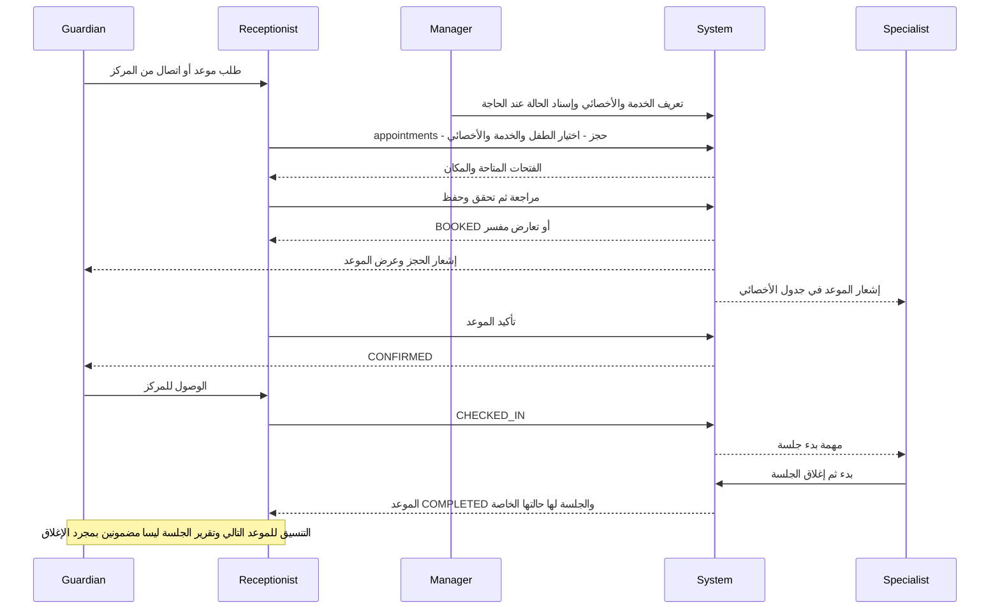
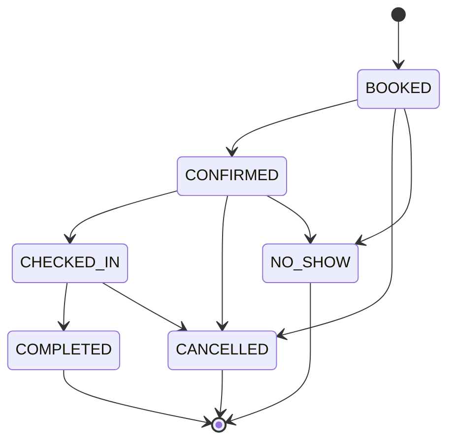
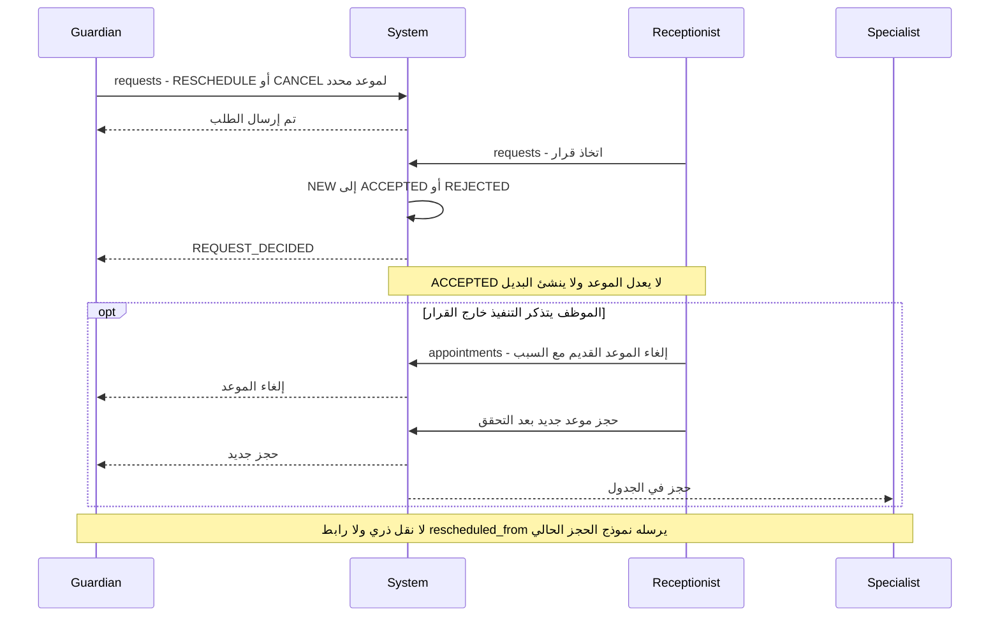
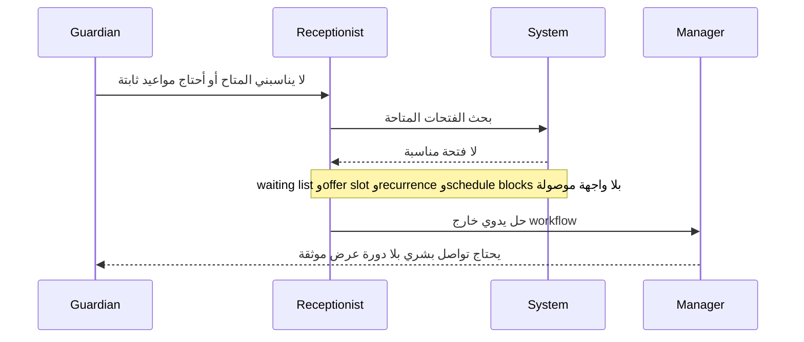

# رحلات موظف الاستقبال

الدليل E01، E05–E07، E13–E15، E18، E22، E26–E27 في [الخريطة الرئيسية](02-MASTER-JOURNEY-MAP.md). الاختبار هنا محاكاة معرفية لموظف جديد من المصدر؛ أعداد النقرات تقدير لمسار الشاشة ولا تشمل الكتابة أو انتظار الشبكة.

## D — حجز، تأكيد، حضور وتسليم للأخصائي

| Step | Actor | Action | Screen | CTA | Result | Next Actor |
|---|---|---|---|---|---|---|
| D01 | Reception | العثور على الطفل | `/children` أو `/guardians/:id` | فتح الطفل | ملف سياقي | Reception |
| D02 | Reception | فتح الحجز | `/appointments` أو ملف الطفل | حجز موعد | modal بأقسام | Reception |
| D03 | Reception | اختيار الطفل | الحجز | بحث بالاسم/رقم الطفل | child_id مقصود، بلا اختيار أول تلقائي | Reception |
| D04 | Reception | تحديد الخدمة والأخصائي | الحجز | service-therapist pair | تركيبة ممكنة + تفاصيل اختيارية | System |
| D05 | Reception | اختيار حضوري/أونلاين | الحجز | نوع الموعد | استبعاد الغرفة للأونلاين | System |
| D06 | System | إظهار المتاح | slot picker | اختيار فتحة | يبدأ/ينتهي وغرفة إذا حضوري | Reception |
| D07 | Reception | تحقق ومراجعة وحفظ | الحجز | التحقق/التأكيد بحسب dialog | validate ثم book؛ إعادة التحقق في DB | Guardian + Specialist |
| D08 | Reception | تأكيد | drawer أو قائمة المواعيد | تأكيد / تغيير الحالة | CONFIRMED | Guardian |
| D09 | Reception | تسجيل وصول | drawer أو task الحضور | تسجيل الحضور | CHECKED_IN | Specialist |
| D10 | Specialist | بدء | اليوم/المواعيد/الملف | بدء الجلسة | session IN_PROGRESS | Specialist |
| D11 | Reception | متابعة انتهاء الجلسة | قائمة/ملف الطفل | فتح الجلسة/حجز جديد | النتيجة موزعة بين sessions/reports/billing | غير مسند تلقائيًا |

حجز التقييم قبل تحويل الطفل لا يستخدم هذا المسار، لأنه يحتاج child_id بينما Application لم يصبح طفلًا. تغيير Application إلى ASSESSMENT_BOOKED ليس إنشاء appointment ولا يحدد أخصائيًا.

## حالات الموعد الحقيقية

لا RESCHEDULED كحالة للموعد. النقل المفاهيمي هو إلغاء وحجز بديل مرتبط. لا IN_PROGRESS في جدول Appointment؛ هي حالة therapy_session. الاعتذار لا يحدد وحده هل توجد رسوم أو حق تعويض؛ هذه أسئلة سياسة مستقلة.

## إعادة الجدولة والإلغاء — موضع فقدان الـhandoff

| Actor | Action | Screen | CTA | Result | Next Actor |
|---|---|---|---|---|---|
| Guardian | طلب تغيير | Parent `/requests` | تغيير الموعد + اختيار موعد/تاريخ/وقت | الموعد محدد، البديل مدمج كنص note | Reception |
| Reception | قبول/رفض | Ops `/requests` | اتخاذ قرار | حالة الطلب فقط؛ note يشرح أن الموعد لا يتغير | Reception يحتاج تنفيذًا |
| Reception | إلغاء أصل الموعد | `/appointments` → drawer | إلغاء + سبب | CANCELLED؛ إشعار للأسرة | Reception |
| Reception | إنشاء بديل | `/appointments` | حجز موعد | BOOKED جديد دون ربط آلي بالطلب/الأصل | Guardian/Specialist |
| System | إثبات تنفيذ التغيير | لا شاشة/إجراء جامع | لا CTA | UX/Operational GAP JG-10 | الأسرة لا تعرف إن كان القبول نُفذ |

يجب ألا يسبق «تم تغيير الموعد» نجاح التعديل الفعلي. المستهدف داخل drawer الحالي: اختيار بديل وتحقق ثم تأكيد موحد، مع إمكان «قُبل الطلب، جارٍ تنسيق البديل» إذا كان التنفيذ مؤجلًا. يظل الطلب في قائمة التنفيذ حتى الربط والنتيجة.

## الإلغاءات وعدم الحضور والتعويض

| السيناريو | الآن | الفجوة | التسليم المطلوب |
|---|---|---|---|
| Parent cancellation | CANCEL request ثم قرار مستقل ثم إلغاء موظف | لا تطبيق موحد للمهلة/الرسوم/التعويض | سبب، من اعتذر، وقت الإخطار، قرار مالي واضح للأسرة |
| Specialist cancellation | الموظف المخول يلغي الموعد | لا workflow بديل/تعويض ولا STAFF_APPOINTMENT_CANCELLED producer | قائمة الأسر المطلوب الاتصال بها مع إقرار التواصل |
| No-show | حالة متاحة من BOOKED/CONFIRMED | لا معاودة اتصال أو تعويض تلقائي؛ حقل السبب لا يعلن required في spec | مهمة اتصال ونتيجة وقرار سياسة معتمد |
| الطفل حضر والأخصائي غائب | CHECKED_IN ليس حلًا للغياب | قرار تبديل أخصائي/تعويض غير موصول | المدير يقرر، الاستقبال يعيد الجدولة، الأسرة تستلم نتيجة |
| Compensation session | لا CTA وحجز مرتبط بالتعويض في النموذج | JG-17 | ربط بالموعد الأصلي وتطبيق سياسة النسخة، لا جلسة مجانية غير موثقة |
| لا شاغر | picker يوضح empty/refusal | قائمة الانتظار وأدوات عرض فتحة DB فقط | طلب انتظار بوقت مفضل ثم عرض وقبول/انتهاء |
| إجازة/تدريب/مرض | schedule_blocks تتحقق منها DB | لا writer UI في الموارد الحالية | إعداد الغياب قبل عرض الفتحات مع معالجة الحجوزات المتأثرة |

## T — قدرات في DB لا تصل لموظف الاستقبال

المصدر الإضافي: [قائمة الانتظار والتكرار 0022](../../db/migrations/0022_waiting_list_and_recurrence.up.sql) و[إغلاق الجدول 0010](../../db/migrations/0010_schedule_blocks.up.sql)؛ القدرات المعنية `book_recurring` و`waiting_candidates` و`offer_slot`. لا نعتبر الكورسات مطلب إطلاق جديدًا؛ المواصفة E30 تستبعدها. المطلوب هنا كشف ما هو موجود وغير موصول، خصوصًا الوعد بتثبيت مواعيد الباقة.

## اختبار الموظف في أول يوم

| السؤال | الطريق المتاح | نتيجة walkthrough | معرفة خارج الشاشة |
|---|---|---|---|
| أين الطلبات الجديدة؟ | dashboard → tasks → تفاصيل الطلب | PARTIALLY؛ يوجد مسار قوي | الطلبات غير الممثلة في catalog لن تظهر |
| بمن أتصل؟ | تفاصيل طلب/guardian بها هاتف وtel | YES من المصدر | قبل وجود بيانات هاتف صالحة يحتاج تصحيح |
| كيف أحدد موعدًا؟ | appointments → حجز → pair → slot → مراجعة | YES للحجز الاعتيادي | ليس لتقييم application قبل تحويلها |
| كيف أغير الموعد؟ | requests → قرار ثم appointments → إلغاء/حجز | NO | يجب تذكر أن القرار لا ينفذ |
| كيف أسجل حضورًا؟ | tasks/drawer → CHECKED_IN | YES من المصدر | يجب ألا يستعمل في online دون معالجة gate |
| ماذا أفعل عند No-show؟ | تغيير الحالة | PARTIALLY | لا خطوات اتصال/مالي/تعويض |
| كيف أربط الطفل بباقة؟ | billing → بيع | NO للدور الافتراضي | يحتاج BILLING.MANAGE وليس حق استقبال افتراضيًا |
| هل تم الدفع؟ | billing/ملف الطفل | PARTIALLY | لا ربط مضمون بالجلسة/إيصال تحت المراجعة |
| ماذا بعد الجلسة؟ | sessions/reports/appointments | PARTIALLY | لا مهمة موحدة للتقرير الناقص أو الموعد التالي |

تقدير النقرات: فتح موعد من task ثم تأكيد الحالة ≈ 2–3 اختيارات؛ الحجز بعد الوصول للقائمة ≈ 5–8 اختيارات بحسب البيانات؛ تنفيذ تغيير مقبول قد يتطلب ثلاث مناطق عمل ونموذجين. القياس الحي مطلوب؛ لا نعرض هذه الأرقام كزمن اختبار فعلي.
