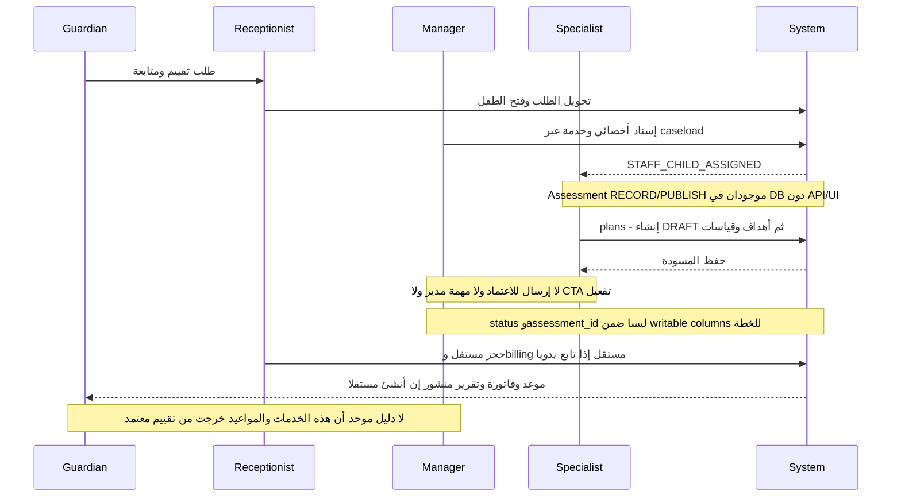
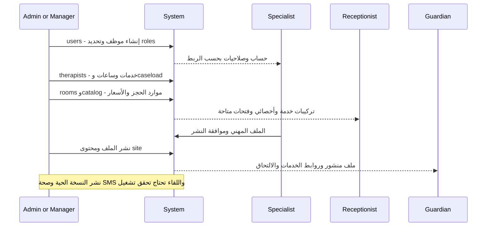

# رحلات مدير المركز والإدارة

E01، E03، E08–E09، E14، E18، E20، E22، E26–E27 في [سجل الأدلة](02-MASTER-JOURNEY-MAP.md). مدير المركز وAdmin يتشاركان CENTER_ADMIN افتراضيًا؛ توصيات الفصل تخص المسؤولية التشغيلية ولا تدعي وجود roles جديدة.

## B — التقييم إلى خطة قابلة للتنفيذ

| Step | Actor | Action | Screen | CTA | Result | Next Actor |
|---|---|---|---|---|---|---|
| B01 | Manager | مراجعة مشكلة الأسرة | `/enrolments/:id` | فتح الطلب | concern لا تشخيص | Manager |
| B02 | Manager | تعيين أخصائي تقييم قبل إنشاء الطفل | لا action على application | لا CTA | UX GAP | Reception منتظر |
| B03 | Manager | إسناد حالة بعد التحويل | `/children/:id` → caseload أو `/therapists` | تعيين أخصائي / إضافة | caseload + إشعار الأخصائي | Specialist |
| B04 | Specialist | تسجيل اختبار ودرجاته | تبويب assessments placeholder | لا CTA | DB فقط | Manager غير موصول |
| B05 | Specialist | نشر نتيجة وتوصية | لا شاشة assessment editor | لا CTA | DB فقط | Guardian منتظر |
| B06 | Specialist | إنشاء خطة | ملف الطفل → `/plans` | خطة جديدة / حفظ | DRAFT مرتبط بطفل وخدمة وأخصائي | Specialist |
| B07 | Specialist | إضافة أهداف | `/plans` → goals | إضافة | baseline/target/status | Specialist |
| B08 | Specialist | توصية خدمات متعددة | عدة plans/caseload rows ممكنة | لا مراجعة مجمعة | لا recommendation واحدة تضم الجميع | Manager مطلوب |
| B09 | Manager | اعتماد الخطة | لا CTA/endpoint تفعيل | لا CTA | DRAFT لا تتحول ACTIVE عبر UI | Reception متوقف |
| B10 | Reception | اختيار المواعيد | `/appointments` | حجز | لا ربط إلزامي بالخطة | Finance |
| B11 | Finance | Package أو Single ثم فاتورة | `/billing` | بيع باقة / فاتورة جديدة | عمليات مستقلة | Guardian |
| B12 | System | تأكيد الدفع وتفعيل الاستحقاق | لا دورة موحدة | لا CTA | JG-17/JG-18 | Guardian ينتظر بدءًا واضحًا |

وجود approved_by/approved_at في DB لا يحل الاعتماد: trigger يسجل من فعّل الخطة، لكن لا يوجد فعل واجهة/endpoint لهذا الانتقال. كذلك PLAN.MANAGE لا يفصل الاقتراح عن قرار المدير. المطلوب فعل صريح يراجع التقييم والخدمات والأهداف قبل الاعتماد، لا إتاحة status كحقل حر.

## ما الذي يتطلب قرار المدير اليوم؟

| قرار | الآن | ما يجب عرضه داخل المهام/التفاصيل الحالية |
|---|---|---|
| هل الطلب مناسب للمركز؟ | قراءة وCONTACTED/REJECTED | سبب، القرار المطلوب، آخر تواصل، مسئول التنفيذ |
| أي أخصائي يقيم؟ | لا تعيين على application | اسم/خدمة/توافر مع السبب وحالة تسليم للاستقبال |
| هل توصية التقييم جاهزة؟ | لا تقييم موصول | نقص مطلوب محدد؛ لا بطاقة وهمية بعدد صفر |
| هل الخطة معتمدة؟ | لا action | ملخص تغيير وخدمة/أخصائي/أهداف ومواعيد مقترحة |
| لماذا لم تبدأ الحالة؟ | بيانات موزعة | blocker: هوية/تقييم/اعتماد/دفع/توافر، لا كلمة «معلق» وحدها |
| لماذا لم يصل تقرير؟ | task مسودة موجودة | الجلسات بلا مسودة لا تُكتشف؛ JG-16 |
| هل هناك إيصال ينتظر المراجعة؟ | لا workflow | queue بالأثر والموعد المحجوز والمهلة |
| ماذا عن غياب الأخصائي؟ | إلغاء يدوي | كل موعد متأثر، بديل/تعويض، من أُبلغ ومتى |

## Q / R / S — الإدارة الداعمة للرحلة

| Journey | Actor | Action | Screen | CTA | Result | Next Actor |
|---|---|---|---|---|---|---|
| S حسابات | Admin | موظف جديد/أدوار/تعليق/أرشفة | `/users` people/roles/screens | إضافة مستخدم / حفظ الأدوار | account وuser_roles | الموظف |
| Q جاهزية أخصائي | Admin | تعريف خدمات وساعات وإسناد | `/therapists` تبويبات | إضافة/حفظ/خدمات الأخصائي | staff data | Reception |
| Q جاهزية غرف | Admin | غرفة/كاميرا | `/rooms` | إضافة / تعديل | بيانات توافر/بث | Reception/Specialist |
| Q كتالوج | Admin | خدمة/باقة/نشاط | `/catalog` | إضافة / حفظ | تعريف يُستخدم في الحجز والبرنامج | Reception/Specialist |
| R ملف مهني | Specialist | بيانات/لغات/شهادات/موافقة | `/therapists/:id/profile` | حفظ / موافقة نشر | ملف قابل لمراجعة النشر | Admin |
| R نشر | Admin | نشر الملف/محتوى الموقع | الملف المهني و`/site` | نشر حسب صلاحية المورد | PUBLISHED | Guardian عبر الموقع/البوابة |
| S إعدادات | Admin | تعديل بيانات المركز والمعامل | `/settings` | تعديل / حفظ / إزالة override | DB parameter | System |
| S تعطل | Admin | فحص الصحة والأخطاء والنشاط | `/ops-log` | تبويب/تحديث | نتائج API activity/health | مسؤول التشغيل |

لا نوصي بدمج users مع therapist clinical profile: الحساب هو هوية وصلاحيات، والملف المهني محتوى وموافقة. نوصي بروابط متبادلة واضحة. أما فريق الموقع وملف الأخصائي فيحتاجان تحديد مصدر الاسم والصورة والمؤهلات، لأن تحديث أحدهما لا يثبت تحديث الآخر؛ هذا احتمال اختلاف محتوى يحتاج مقارنة سجلات فعلية، وليس ادعاء تكرار كل البيانات.

`/site/team` و`/therapist-services` تم دمجهما بالفعل كإعادة توجيه إلى تبويب داخل الصفحة الأم؛ لا حاجة لشاشات جديدة لهما. إدارة الصحة ينبغي أن تميز «لا أخطاء API» من «maintenance متوقف» أو «SMS لم يُسلَّم»؛ قراءة مقياس واحد لا تضمن كامل رحلة الإشعار.
