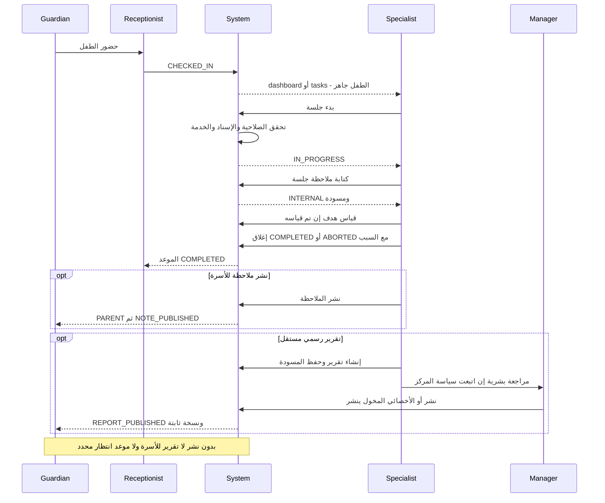
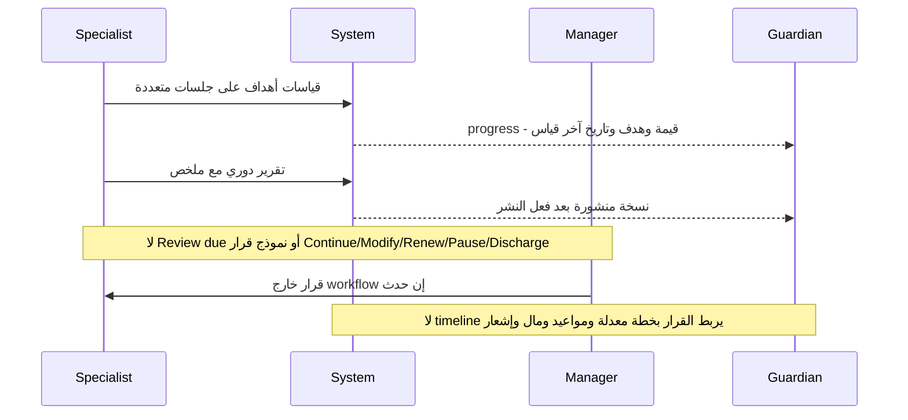
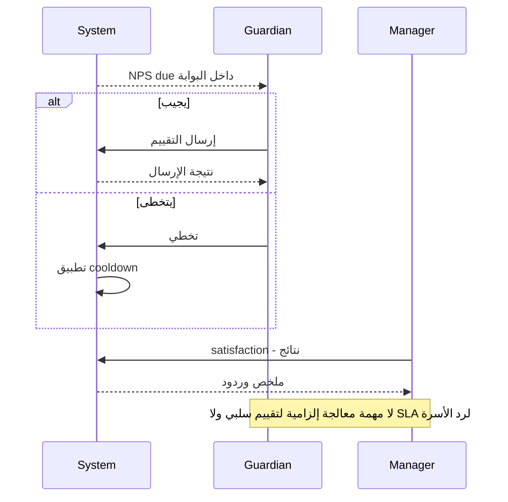

# رحلات الأخصائي والتقدم

E06–E09، E14–E18، E22–E23، E28 في [سجل الأدلة](02-MASTER-JOURNEY-MAP.md). التقييم الأولي والتقرير الدوري وملاحظة الجلسة ثلاثة أشياء مختلفة؛ لا تُستعمل شاشة التقرير بديلًا صامتًا عن assessment workflow.

## E — الجلسة العلاجية إلى الأسرة

| Step | Actor | Action | Screen | CTA | Result | Next Actor |
|---|---|---|---|---|---|---|
| E01 | Specialist | معرفة اليوم | `/dashboard` «يومك» أو `/appointments?view=mine` | فتح يومك | قائمة موعد/حضور | Specialist |
| E02 | Specialist | بدء موعد حضر صاحبه | task/drawer/appointments | بدء الجلسة | POST appointment/session | System |
| E03 | System | فحص أهلية البدء | لا شاشة إضافية | نتيجة الطلب | session_id واحد؛ يرفض بدء ثاني أو غياب caseload عند اشتراطه | Specialist |
| E04 | Specialist | توثيق | `/sessions` أو ملف الطفل sessions | كتابة ملاحظة | PUT note ينشئ/يحفظ INTERNAL | Specialist |
| E05 | Specialist | تحديث هدف | `/plans` measurements | إضافة قياس | measurement مربوط بالهدف؛ session_id اختياري | Specialist |
| E06 | Specialist | إنهاء الجلسة | `/sessions` | إغلاق + نتيجة | COMPLETED/ABORTED، موعد COMPLETED | Reception |
| E07 | Specialist | مشاركة الملاحظة | ملف الطفل تبويب الملاحظات | نشر | visibility=PARENT، not draft، approver | Guardian |
| E08 | Specialist | تقرير رسمي | `/children/:id/reports/new` | حفظ المسودة / معاينة | report DRAFT | Publisher |
| E09 | Publisher مخول | إصدار | editor أو `/reports` | نشر التقرير | PUBLISHED + snapshot + إشعار | Guardian |
| E10 | Guardian | القراءة | `/progress?tab=reports` → `/reports/:id` | فتح التقرير | المحتوى المنشور | Guardian |
| E11 | Reception | تنسيق التالي | ملف الطفل/appointments | حجز موعد | إجراء مستقل لا ينتظر تقريرًا تقنيًا | Guardian |

## متى يرى ولي الأمر التقرير بالضبط؟

التقرير الرسمي يظهر عندما تكون حالته `PUBLISHED` وتسمح سياسة الطفل بالوصول، بعد فعل نشر صريح. حفظ مسودة أو اكتمال session لا يكفي. عند النشر تُنسخ بيانات الأهداف في snapshot حتى لا تتغير النسخة التي قرأتها الأسرة مع القياسات اللاحقة.

ملاحظة الجلسة تظهر بشروط `visibility='PARENT'` و`is_draft_flg=false` و`approved_by IS NOT NULL`؛ لها فعل نشر مستقل. اختيار «أكملت الجلسة» لا يمنح إذن نشر الملاحظات تلقائيًا.

إذا لم يكتب الأخصائي تقريرًا: الجلسة تستطيع الإغلاق دون تقرير، ولا يُنشأ report stub أو due task تلقائي للجلسة غير الموثقة. مهام REPORT_FINISH تكتشف المسودات الموجودة؛ لا تكتشف غياب المسودة أصلًا. لذلك قد ترى الأسرة حضورًا بلا متابعة ولا تفسير موعد انتظار. المستهدف: حالة «ملخص الجلسة قيد الإعداد» وموعد استحقاق وفق نوع التقرير وسياسة المركز، مع تصعيد، دون كشف الملاحظة الداخلية.

المواصفة E30 تذكر مدة لتقرير التقييم؛ لا نعممها تلقائيًا على كل session note أو progress report. تعيين SLA لكل نوع قرار عمل، وليس رقمًا نضعه في الواجهة بلا مصدر.

## J — Progress Assessment ومراجعة الخطة

| Actor | Action | Screen | CTA | Result | Next Actor |
|---|---|---|---|---|---|
| Specialist | تسجيل baseline/target | `/plans` goals | حفظ | هدف قابل للقياس | Specialist |
| Specialist | قياس بعد جلسات | `/plans` measurements | إضافة | نقاط مقارنة | System |
| Guardian | متابعة | `/progress` | تبويب التقدم | فرق الهدف عن الحالي مع آخر قياس؛ «لم يُقَس» بدل صفر وهمي | Guardian |
| Specialist | مقارنة وتلخيص | report editor | حفظ/نشر | تقرير، وليس قرار دورة علاج | Manager |
| Manager/Specialist | Continue | لا review action | لا CTA | الاستمرار ممكن تشغيليًا دون قرار مسجل | Reception |
| Manager/Specialist | Modify | تعديل حقول خطة/أهداف متاح | تعديل/حفظ | تعديل بيانات؛ بلا approval cycle واضح | Guardian لا إشعار مضمون |
| Finance/Manager | Renew | بيع جديد منفصل | بيع باقة | لا ربط قرار سريري بتجديد | Guardian |
| Manager | Pause | لا خطة PAUSED ولا package freeze موصول | لا CTA | UX GAP | Reception/Guardian |
| Manager/Specialist | Complete/Discharge | حالة COMPLETED في DB؛ لا transition API للخطة | لا CTA | UX GAP | Guardian |

استكمال المراجعة ينبغي أن يعيد رسالة بسيطة: «تقدم طفلك في ...، سنواصل/نعدل ...، المراجعة القادمة ...». لا يكفي رسم نسبة؛ كما لا يجوز استخلاص نجاح سريري أو تشخيص من نسبة الهدف وحدها.

## P — رضا الأسرة وإغلاق حلقة المتابعة

| Actor | Action | Screen | CTA | Result | Next Actor |
|---|---|---|---|---|---|
| Guardian | تقييم/تخطي | NPS card في البوابة | إرسال / تخطي | response أو cooldown | Manager |
| Manager | مراجعة النتائج | `/satisfaction` results | فتح النتائج/تحديث | summary وتفاصيل | Manager |
| Manager/Reception | متابعة سبب عدم الرضا | communications ممكنة | رسالة/اتصال | فعل بشري مستقل | Guardian |

## أول شاشة للأخصائي

يوجد بالفعل «يومك» وبدء من CHECKED_IN؛ لذلك وصف التطبيق بأنه «مؤشرات فقط» غير دقيق. لكن `dashboard.html` يربط نص «لا توجد مواعيد متبقية لك اليوم» بـ`@else` التابع لـ`startFailed()`، لا بغياب inProgress/nextUp. يمكن من قراءة الشروط أن تظهر عبارة الفراغ مع الموعد التالي. JG-21 مشكلة وضوح، ويجب تأكيدها بعد التشغيل.

الحكم العام: **PARTIALLY**. الأخصائي يستطيع الوصول إلى يومه، لكن الأعمال غير الموثقة والتقييمات وقرارات الخطط ودخول الاستشارة الأونلاين لا تغطيها أول شاشة تغطية كاملة.
