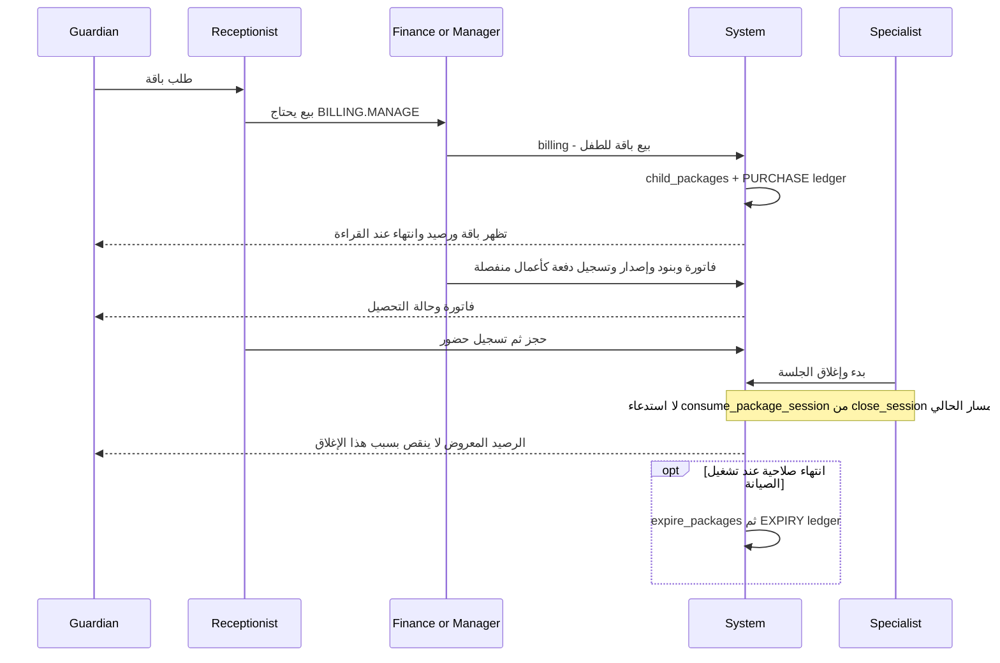
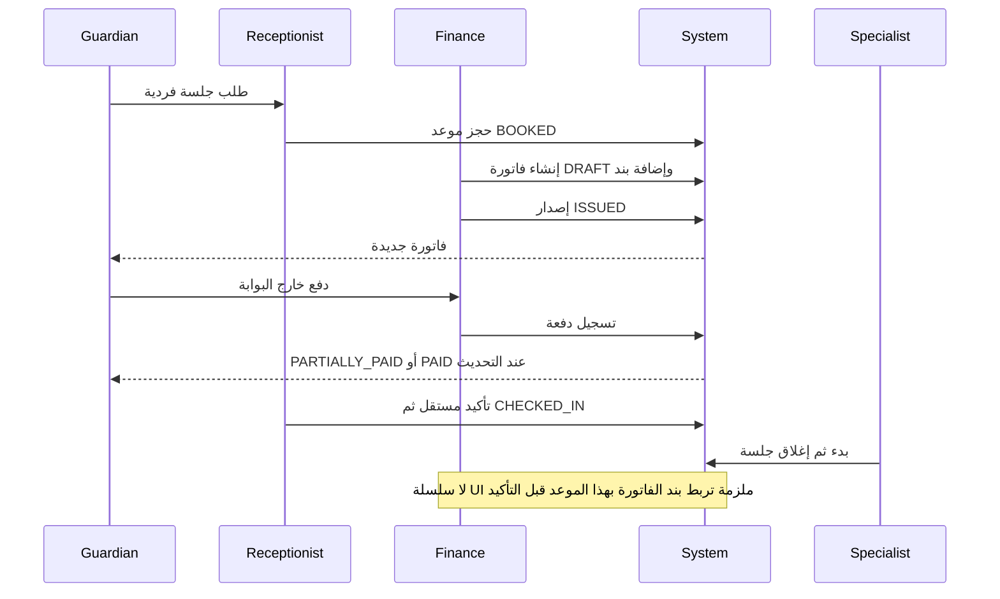
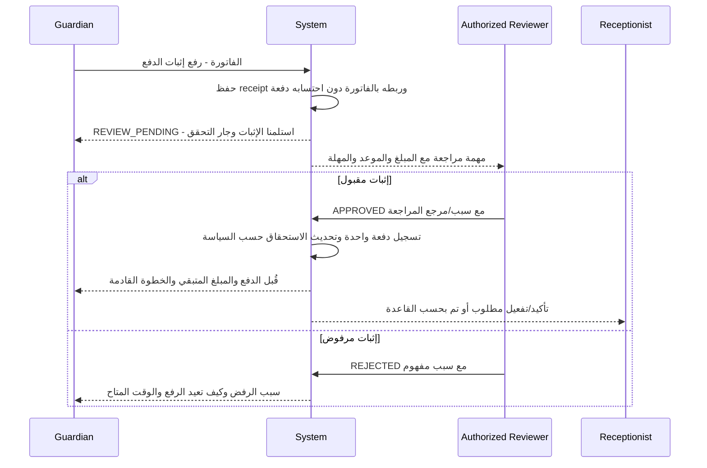

# الدفع والباقات وإثبات الدفع

E03، E06، E10–E11، E18–E19، E26، E30 في [سجل الأدلة](02-MASTER-JOURNEY-MAP.md). هذا تحليل لسلوك البرنامج، لا اعتماد سياسة مالية جديدة. «فاتورة مدفوعة» و«إيصال مقبول» و«استحقاق جلسات نشط» حقائق مختلفة.

## H — ما الذي يوجد فعلًا؟

البوابة تقرأ الفواتير والباقات والرصيد. لا input file ولا submit proof ولا receipt API ولا review queue موصول. `askAboutPayment()` يعرض toast فقط، ولا يرسل CALLBACK ولا يسجل مهمة ولا يدفع مالًا. زر ذو وعد بالتواصل يجب أن ينفذ طلبًا أو يقول بوضوح إنه معلومات اتصال؛ حاليًا JG-27.

`REVIEW_PENDING` و`APPROVED` و`REJECTED` لإثبات الدفع هي حالات مستهدفة، ولا يجوز عرضها كحالات النظام الحالي. `REJECTED` موجودة لكيانات أخرى كالطلب، ولا يدل وجود الكلمة وحده على اكتمال مراجعة الدفع.

## F — الباقة الحالية

| Step | Actor | Action | Screen | CTA | Result | Next Actor |
|---|---|---|---|---|---|---|
| F01 | Admin | تعريف باقة | `/catalog` service-packages | إضافة/حفظ | قالب خدمة وعدد وسعر | Finance |
| F02 | Finance | بيع للطفل | `/billing` | بيع باقة | sell_package ينشئ اشتراكًا وPURCHASE | Reception |
| F03 | System | تفعيل | لا خطوة دفع مرتبطة بالبيع | — | child_packages يبدأ ACTIVE في البنية القائمة | Guardian |
| F04 | Finance | تحصيل | `/billing` invoice drawer | فاتورة/بنود/إصدار/إضافة دفعة | فاتورة مستقلة؛ البيع ليس تحصيلًا | Guardian |
| F05 | Reception | حجز جلسات | `/appointments` | حجز | لا اختيار entitlement/child_package في bookingBody | Specialist |
| F06 | Specialist | حضور وجلسة | `/sessions` | إغلاق | لا خصم باقة | System؛ فجوة JG-09 |
| F07 | Guardian | معرفة المتبقي | `/billing` | قراءة بطاقة الباقة | max(total-used,0) | Guardian؛ الرقم لا يثبت صحة الدفتر |
| F08 | System | انتهاء | maintenance | لا CTA parent | EXPIRED + EXPIRY ledger | لا إنذار قرب انتهاء موصول |
| F09 | Finance | Renewal | بيع جديد | بيع باقة | شراء منفصل دون continuation واضح | Guardian |
| F10 | Manager | Upgrade/Change/Pause/Cancel | لا actions دورة اشتراك متكاملة | لا CTA | UX/Business gap JG-17 | Guardian ينتظر قرارًا |
| F11 | Reception/Manager | Compensation | لا ربط تعويض في booking form | لا CTA | غير موصول | Guardian |

التحقق من غياب الاستهلاك شمل البحث عن `consume_package_session` في DB وAPI والواجهة، مع قراءة `close_session`؛ النتائج التنفيذية هي تعريف الدالة والمنح، لا caller في رحلة التشغيل. لا يكفي وصل الدالة اعتباطيًا: يجب تحديد أي اشتراك وأي خدمة ومنع الخصم المكرر وربط سبب التعويض بالموعد.

## G — الدفع بالحصة ومقارنته بالباقة

| Actor | Action | Screen | CTA | Result | Next Actor |
|---|---|---|---|---|---|
| Guardian | طلب جلسة | اتصال/رسالة، لا self-booking | تواصل/رسالة | طلب بشري | Reception |
| Reception | حجز | Ops appointments | حجز | BOOKED | Finance |
| Finance | فاتورة وبند | Ops billing | فاتورة جديدة ثم إضافة بند | DRAFT؛ description/qty/unit_amt في form | Finance |
| Finance | إصدار | invoice drawer | إصدار | ISSUED وأسرة تُشعر | Guardian |
| Finance | تسجيل الدفع | invoice drawer | إضافة دفعة | totals تتغير | Reception |
| Reception | تأكيد/حضور | appointment drawer | تأكيد / حضور | حالة الموعد | Specialist |

| المقارنة | Package الحالي | Single Session الحالي | المستهدف من قرارات العمل |
|---|---|---|---|
| الاختيار | بيع باقة في billing | حجز + فاتورة منفصلة | توضيح خيار الدفع والتكلفة قبل الالتزام |
| السعر | سعر snapshot في اشتراك | unit_amt في بند | الأسعار المبنية في 0135/0136 تُستهلك من فعل سياقي |
| الربط | booking لا يختار اشتراكًا | البند لا يختار موعدًا من النموذج | فاتورة/استحقاق/موعد مرتبطون |
| التأكيد | مستقل عن التحصيل | مستقل عن التحصيل | قاعدة خاصة بالحالة ونوع الخدمة موحدة |
| الاستهلاك | function بلا caller | لا رصيد package مطلوب | خصم مرة واحدة للباقة، وعدم خصم للحصة |
| التثبيت | لا booking course UI | حجز فردي | ميزة تثبيت الباقة قرار موثق؛ لا نفترض تكرارًا مبنيًا |
| الإلغاء/التعويض | lifecycle غير موصول | يدوي | بيان حق التعويض/الرسوم قبل التأكيد |
| المتبقي | ظاهر لكن الخصم مفقود | قيمة مستحق الفاتورة | كشف قابل للتفسير للأسرة |

## H — Swimlane مستهدف لإثبات الدفع، كله غير موصول حاليًا

| Actor | Action | Screen | CTA | Result | Next Actor |
|---|---|---|---|---|---|
| Guardian | Upload proof | **مستهدف:** invoice detail داخل billing | رفع إثبات الدفع | REVIEW_PENDING؛ لا تغيير paid_amt | Reviewer |
| Reviewer | فحص | **مستهدف:** task → invoice drawer receipt tab | قبول / رفض | قرار مسجل | System |
| System | Approval | **مستهدف:** نفس الفاتورة | لا CTA إضافي | دفعة واحدة + تحديث شرط التأكيد | Guardian/Reception |
| Guardian | Rejection recovery | **مستهدف:** invoice detail | رفع إثبات آخر | إيصال جديد مرتبط بالسابق | Reviewer |
| System | Expired payment window | **مستهدف:** الموعد والفاتورة | اختيار موعد جديد/تواصل بحسب القرار | لا تفعيل حجز منتهي بصمت | Guardian |

| حالة الأسرة | النص المقترح | CTA | ما يجب ألا يدعيه النص |
|---|---|---|---|
| لم ترفع | لم نستلم إثبات الدفع بعد | رفع الإثبات | لا يقول إن الحجز مؤكد |
| REVIEW_PENDING | استلمنا الإثبات، نراجعه الآن؛ نرد قبل وقت محدد | عرض الإثبات / تواصل عند التأخر | لا يقول «تم الدفع» |
| APPROVED | تم اعتماد مبلغ … للفاتورة … | عرض الموعد/باقي المستحق | لا يعني بالضرورة سداد كامل إذا المبلغ جزئي |
| REJECTED | لم نتمكن من اعتماد الإثبات بسبب … | رفع إثبات جديد | لا يمحو تاريخ الإرسال |
| النافذة انتهت | انتهت مهلة هذا الموعد؛ هذه حالة المبلغ/الإثبات | إعادة اختيار أو متابعة مع الموظف | لا يؤكد موعدًا شغله شخص آخر |
| تعذر الرفع | لم نتأكد من حفظ الإثبات | إعادة المحاولة | لا يرفع مرتين عند response مفقود |

## الأقساط — الحفاظ على قرار المالك الحالي

0142 تبني payment_plans وinvoice_installments، وإصدار الفاتورة يولد الجدول، والمدفوعات تسدد حسب seq، والصيانة تضع DUE/OVERDUE وترسل أحداثها. لكن تعريفات التقسيط والجدول ليست موصولة بمورد CRUD/شاشة حالية، وAFTER_SESSIONS وتفعيل الاشتراك بالدفعة الأولى مؤجلان إلى layer B.

0138 سحبت PACKAGE_DEPOSIT_PCT وPACKAGE_ACTIVATION_KIND. لا نعيد اقتراح «50% ثابتة» كتفعيل؛ المرجع الحالي خطة السداد وأول قسط وفق OD-33. كذلك لا نقترح حجب علاج قائم لمجرد تأخر قسط؛ الوثيقة المالية تبقي الإشعار دون الحجب. قرار إتاحة الحجز قبل الدفع يجب أن يُطبق كقاعدة أعمال معتمدة، لا inference من badge.
