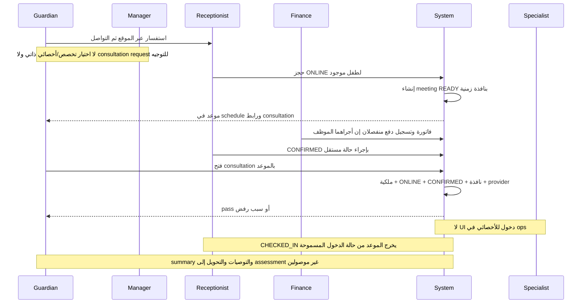
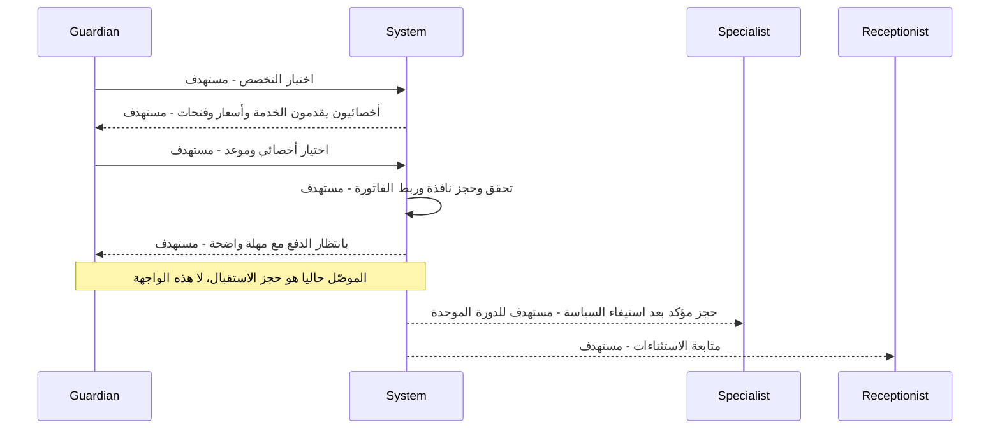
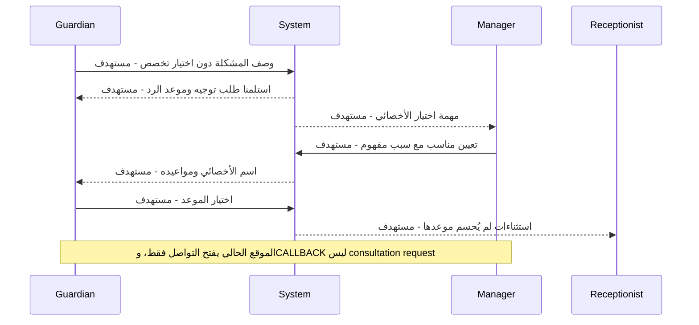

# رحلة الاستشارة الأونلاين — المساران ودورة التنفيذ

المصدر E01، E03، E06، E12، E25، E30 في [سجل الأدلة](02-MASTER-JOURNEY-MAP.md). صفحة consultation الحالية مدخل لقاء قائم؛ ليست نظام اختيار/طلب استشارة. الموقع يعرض «استفسر عن استشارة أونلاين» وينتقل إلى contact، وهذا استفسار صادق، لا booking ناجح.

## As-is — ما يعمل من المصدر وما ينقطع

## Path A — التخصص ثم الأخصائي والمواعيد

| Actor | Action | Screen | CTA | Result | Next Actor |
|---|---|---|---|---|---|
| Guardian | اختيار تخصص | لا شاشة parent حاليًا | **مستهدف:** اختر مجال المساعدة | service selection | System |
| System | أخصائيون وفتحات | لا screen self-service | **مستهدف:** عرض المواعيد | نتائج مرتبطة بتخصص وتكلفة | Guardian |
| Guardian | اختيار وقت | لا screen parent slot picker | **مستهدف:** احجز هذا الموعد | حجز مؤقت/فاتورة بحسب السياسة | Finance/System |
| Reception | البديل الحالي | Ops `/appointments` | حجز + ONLINE | موعد قائم فقط | Guardian |

إعادة استخدام available_slots وservice-therapist pairing مناسبة، لكن endpoints الحالية تحتاج مراجعة صلاحية guardian وعقدها قبل استخدامها في واجهة عامة. وجود read endpoint لا يثبت إتاحته للأسر.

## Path B — لا يعرف التخصص ويطلب توجيه المدير

| Actor | Action | Screen | CTA | Result | Next Actor |
|---|---|---|---|---|---|
| Guardian | وصف المشكلة | **مستهدف:** requests تبويب استشارة، امتداد لا dashboard جديد | ساعدني في اختيار الأخصائي | consultation request | Manager |
| Manager | تحديد مناسب | **مستهدف:** task → request detail | اختيار أخصائي | assignment + feedback | Guardian |
| Guardian | اختيار من مواعيد المعين | **مستهدف:** نفس الطلب | اختيار موعد | Booking/Invoice | System |
| Manager | لا أخصائي مناسب | **مستهدف:** نفس التفاصيل | اعتذار/طلب معلومات مع السبب | نتيجة واضحة بدل pending دائم | Guardian |

## الدورة المشتركة بعد المسارين

| المرحلة المطلوبة | الوضع الحالي | الشاشة/الفعل الفعلي | المطلوب لاستكمالها |
|---|---|---|---|
| Booking | جزئي؛ موظف لطفل موجود | Ops appointments → ONLINE | طلب استشارة/هوية/حجز ذاتي أو بتوجيه |
| Invoice | مستقل | Ops billing | ربط الفاتورة بالموعد المقصود والسعر |
| Payment / Proof Upload | غير موصول للأسرة | Parent billing قراءة | receipt upload وعقد تخزين/تحقق |
| Review Pending | غير موجود كدورة إيصال | لا screen | task للمراجع وETA للأسرة |
| Approval / Rejection | غير موجود | addPayment ليس receipt approval | قبول/رفض مسجل + سبب وإعادة تقديم |
| Confirmed | موجود لكنه قابل للتغيير يدويًا | appointment status | التأكيد لا يغني عن التحقق المالي |
| Meeting Link | موجود للموعد | Parent schedule → consultation/:id | عدم إرسال pass دائم، السياق والموعد واضحان |
| Reminder | DB/SMS قدرة قائمة | notification feed/schedule | تحقق من scheduler/provider والقناة |
| Ready | meeting ينشأ READY | لا ready task خاص | READY ليس دليل استيفاء الدفع أو استعداد الطرفين |
| Check-in | موعد يمكن أن يصير CHECKED_IN | Ops drawer | gate الحالي يقبل CONFIRMED فقط؛ حل تعارض دورة الحضور |
| Consultation | مدخل parent موجود | consultation embedded provider | دخول الأخصائي في ops وإعادة الاتصال/انتهاء الباب |
| Completed | لا إنهاء consultation workflow موحد | إغلاق provider/انتهاء pass لا يثبت نتيجة عمل | قرار إنهاء مسجل مرتبط بالموعد |
| Summary / Recommendation | غير موصول كتوصية استشارة | reports مسار عام ليس بديلًا ضمنيًا | ملخص منشور يربط التوصية بالطلب |
| Conversion | غير موصول | apply لا يستقبل سياق الاستشارة | إجراء إحالة يحافظ على guardian/child ولا يعيد بياناتهما |

## تعارضات تمنع الاعتماد على الرحلة

1. **JG-07 — شرط دفع غير محقق فعليًا:** تعليق gate يقول إن السداد ينقل الموعد CONFIRMED، لكن جسم الدالة يسأل عن status فقط. مسار `set_appointment_status` يسمح بالتأكيد، ولم يُعثر على سلسلة دفع → موعد تربط هذه الحقيقة. النتيجة: شرط العمل المالي غير مضمون، حتى إذا أمكن تشغيل اللقاء.
2. **JG-07 — حضور يمنع الدخول:** `authorize_meeting_entry` يرفض ما ليس CONFIRMED، ومنه CHECKED_IN. لا نفرض استعمال CHECKED_IN للأونلاين بلا قرار دورة متسق.
3. **JG-08 — طرف واحد في الواجهة:** endpoint يدعم التحقق من المتصل، لكن ops routes/actions لا تقدم join للموعد. live-view بث مختلف ولا يحل ذلك.
4. **JG-05/JG-06 — البداية والمال:** المساران غير مبنيين، ومراجعة الإثبات غير موجودة. لا يمكن تسمية واجهة join الموجودة رحلة استشارة end-to-end.

## حالات الباب المعروضة حاليًا

| الحالة | سلوك الشاشة | الملاحظة |
|---|---|---|
| الموعد غير online | not-online | تفسير مناسب بدل غرفة فارغة |
| غير CONFIRMED | not-confirmed + billing | النص يوحي بمال، بينما السبب الفعلي status؛ قد يكون CHECKED_IN |
| مبكر/متأخر/ملغى | door-closed | يحتاج وقت الفتح أو نتيجة الإلغاء والسداد بوضوح |
| ليس للأسرة/غير موجود | not-found | رفض موحد مناسب للحماية |
| provider غير جاهز | unavailable | لا ينبغي أن تطلب الأسرة إعادة الدفع |
| pass انتهى | expired + إعادة محاولة | صلاحية short-lived؛ هذا ليس انتهاء الاستشارة business-wise |
| ended | انتهى اللقاء | لا ملخص/توصية/next-step موصول |
| network | error + retry | لا تفترض إنشاء حجز جديد عند إعادة join |

المستهدف يعيد ولي الأمر بعد اللقاء إلى «ملخص الاستشارة والخطوة التالية» داخل الطلب نفسه: متابعة منزلية أو حجز تقييم أو طلب معلومات أو إنهاء مع سبب. لا استمارة التحاق ثانية لنفس الطفل والبيانات.
