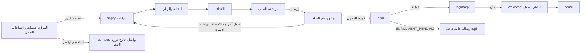
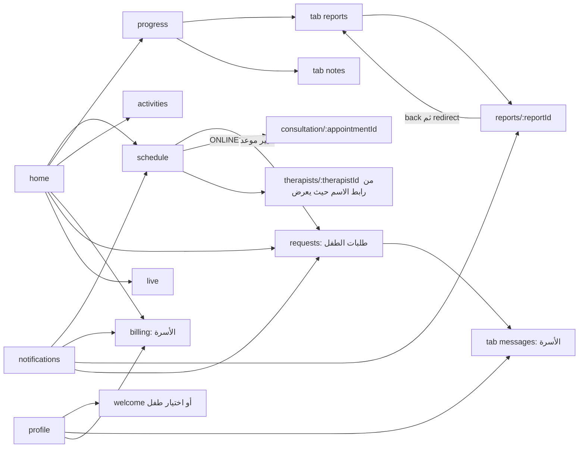
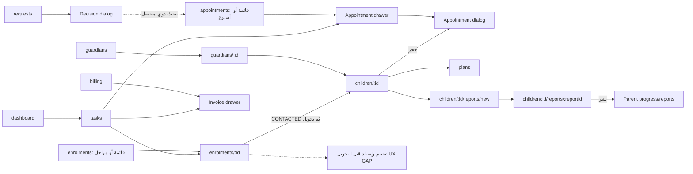

# خريطة الشاشات الفعلية

هذه خريطة navigation من [Portal routes](../../web/portal/src/app/app.routes.ts) و[Ops routes](../../web/ops/src/app/app.routes.ts) والقوالب والأفعال، لا من أسماء المجلدات. `P` للبوابة و`O` للموظفين و`W` للموقع. `/billing` في التطبيقين شاشتان لدورين مختلفين. كل النتائج هنا من المصدر، وليست زيارات حية.

## الموقع إلى البوابة

لا OTP بين D وE. لا صفحة Application Status للأسرة. المراحل الأربع حالات داخل `/apply`، وليست أربعة routes.

## البوابة بعد الدخول

مسار اسم الأخصائي مصدره المكوّن المشترك/الشاشات التي تقدم الرابط، وليس ضمان أن كل card قابلة للفتح. notification إلى NOTE يذهب `/reports` الذي يعيد إلى tab reports، وليس notes؛ JG-14. لا child switch في notification.open الحالية.

## من طابور الموظفين إلى الإجراء

drawer وdialog فوق الصفحة ليسا routes جديدة. تكرار فتح نفس الإجراء من task والطفل والجدول يحسن السياق عندما يستخدم نفس service/spec؛ لا يصنف تلقائيًا duplicate functionality.

## جرد البوابة — Actor / Screen / CTA / Result / Next

| ID | Actor / Action | Screen الفعلية | CTA الأساسي أو التبويب | Result / Next |
|---|---|---|---|---|
| P01 | Guardian دخول | `/login` Login | متابعة / طلب التحاق | OTP أو pending أو apply |
| P02 | Guardian إثبات الدخول | `/login/otp` Otp داخل Login | تحقق / إعادة البدء | welcome أو خطأ/قفل |
| P03 | Guardian طلب | `/apply` Apply؛ أربعة أقسام وsuccess | التالي / إرسال | Application؛ انتظار اتصال |
| P04 | Guardian اختيار طفل | `/welcome` Welcome | بطاقة طفل | home بالسياق |
| P05 | Guardian التالي | `/home` Home | الموعد/البث/التغيير بحسب البيانات | schedule/live/requests/billing |
| P06 | Guardian جدول | `/schedule` Schedule | القادمة/السابقة/طلب تغيير | requests أو consultation |
| P07 | Guardian التقدم | `/progress?tab=progress` ProgressHub/Progress | التقدم | قراءة أهداف وقياسات |
| P08 | Guardian التقارير | `/progress?tab=reports` Reports | فتح تقرير | P10 |
| P09 | Guardian ملاحظات | `/progress?tab=notes` Reports scope notes | قراءة | محتوى في القائمة؛ لا detail note |
| P10 | Guardian تقرير | `/reports/:reportId` Report | رجوع | P08؛ منشور فقط |
| P11 | Guardian برنامج منزلي | `/activities` Activities | تم التنفيذ | log ثم حالة اليوم |
| P12 | Guardian المال | `/billing` Billing | استفسار الدفع / إعادة جزء فاشل | قراءة الفواتير والباقات؛ toast للاستفسار |
| P13 | Guardian طلب تغيير/اتصال | `/requests?tab=requests` Requests | نوع ثم إرسال | parent_request + status |
| P14 | Guardian رسالة | `/requests?tab=messages` FamilyMessages | إرسال/تحديث/أقدم | مراسلة أسرية لا child guard |
| P15 | Guardian لقاء | `/consultation/:appointmentId` Consultation | دخول/إعادة محاولة/خروج | provider أو رفض |
| P16 | Guardian بث | `/live` Live | مشاهدة/خروج | بث session الحالية أو رفض |
| P17 | Guardian ملف أخصائي | `/therapists/:therapistId` Therapist | رجوع | قراءة مهنيّة؛ ليس slot selection |
| P18 | Guardian إشعارات | `/notifications` Notifications | فتح | هدف حسب link_kind |
| P19 | Guardian الحساب | `/profile` Profile | حفظ اتصال/تبديل طفل/موافقات/خروج | بعض الحفظ موصول؛ consent مرفوض دائمًا |

NPS card مكوّن ثانوي داخل البوابة وليس route مستقلًا؛ تغطيه رحلة P في 06. shell وstatus-badge وappointment-row وempty/error/skeleton مكونات مشتركة، تُراجع مع كل شاشة تستعملها.

## جرد Console/Admin

| ID | Actor / Action | Screen | CTA / الأقسام | Result / Next |
|---|---|---|---|---|
| O01 | Staff دخول | `/login` Login | دخول/إعداد كلمة المرور بحسب الحالة | dashboard |
| O02 | Staff يومه | `/dashboard` Dashboard | مهام/يومك/فتح مؤشر | task أو drawer أو قائمة |
| O03 | Staff تنفيذ | `/tasks` Tasks | المطلوب الآن/متأخر/لي/فتح | إجراء record مع صلاحية |
| O04 | Staff قراءة حدث | `/notifications` Inbox | غير المقروء/فتح | وجهة الحدث؛ ليست قائمة إنجاز |
| O05 | Reception أسرة | `/guardians` ResourceScreen | بحث/إضافة/تعديل/عرض | guardian detail أو معاينة أفراد |
| O06 | Reception تفاصيل الأسرة | `/guardians/:guardianId` GuardianDetail | اتصال/رسالة/تعديل | طفل/طلب/مال الأسرة |
| O07 | Reception طفل | `/children` ResourceScreen | بحث/إضافة/فتح | child profile |
| O08 | Staff ملف طفل | `/children/:childId` ChildProfile | حجز/إسناد/خطة/تقرير | context tabs وdialogs |
| O09 | Staff بطاقة | `/children/:childId/card` ChildCard | طباعة | بطاقة خارجية دون تفاصيل سريرية |
| O10 | Specialist تقرير جديد | `/children/:childId/reports/new` ReportEditor | حفظ/معاينة | مسودة + route id |
| O11 | Specialist تحرير تقرير | `/children/:childId/reports/:reportId` ReportEditor | حفظ/نشر | نسخة منشورة للأسرة |
| O12 | Manager الأخصائيون | `/therapists` ResourceScreen + services extra tab | إضافة/تعديل/خدمات | staff/working-hours/caseload/matrix |
| O13 | Specialist/Admin الملف المهني | `/therapists/:therapistId/profile` TherapistProfileEditor | حفظ/موافقة/نشر | ملف منشور عند استيفاء الشروط |
| O14 | Admin موارد المكان | `/rooms` ResourceScreen | غرف/كاميرات | موارد حجز/بث |
| O15 | Specialist خطة | `/plans` ResourceScreen | plans/goals/measurements/child-activities | إنشاء/تحرير؛ بلا تفعيل خطة |
| O16 | Admin تعريف خدمات | `/catalog` ResourceScreen | services/service-packages/activity-library | تعريفات تشغيل |
| O17 | Editor/Admin الموقع | `/site` ResourceScreen + TeamScreen | contact/services/programs/FAQ/reviews/texts/sections/team | تحرير/نشر حسب spec |
| O18 | Reception/Specialist الجدول | `/appointments` DayScreen؛ `view=mine` | حجز/قائمة/أسبوع/drawer/حالات | booking/check-in/start |
| O19 | Specialist الجلسات | `/sessions` DayScreen | ملاحظة/إغلاق | session status؛ لا تقرير تلقائي |
| O20 | Publisher التقارير | `/reports` DayScreen | فتح/نشر/تصدير الصفحة | report publish |
| O21 | Finance الفواتير | `/billing` DayScreen + ledger | invoices/payments/packages/balances | إصدار/تحصيل/بيع/قراءة رصيد |
| O22 | Reception طلبات الأسر | `/requests` DayScreen | اتخاذ قرار | accepted/rejected فقط |
| O23 | Reception/Manager الالتحاق | `/enrolments` DayScreen | فتح/حالة/تحويل/مراحل | إدارة طابور الطلبات |
| O24 | Reception/Manager الطلب | `/enrolments/:applicationId` EnrolmentDetail | اتصال/الخطوة التالية/تحويل | ملف طفل؛ تبويب تقييم فارغ وظيفيًا |
| O25 | Staff بث | `/sessions/:sessionId/live` LiveView | فتح/رجوع | بث وليس consultation join |
| O26 | Admin الصلاحيات | `/users` Access | people/roles/screens | حسابات وأدوار ومستندات موظف |
| O27 | Manager رضا الأسر | `/satisfaction` ResourceScreen + Satisfaction | surveys/results | تعريفات ونتائج |
| O28 | Admin صحة الخدمة | `/ops-log` OpsLog | صحة/أخطاء/نشاط | قراءة تشغيلية |
| O29 | Admin إعدادات | `/settings` Settings | تعديل مركز/parameter | قيم تحفظ وتقرأ عبر API |
| O30 | Staff رفض صلاحية | `/denied` Denied | رجوع للوحة | يوضح missing permission |
| O31 | Staff محادثات | `/communications` FamilyMessages | أسرة/رسالة/أقدم | مراسلة ورد |

## التبويبات والنماذج المهمة داخل الشاشات

| السطح | تفاصيل تحت نفس route | لماذا تُحسب في المراجعة؟ |
|---|---|---|
| O08 | overview، guardians، appointments، sessions، assessments، plans، reports/notes، finance بحسب صلاحيات الصفحة | تقييم الطفل placeholder لا ميزة؛ كل جزء له partial load مختلف |
| O24 | overview، بيانات الطلب، assessment، activity/تاريخ بحسب قائمة tabs | nextStep ليس حجز تقييم؛ timeline مشتق من timestamps |
| O15 plans | child/service/therapist/start/end | إنشاء DRAFT؛ لا status action |
| O15 goals | plan_id/title/baseline/target/status | علاقة الخطة تُدخل كرقم في editor العام |
| O15 measurements | goal/date/value/trials/session/note | session_id ليس اختيارًا سياقيًا |
| O15 child-activities | child/activity/plan/goal/frequency/dates | البرنامج المنزلي يحتاج علاقة مفهومة |
| O12 hours/caseload | therapist/day/time وtherapist/child/service | إدخال مراجع رقمية مع نقص تحقق سياقي |
| O12 services matrix | أخصائي × خدمة | رابط prerequisite للحجز، كبير على الموبايل |
| O14 | غرفة وكاميرا | الكاميرا لا تعني وحدها صلاحية ولي الأمر للبث |
| O16 | خدمة، تعريف باقة، مكتبة نشاط | تعريف الباقة غير بيعها وغير تحصيلها |
| O17 team | profile/facts/videos/certificates/photos | تحرير حقيقي داخل TeamScreen، لا route منفصل |
| O21 invoice drawer | header، سطور، payments، amount due | لا receipt review ولا installment detail |
| O21 ledgers | payments، packages/prices، balances | قراءات إضافية لا تعني كشف package_ledger حركات الاستهلاك |
| O26 | people، roles، screens، وثائق وصورة/إعداد حساب | أثر أمني؛ يجب توضيح نطاق الدور وحفظه |
| P03 form | basic/concern/goals/review/success | لكل مرحلة تحقق وخطوة لاحقة مختلفة |
| P02 OTP | nested overlay | التركيز والخروج والتوقيت جزء من journey |
| O18 booking | child search/pair/mode/slots/manual details/review | اختيار الغرفة والأخصائي والوقت مترابط، ليس حقولًا مستقلة |

القوالب المصدرية: [ResourceScreen](../../web/ops/src/app/features/resource/resource-screen.html)، [DayScreen](../../web/ops/src/app/features/day/day-screen.html)، [ChildProfile](../../web/ops/src/app/features/child/child-profile.html)، [TeamScreen](../../web/ops/src/app/features/team/team-screen.html)، [InvoicePanel](../../web/ops/src/app/features/drawer/invoice-panel.html). التحديث المتزامن أضاف اختيار المراجع بالأسماء في ResourceScreen؛ المتبقي هو التصفية بسياق الطفل/الخطة وحقل session_id الرقمي للقياس؛ JG-22.

## الروابط القديمة ليست شاشات مكررة

| التطبيق | عنوان قديم | الوجهة الحالية | الحكم |
|---|---|---|---|
| Portal | `/otp` | `/login/otp` | alias يحفظ الوصول |
| Portal | `/reports` | `/progress?tab=reports` أو notes حسب query | دمج فعلي؛ إصلاح روابط الإشعارات مطلوب |
| Portal | `/communications` | `/requests?tab=messages` | دمج فعلي يحفظ المسودات |
| Ops | `/inbox` | `/notifications` | تغيير تسمية، المهام في `/tasks` |
| Ops | `/my-day` | `/appointments?view=mine` | نفس الجدول بفلتر شخصي |
| Ops | `/therapist-services` | `/therapists?tab=services` | matrix داخل موضوع الأخصائي |
| Ops | `/site/team` | `/site?tab=team` | team داخل الموقع |
| Ops | `/access` | `/users` | redirect |
| كلاهما | `/` و`**` | welcome أو dashboard | route مجهول يختفي إلى البداية؛ لا تفسير مخصص |

## ما لا route له — لا نرسمه كأنه يعمل

التقييم ونشره، اعتماد/إكمال الخطة، self-book consultation، توجيه استشارة المدير، proof upload/review، تغيير الموعد المتكامل، تفعيل/تجميد/ترقية اشتراك، makeup booking، completeness workflow، waiting list/offer، schedule block editor. اقتراحات وضعها داخل الصفحات الحالية موثقة في [المستهدف](13-RECOMMENDED-TARGET-JOURNEY.md).

`website/` و`html/` و`figma/` تحتوي مراجع/تصميمات وليست تلقائيًا صفحات التطبيق الحية. السطح العام المشغَّل وفق README وإعدادات deploy هو `site/`؛ صفحة `privacy.html` سطح محتوى أيضًا. لا نعدّ screenshot أو HTML reference ميزة متصلة بالـAPI.
