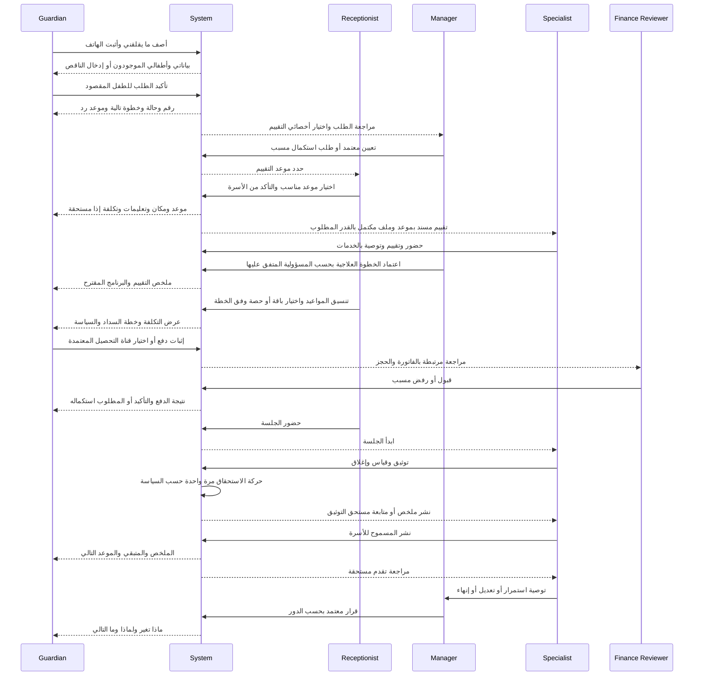
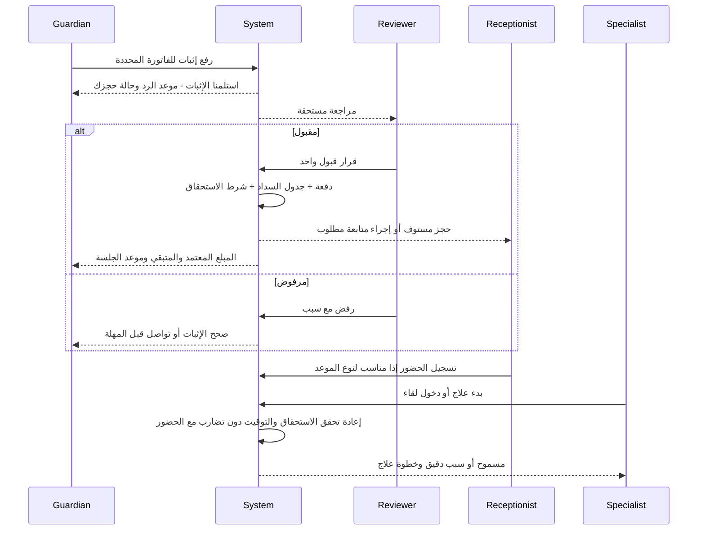

# الرحلة المستهدفة — إغلاق الفجوات دون تضخيم الشاشات

هذه توصية تصميم/خدمة للمرحلة التالية فقط؛ لا كود ولا تغيير قاعدة بيانات نُفّذ هنا. تبدأ من [الفجوات JG](12-GAPS-CONFLICTS-PRIORITIES.md)، وتحافظ على PostgreSQL مصدر الحقيقة وعلى حالات العمل المعتمدة. أسماء الحالات الجديدة أدناه مفاهيم مقترحة إلى أن يعتمد عقدها؛ لا تُعرض على أنها enum موجودة.

## مبدأ التشغيل

كل انتقال يجب أن يجيب: من بدأ؟ ما السجل؟ ماذا تم فعليًا؟ ما الذي بقي؟ من المسؤول؟ متى نرد؟ وما الرابط الذي يعيد الأسرة إلى السجل الصحيح؟ لا تصبح المهمة مكتملة لمجرد فتحها أو تعليم notification كمقروءة. لا تُستخرج قرارات مالية/سريرية من نص زر أو mapping frontend.

## الرحلة الموحدة — من القلق إلى البرنامج والمتابعة

لا نساوي إنشاء طفل أو تفعيل حساب باعتماد العلاج. ويمكن إصدار فاتورة تقييم قبل الخطة إذا كانت خدمة مدفوعة؛ موضع الفاتورة يتبع نوع الخدمة ولا نلزم كل الخدمات بالانتظار لنهاية التقييم.

## أين يوضع كل إجراء؟

| Gap | امتداد الشاشة القائمة | Actor / CTA المستهدف | Result / Next Actor | لماذا يلزم؟ |
|---|---|---|---|---|
| JG-01/12 | apply + login/OTP + profile | Guardian: تحقق/اختر طفلي/أكمل الناقص | هوية ومطابقة → الطلب | يمنع إعادة الإدخال والتكرار؛ ليس wizard موازيًا |
| JG-11 | تفاصيل طلب داخل requests أو وصول موثق من success | Guardian: تابع طلبك | timeline/action/contact | استمرارية الطلب قبل إنشاء الطفل |
| JG-02 | enrolment detail + tasks | Manager: تعيين تقييم؛ Reception: حجز | assessment appointment → الأسرة/الأخصائي | يغلق handoff موجودًا ومقطوعًا |
| JG-03 | assessment tab في ملف الطفل/الطلب مع محرر | Specialist: تسجيل/إكمال/نشر | نتيجة وتوصية → الأسرة/المدير | لا تتحول progress reports إلى assessment بديل |
| JG-04 | plans داخل child profile | Specialist: أرسل للاعتماد؛ Manager: اعتماد/إعادة تعديل | خطة قابلة للجدولة | يغلق DRAFT؛ لا حقل status حر |
| JG-05 | requests consultation tab + picker مشترك | Guardian: أعرف التخصص/ساعدني في الاختيار | Path A أو B إلى حجز واحد | رحلة جديدة وظيفيًا؛ داخل navigation قائم |
| JG-08 | appointment drawer / يوم الأخصائي | Specialist: دخول الاستشارة | لقاء مرتبط بالموعد | طرف مفقود؛ لا صفحة بث أخرى |
| JG-06 | billing invoice detail + receipt section في drawer | Guardian: رفع؛ Reviewer: قبول/رفض | receipt/دفعة/نتيجة | يحل مراجعة مالية فعلية |
| JG-09/17/28 | package detail داخل billing/child finance | Finance: تفعيل/تغيير/تجميد/تجديد بحسب العقد | اشتراك وخدمات وledger | يفسر الاستحقاق، لا قائمة باقات شكلية |
| JG-10 | appointment drawer + request detail | Reception: تنفيذ تغيير الموعد | قديم/جديد/طلب مرتبط → الأسرة | يجمع أفعالًا كانت متفرقة |
| JG-13 | profile consent + child consent | Guardian: إدارة تفضيل/طلب تعديل بحسب الصلاحية | نتيجة حقيقية/مهمة موظف | إزالة وعد تحكم كاذب |
| JG-14/15 | notifications + task navigation | System: deep link وrecipient صحيح | نفس الطفل والكيان | لا شاشة إشعارات ثانية |
| JG-16/23 | tasks + session panel | Specialist: استكمال التوثيق | published/سبب تأخير → الأسرة | يكتشف السجل الذي لم ينشأ أصلًا |
| JG-26 | plans review section | Specialist/Manager: قرار متابعة | continue/modify/renew/pause/discharge | يعيد تفسير التقدم للأسرة |
| JG-22 | ResourceScreen editor | Staff: بحث/اختيار من سياق | مرجع صحيح مقروء | تحسين عنصر مشترك بدل صفحات CRUD جديدة |

أي route جديد لاحقًا ينبغي أن يُبرر بهوية سجل يحتاج رابطًا مباشرًا أو عملًا معقدًا لا يستوعبه drawer، لا بعدد المكونات. يمكن أن يكون assessment editor صفحة تفاصيل إذا طول الاختبار يتطلب ذلك، لكنه يخدم JG-03 تحديدًا.

## قفل حلقة الدفع والحضور

لا Receipt APPROVED قبل التأكد، ولا invoice PAID لمجرد رفع صورة. لا نعتمد CONFIRMED كبديل عن الحقيقة المالية. لا نعيد تفعيل نافذة موعد منتهية بمجرد وصول دفعة متأخرة؛ يظهر استثناء للمراجع والاستقبال مع بيان المبلغ للأسرة.

## Timeline موحدة المعنى ومختلفة لكل رحلة

| Journey | المعالم المستهدفة | حالة «مطلوب منك» | حالة «نعمل عليها» | نهاية لا تكون صامتة |
|---|---|---|---|---|
| الالتحاق | استلام → مراجعة → تعيين → موعد → تقييم منشور → برنامج مقترح | بيانات/موافقة على وقت | مراجعة/تنسيق/تقييم | ملخص وخطة أو رفض مسبب/إحالة |
| إثبات الدفع | أُرسل → قيد التحقق → مقبول/مرفوض → أثر على الموعد | إعادة رفع/سداد باقي | انتظار المراجع | المبلغ والموعد/سبب الرفض |
| الأونلاين | طلب → أخصائي → موعد → دفع → إتاحة اللقاء → انتهى → ملخص | وقت/دفع/انضمام | مراجعة/انتظار الأخصائي | توصية وخيار إحالة بنفس البيانات |
| الجلسة | موعد → حضور → جارية → انتهت → ملخص قيد الإعداد → منشور | نشاط منزلي/موعد قادم | إعداد الملخص | تقدم + متبقٍ + التالي |
| الباقة | اختيار → سداد وفق خطة → نشطة → استهلاك → قرب نهاية → مراجعة/تجديد | سداد/اختيار متابعة | قرار تغيير/تعويض | كشف آخر رصيد وسبب الإنهاء |
| طلب تغيير | استلام → تنسيق → قبول مبدئي عند الحاجة → تنفيذ → إشعار | اختيار بديل | تنفيذ التعديل | «نقلنا من … إلى …» بعد نجاحه فقط |
| التقدم | قياس → مراجعة → قرار → برنامج محدث | مشاركة ملاحظة/اختيار وقت | مراجعة مختص/اعتماد | سبب الاستمرار/التعديل/الإنهاء وتاريخه |

كل checkmark يتطلب حدثًا/وقتًا من DB. لا نرسم تعيينًا أو اعتمادًا بالاستنتاج من ترتيب الشاشات. عند الفشل نضع «تعذر تحميل الحالة» ونحافظ على آخر تحديث موثق؛ لا نرجع إلى أول خطوة ولا نعرض نجاحًا سابقًا كأنه حديث.

## المعنى المطلوب لبطاقة المهمة

| الحقل | مثال تشغيلي مستهدف | مصدر الحقيقة |
|---|---|---|
| ما الذي حدث | وصل إثبات للفاتورة … | receipt event |
| ما المطلوب | راجع المبلغ والمرجع ثم اقبل أو ارفض | نوع المهمة والإجراء المسموح |
| لمن/أي طفل | الطفل والأسرة والسجل المعني | علاقات كيانات، لا نسخ اسم فقط |
| المسؤول | المخول أو الموظف المسند | assignment قابل للتغيير بسجل |
| الموعد | قبل انتهاء مهلة الحجز/موعد SLA | سياسة مركز + timestamps |
| التالي | سيصل الرد للأسرة ويتحدد وضع الموعد | ناتج الإجراء نفسه |
| CTA | راجع الإثبات | يفتح نفس الفاتورة/الإثبات ويعيد القراءة |
| البديل | تعذر التحقق / طلب معلومات | سبب ومهمة متبقية، لا إغلاق كاذب |

المهام التي لا يجوز أن تضيع: طلب جديد، طلب اتصال، أخصائي تقييم غير معين، تقييم غير مكتمل، خطة تنتظر اعتمادًا، إثبات ينتظر مراجعة، موعد لم يؤكد، طفل حضر، جلسة لم توثق، تقرير لم ينشر، no-show يحتاج اتصالًا، بديل بعد إلغاء أخصائي، باقة تقترب من النهاية، مراجعة تقدم، استثناء دفع. لا يكفي إضافة cards: يجب وجود مصدر بيانات وعقد إنجاز لكل نوع.

## الاستثناءات التشغيلية والسياسة

| الموضوع | ما يحافظ عليه التصميم | ما يحتاج حسمًا/توصيلًا قبل التنفيذ |
|---|---|---|
| تقرير بعد الجلسة | عدم نشر INTERNAL؛ فصل إغلاق الجلسة عن النشر | موعد إصدار لكل نوع وتنبيه صاحب التوثيق؛ لا نمنع الإغلاق بلا قرار |
| توقف/غياب | Appointment/Session/Billable حقائق منفصلة | من اتخذ القرار، وقت الإخطار، موعد بديل/تعويض |
| الباقة | لا خصم مزدوج ولا رصيد تعويض مستقل بلا سبب | policy نسخة الباقة وروابط makeup كما استقر E30، لا إحياء makeup_credits الملغى |
| التقسيط | OD-33 وخطة السداد؛ 0142 layer A | توصيل layer B والعرض؛ لا إعادة معامل نسبة ثابتة |
| قسط متأخر | الإشعار لا حجب العلاج القائم بحسب القرار الموثق | task تحصيل وتفسير للأسرة |
| التجميد/الترقية | قدرة لم تبنَ؛ لا تعديل status حر | الأيام المسموحة والأثر على expires/money/appointments من policy |
| الموافقات | حق واضح ونطاق الطفل وسجل حقيقي | لا optimistic success لمصدر يرفض أصلًا |
| الهوية | نفس الهاتف قد يمثل وليي أمر؛ لا merge أعمى | ambiguity review مع حماية البيانات قبل التحقق |
| متعددة الخدمات | عدة أخصائيين ممكنون | توصية وخطة وجدول واستحقاق يبينون خدمة كل جلسة |

القرارات الموجودة في E30 تُستخدم بآخر تعديلاتها. المدد وقواعد الإفراج/الرفض التي لم تُحسم لا تتحول لأرقام صلبة في UI. هذه الحزمة تحدد موضع القرار وأثره؛ لا تعيد فتح قرارات المالك ولا تطلب موافقته على إنجاز التحليل المصرح به.

## اختبار النهاية إلى النهاية الذي يثبت اكتمال التصميم لاحقًا

1. أسرة جديدة تبدأ من الموقع وتثبت الهاتف؛ تُنشأ سجلاتها عبر الأفعال العامة فقط، دون INSERT تجهيز يسبق الرحلة.
2. مدير يرى الطلب ويعين التقييم؛ الاستقبال يستلم مهمة ذات وقت ويحدد موعدًا؛ الأسرة ترى الموعد.
3. أخصائي يسجل التقييم وينشر النتيجة؛ خطة تقترح وتعتمد أو تعاد للتعديل مع سبب.
4. الأسرة ترى تكلفة وسدادًا واضحين، ترفع إثباتًا؛ المراجع يقبل أو يرفض؛ النتيجة تعود لنفس الفاتورة والطفل.
5. وصول الطفل/بدء العلاج أو دخول الأونلاين لا يتضاربان مع الدفع؛ الأخصائي والأسرة يصلان للقاء نفسه.
6. الجلسة تنتهي؛ حركة رصيد واحدة صحيحة؛ التوثيق المنتظر يظهر في مهام الأخصائي بموعد؛ النشر يوصل ملخصًا للأسرة.
7. تغيير موعد وno-show وإلغاء أخصائي ينتجان قرارًا وبديلًا/تعويضًا وfeedback، لا badge فقط.
8. مراجعة تقدم تنتهي باستمرار/تعديل/تجديد/توقف/إنهاء موثق، وتعرف الأسرة لماذا وما المطلوب بعدها.
9. يعاد الاختبار مع طفلين وهاتف مشترك وتطابق ملتبس، وفشل شبكة ودفعة مكررة وموعد انقضت مهلته.
10. تفحص الشاشات على مقاسات الموبايل في 10 وحالات 11؛ لا دور يحتاج IDs محفوظة خارج الواجهة أو تعليمات شفوية لسد فجوة عمل.

النجاح النهائي: ولي الأمر يستطيع تحديد موقعه وخطوته التالية من كل حالة؛ الموظف يرى عمله المطلوب وموعده؛ الأخصائي يرى يومه وما تبقى من التوثيق. لا رحلة تُغلق داخل قاعدة البيانات دون رجوع نتيجة مناسبة للطرف الذي بدأها.
