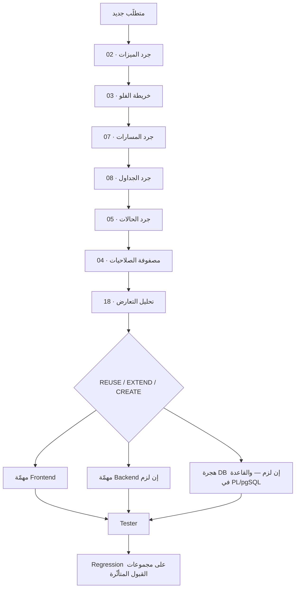

# SYSTEM DISCOVERY & FEATURE INVENTORY — الفهرس

**المرحلة:** جرد واستكشاف. **لا تطوير في هذه المرحلة.**
**تاريخ المسح:** 2026-09-12 · **آخر هجرة مقروءة:** `0129_origin_of_a_record`
**كُتب بقراءة الكود لا الوثائق** — وحيث اختلف الكود عن وثيقة قائمة، سُجِّل الاختلاف
في [18-system-conflict-report.md](18-system-conflict-report.md) ولم يُصلَح.

---

## ما هذه الوثائق

مرجع واحد لما هو **موجود فعلًا** في `Hand By Hand (new)`: الميزات، الفلوهات،
الأدوار، الحالات، الشاشات، المسارات، الجداول، القواعد، الإشعارات، التكاملات،
والمهام الدورية — ثم تقارير التعارض والتكرار والفلو الناقص.

الغرض المعلن: **ألّا يُبنى شيء مرتين، وألّا تكسر ميزة جديدة فلوًا قائمًا.**

## النطاق والمنهج

| البند | القيمة |
|---|---|
| المصدر الأول | `db/migrations/*.up.sql` (١٢٩ ملفًّا · ٢٧٢٣٥ سطرًا) — هي مصدر الحقيقة لقواعد العمل |
| المصدر الثاني | `api/` (Go · ١٩١٨٦ سطرًا) — الطبقة التي تنقل |
| المصدر الثالث | `web/portal` · `web/ops` · `web/shared` (Angular · ٢٢٨٨٩ سطرًا) |
| المصدر الرابع | `site/` (الموقع العامّ) · `deploy/` (النشر والجدولة) |
| ما لم يُقرأ كاملًا | `tests/` (١٧٤٥٦ سطرًا) — قُرئت عناوينها وأسماء الفحوص، لا كل فحص |
| ما استُثني | `.claude/worktrees/**` (نسخة عمل لجلسة أخرى) · `html/**` (النظام القديم) — راجع 21 |

**قاعدة المسح:** لا يُسجَّل شيء لأن اسم ملفّ أو اسم شاشة يقوله. كل بند في هذه
الوثائق له موضع في الكود، وكل «غير موصول» مُثبت بغياب المنادي لا بانطباع.

## الوثائق

| # | الوثيقة | ماذا فيها |
|---|---|---|
| 01 | [system-overview](01-system-overview.md) | الستاك · الطبقات · الأرقام · القواعد الخمس |
| 02 | [master-feature-inventory](02-master-feature-inventory.md) | **٤٤ ميزة** `F-01`…`F-44` بكل حقولها |
| 03 | [master-business-flow-map](03-master-business-flow-map.md) | **١٤ فلو** `FL-01`…`FL-14` + خرائط Mermaid |
| 04 | [role-permission-matrix](04-role-permission-matrix.md) | ٤ أدوار × ٣٥ صلاحية · ومصفوفة الفعل |
| 05 | [status-inventory](05-status-inventory.md) | ١٢ آلة حالة · كل انتقال مسموح |
| 06 | [frontend-screen-inventory](06-frontend-screen-inventory.md) | ٥٦ شاشة في ثلاثة أسطح |
| 07 | [api-inventory](07-api-inventory.md) | ١١٨ مسارًا صريحًا + ١٧٨ من CRUD |
| 08 | [database-entity-map](08-database-entity-map.md) | ٨٦ جدولًا · ١٥ عرضًا · ١٧٠ دالّة |
| 09 | [business-rule-inventory](09-business-rule-inventory.md) | ٩٩ رمز رفض `HB0xx`–`HB2xx` وقاعدة كل واحد |
| 10 | [notification-inventory](10-notification-inventory.md) | ١٦ نوعًا · قنواتها · وأيّها ميّت |
| 11 | [integration-inventory](11-integration-inventory.md) | Twilio · Jitsi · SMS HTTP · الكاميرات · الملفّات |
| 12 | [background-job-inventory](12-background-job-inventory.md) | ٧ مهامّ في `run_maintenance` + ساحب SMS |
| 13 | [feature-dependency-map](13-feature-dependency-map.md) | من يعتمد على من |
| 14 | [feature-impact-matrix](14-feature-impact-matrix.md) | أثر تعديل كل ميزة على الطبقات |
| 15 | [parent-lifecycle](15-parent-lifecycle.md) | دورة حياة `guardians` ومصادر إنشائه |
| 16 | [beneficiary-lifecycle](16-beneficiary-lifecycle.md) | دورة حياة `children` |
| 17 | [appointment-session-lifecycle](17-appointment-session-lifecycle.md) | الفرق بين Appointment · Session · Consultation · Assessment |
| 18 | [system-conflict-report](18-system-conflict-report.md) | **٣١ تعارضًا** مصنَّفة CRITICAL→LOW |
| 19 | [duplication-report](19-duplication-report.md) | التكرار والتداخل |
| 20 | [missing-incomplete-flow-report](20-missing-incomplete-flow-report.md) | الفلوهات المقطوعة والقدرات غير الموصولة |
| 21 | [technical-debt-legacy](21-technical-debt-legacy.md) | الدين التقني والإرث |
| 22 | [recommendations](22-recommendations.md) | TOP 10 RISKS · TOP 10 FIXES · تقييم الصحة |

---

## القاعدة النافذة من الآن

> **لا تُبنى ميزة قبل مراجعة هذا المرجع.**

أي متطلَّب جديد يمرّ أوّلًا بـ **PRE-DEVELOPMENT ANALYSIS** ويُكتب كتعليق/بطاقة
قبل أي كود. القالب:

```markdown
## PRE-DEVELOPMENT ANALYSIS — <اسم المتطلَّب>

**Requested Feature:**
**Existing Similar Feature:**        (02 — رقم F-xx أو «لا يوجد» مع دليل grep)
**Existing Flow it touches:**        (03 — رقم FL-xx)
**Reusable Screens/Components:**     (06)
**Reusable APIs:**                   (07)
**Reusable Tables:**                 (08)
**Reusable Business Rules:**         (09 — رمز HBxxx إن وُجد)
**Status changes:**                  (05 — هل يحتاج حالة جديدة؟ ولماذا لا تكفي القائمة؟)
**Permission changes:**              (04 — هل يحتاج رمزًا جديدًا؟ ولماذا لا يكفي القائم؟)
**Possible Conflict:**               (18)
**Possible Impact:**                 (13 · 14)
**Frontend Changes:**
**Backend Changes:**
**Database Changes:**
**Testing Impact:**                  (أي مجموعة `tests/db/pXX` و`tests/api/aXX` تتأثّر)
**Decision:** REUSE | EXTEND | CREATE NEW  — ومعه سبب مكتوب
```

**ترتيب القرار دائمًا: REUSE ← EXTEND ← CREATE NEW.**
لا API جديدة إن كفى قائم · لا جدول جديد إن كان الكيان موجودًا · لا حالة جديدة إن
أدّت قائمةٌ الوظيفة · لا رمز صلاحية جديد إن كان الفرق تسميةً لا قرارًا.

## المسار الواجب لأي متطلَّب



## OPEN QUESTIONS

كل سؤال لم يُجِب عنه الكود سُجِّل كـ`OQ-xx` ولم يُقرَّر عنه في هذه الوثائق.
مجموعها في نهاية كل وثيقة معنيَّة، وملخَّصها في [22-recommendations](22-recommendations.md).

## علاقة هذه الوثائق بما هو قائم

هذا المرجع **لا يُلغي** ولا ينسخ:

- [`../00-roadmap.md`](../00-roadmap.md) — حالة المراحل والقبول (مالكها `project manger`)
- [`../01-stack-decisions.md`](../01-stack-decisions.md) — سجلّ القرارات `D-1`…`D-26`
- [`../../pm/02-backlog.md`](../../pm/02-backlog.md) — الباكلوج المرجع (`HBH-001`…`HBH-050`)
- [`../business-analysis/07-intake-to-active-lifecycle.md`](../business-analysis/07-intake-to-active-lifecycle.md) — ثغرات `LC-01`…`LC-15`
- [`../architect/`](../architect/) — الرأي المعماري والاستشارة الأونلاين
- [`../../tests/test-cases/`](../../tests/test-cases/) — حالات الاختبار المستقلّة

حيث وجدتُ بندًا مسجَّلًا في أحدها، **أشرتُ إليه ولم أعِد ترقيمه**. وحيث وجدتُ بندًا
غير مسجَّل في أيٍّ منها، وسمته `NEW` في تقرير التعارض.
