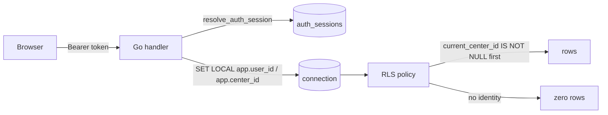

# 01 — SYSTEM OVERVIEW

## ما هو النظام

منصّة إدارة **مركز مهارات وعلاج للأطفال** في مصر. طرفاه:

1. **بوّابة الأسرة** (`web/portal`) — وليّ الأمر يرى جدول طفله، تقدّمه، برنامجه
   المنزلي، فواتيره، تقاريره، ويشاهد جلسته **بثًّا مباشرًا**، ويرسل طلبات.
2. **تطبيق المركز** (`web/ops`) — الاستقبال والأخصائيون ومدير المركز: الحجز،
   الجلسات، الخطط، التقارير، الفواتير، طلبات الالتحاق، المستخدمون، الإعدادات،
   ومحتوى الموقع.
3. **الموقع التعريفي** (`site/`) — السطح **الوحيد** المقصود أن يكون على الإنترنت
   المفتوح؛ بابه الوحيد إلى النظام هو رابط **طلب الالتحاق** في البوّابة.

## الستاك — مثبَّت

```
PostgreSQL 17  ←  PL/pgSQL (قواعد العمل)
       ↑
  Go (api/hbhd) ←  طبقة نقل: تصادق، تنقل، تترجم رموز الرفض
       ↑
 Angular 20 (portal · ops · shared)     +     HTML/CSS/JS خام (site)
```

**لا React ولا Vue.** مكتبة رسوم واحدة تُختار مرة وتُوثَّق.

## القواعد الخمس التي تحكم كل شيء

| # | القاعدة | أين تُفرض |
|---|---|---|
| ١ | **مصدر حقيقة واحد: PostgreSQL** — لا كتابة مزدوجة | قرار `D-26`؛ أوراكل/APEX متوقّفة منذ 2026-09-03 |
| ٢ | **قواعد العمل في PL/pgSQL** — لا في Go ولا في Angular | ١٧٠ دالّة · ٩٩ رمز رفض · الطبقة تنقل ولا تقرّر |
| ٣ | **الحذف ناعم دائمًا** (`active_flg` + `deleted_at`) — **لا منحة `DELETE` على أي جدول** | `DELETE` في الـAPI = أرشفة (`store.SoftDelete`) |
| ٤ | **كل وصول يمرّ عبر RLS** والصلاحية تُفحص **داخل السياسة** | ١٩٥ سياسة على ٨٧ جدولًا · دور `hbh_app` بـ`NOSUPERUSER, NOBYPASSRLS` ولا يملك جدولًا |
| ٥ | **الحالات آلات حالة** مقيَّدة بجدول تاريخ — لا تحديث حرّ لعمود حالة | ٨ دوالّ `legal_*_transition` + مشغّلات |

## القرارات المقفلة (قرارات عمل، لا تخصّ المحرّك)

- **مصر:** `EGP` · `Africa/Cairo` · عطلة الجمعة والسبت · تقويم ميلادي · رقم قومي
  ١٤ رقمًا · جوال `01XXXXXXXXX` — **وكلها بارامترات، لا ثوابت في الكود**.
- **طفل واحد لكل جلسة.** لا جلسات جماعية ولا جداول مشاركين (قيد استبعاد على الطفل).
- **بث مباشر فقط — ولا تسجيل، أبدًا.** لا جدول تسجيلات، ولا عمود احتفاظ، و
  `ck_att_no_video` يرفض أي `mime` يبدأ بـ`video/`. «لحظة مهمّة» = ملاحظة سريرية
  بختم زمني.
- **كل لحظة تُخزَّن UTC وتُقارَن UTC.** `timestamptz` دائمًا؛ التحويل للعرض فقط.

## الأرقام — مقيسة 2026-09-12

| الطبقة | القياس |
|---|---|
| الهجرات | **١٢٩** (`0001`…`0129`) · ٢٧٢٣٥ سطر SQL |
| الجداول | **٨٦** في سكيما `hbh` |
| العروض | **١٥** (`v_*`) — كلها `security_invoker = true` |
| الدوالّ | **~١٧٠** (منها ٦٨ تُنادى من Go، والباقي مشغّلات وحُرّاس وأدوات) |
| سياسات RLS | **١٩٥** على **٨٧** جدولًا (`ENABLE ROW LEVEL SECURITY`) |
| المشغّلات | **٢١٢** |
| رموز الرفض | **٩٩** (`HB001`…`HB253`) — منها `HB202` و`HB210` متقاعدان |
| مسارات API صريحة | **١١٨** |
| مسارات CRUD مولَّدة | **~١٧٨** (٣٠ موردًا) — الإجمالي **~٢٩٦** |
| شاشات Angular | **٥٦** (بوّابة ٢٠ · كونسول ٢٨ · مشتركة ٨) |
| كود Go | ١٩١٨٦ سطرًا |
| كود TypeScript | ٢٢٨٨٩ سطرًا |
| اختبارات القاعدة | ١٧ مجموعة `pXX` · ١٢٦٩٢ سطرًا |
| اختبارات API | ١٠ مجموعات `aXX` · ٤٧٦٤ سطرًا |

## الطبقات ومسؤوليّتها

| الطبقة | المجلّد | ماذا تقرّر | ماذا لا تقرّر |
|---|---|---|---|
| القاعدة | `db/migrations` · `db/seed` | **كل** قاعدة عمل · كل انتقال حالة · كل صلاحية · كل عزل مركز | شكل الردّ · النصوص |
| الخدمة | `api/internal/{http,store,domain,sms,meeting,auth,audit,config}` | المصادقة · ضبط هوية الطلب (`SET LOCAL`) · ترجمة `SQLSTATE` إلى HTTP · حدّ المعدّل · CORS · رؤوس الأمن | لا شيء من قواعد العمل |
| البوّابة | `web/portal` | العرض · التنقّل · اختيار الطفل الحالي | لا تخويل (إخفاء زر ليس ضابطًا) |
| الكونسول | `web/ops` | العرض · حرّاس المسار (تحسين تجربة، لا أمان) | لا تخويل |
| الموقع | `site` | صفحة عامّة ثابتة | **لا يمرّر شيئًا إلى الخدمة** — هذا كلّ أمانه |

## هوية الطلب والعزل



- `current_center_id()` · `current_user_id()` · `current_portal_user()` ·
  `current_user_is_staff()` — كلها `SECURITY DEFINER` لكسر الحلقة (السياسة على
  `users` تناديها وهي تقرأ `users`).
- **كل سياسة تبدأ بـ`hbh.current_center_id() IS NOT NULL`** قبل أي شرط آخر.
- **الهوية تفشل مقفولة**: لا هوية = **صفر صفوف**، لا كل الصفوف.

## أسطح النشر

| السطح | منفذ | عامّ؟ | ملفّ |
|---|---|---|---|
| API | 8090 | لا (`127.0.0.1` + نفق) | `deploy/server/api.native.sh` |
| البوّابة | — | لا (لم تُنشر بعد) | `deploy/server/web.native.mjs` |
| الكونسول | — | لا | نفس الخادم الثابت |
| الموقع | 8093 | **نعم** — دومين حقيقي | `deploy/server/site.native.mjs` |
| الصيانة | — | — | `cron` كل ساعة · `maintenance.native.sh` |

> **الخادم الثابت واحد يخدم ثلاثة أصول** — وهذا هو بالضبط ما سبَّب حادثة نشر
> حقيقية (رمز دخول أي وليّ أمر مُتاحًا على الإنترنت المفتوح ١١ دقيقة). القاعدة
> المستفادة والمكتوبة في `CLAUDE.md`: **القاعدة تُكتب حيث تُنفَّذ**، و`site.native.mjs`
> صار يحمل قائمة سماح لأنواع الملفّات بدل قائمة منع.

## أسئلة مفتوحة

**OQ-01** — النطاق الحاضر يقول «بوابة ولي الأمر + تطبيق المركز». `hbh.branches`
موجود ومبذور بفرع واحد، ولا شاشة ولا مسار يديره. هل تعدُّد الفروع نطاقٌ قادم أم
عمودٌ يُجمَّد؟ (أثره: كل سياسة تحمل `branch_id`، و`v_*` لا تفلتر به.)
