# 03 — MASTER BUSINESS FLOW MAP

**١٤ فلو** `FL-01`…`FL-14`. الخطّ المتّصل = موصول ومُشي · الخطّ المتقطّع = القاعدة
موجودة والطريق مقطوع.

---

## الخريطة العليا — رحلة الطفل من الباب إلى التقرير

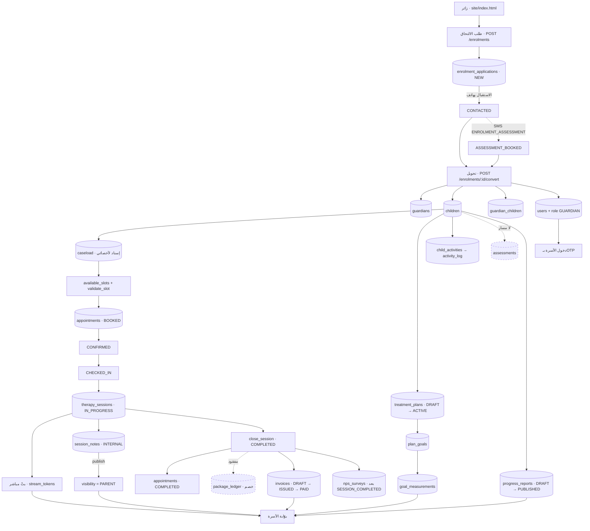

**اقرأ الخريطة هكذا:** الطرفان ممتازان — الطلب والتحويل من جهة، والجلسة والفاتورة
والتقرير من جهة. **والمسافة بينهما هي التي تُصنع مرّةً واحدة لكل طفل** (منح الحساب ·
الإسناد · كتابة الخطة)، وهي التي لم تُختبَر لأن كل تجهيزة اختبار تنطلق من حالة
تُبنى بـ`INSERT` مباشر بدور المالك.
> **ما يُختبر هو ما يتكرّر، وما يُنسى هو ما يحدث مرّة.**

---

## FL-01 · Parent Enrolment Flow (الالتحاق)

| الحقل | القيمة |
|---|---|
| **Starting Point** | الموقع التعريفي → رابط البوّابة → `/apply` |
| **Actors** | زائر (مجهول) → RECEPTION / CENTER_ADMIN |
| **Preconditions** | لا شيء. **أوّل كتابة غير مصادَقة في السكيما** |
| **Statuses** | `NEW → CONTACTED → ASSESSMENT_BOOKED → ENROLLED` · `REJECTED` · `DUPLICATE` |
| **Screens** | `portal/features/apply/apply.ts` → `ops` `/enrolments` |
| **Backend** | `POST /api/v1/enrolments` → `PATCH /api/v1/enrolments/{id}` → `POST .../convert` |
| **Entities** | `enrolment_applications` → `guardians` + `children` + `guardian_children` + `users` + `user_roles` |
| **Notifications** | SMS `ENROLMENT_SUBMITTED` · `ENROLMENT_ASSESSMENT` |
| **Final Result** | أسرة لها سجلّ حقيقي وحساب بوّابة |
| **Related** | FL-02 · FL-03 · FL-13 |

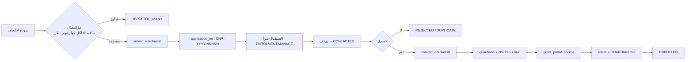

**Alternative Flow:** `NEW → REJECTED` أو `NEW → DUPLICATE` مباشرة.
**Exception Flow:** `HB091` تحويل من حالة غير مسموحة · `HB090` انتقال حالة غير
قانوني · تصادم جوال عند منح الحساب (`0126`).

**Preconditions التي يفرضها الكود:** التحويل مرفوض من أي حالة غير `CONTACTED` أو
`ASSESSMENT_BOOKED` — أي أن **إنسانًا قد هاتف الأسرة وحرّك الصفّ بيده** قبل أن يصل
التحويل. وهذا بالضبط ما جعل ضمّ منح الحساب إلى التحويل آمنًا في `0125`: تصحيحٌ
أُدخل بالخطأ لا يصل إلى هنا، وملفٌّ يُفتح قبل موافقة الأسرة كذلك.

---

## FL-02 · Parent Account & Login Flow

| الحقل | القيمة |
|---|---|
| **Starting Point** | `/login` في البوّابة |
| **Actors** | GUARDIAN |
| **Preconditions** | صفّ في `hbh.users` بجوال الأسرة **مقيَّسًا** — يُنشأ حصرًا عبر FL-01 |
| **Backend** | `POST /auth/otp/request` → `POST /auth/otp/verify` → توكن Bearer |
| **Entities** | `users` · `otp_codes` · `auth_sessions` · `sms_outbox` |
| **Final Result** | جلسة عمرها ٤٨٠ دقيقة |
| **Related** | FL-01 · FL-13 |

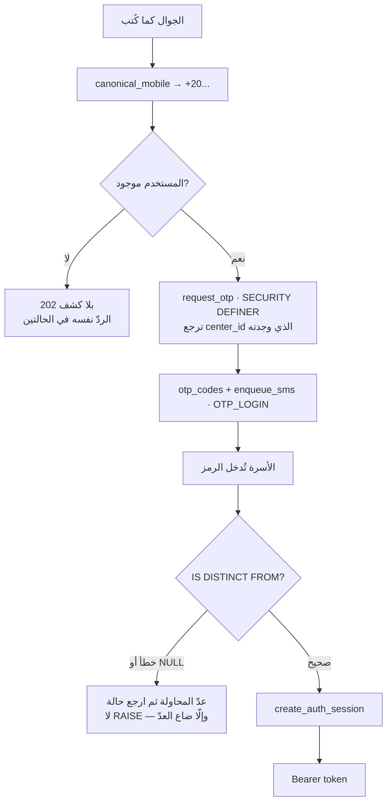

**Exception Flow:** `OTP_MAX_ATTEMPTS` (٥) · انقضاء `OTP_TTL_MINUTES` (١٥) ·
`OTP_RESEND_SECONDS` (٦٠) · حدّ معدّل IP.
**قاعدة الكشف:** الردّ على جوال **موجود** لا يُفرَّق عنه على جوال **غير موجود** —
وإلّا تعلّم من يجرّب الأرقام أيّها حقيقي. **ويُكتب الفحص بمقارنة جسمين من نفس
النقطة، لا بجسم متوقَّع منسوخ** (و`request_id` وحده يُستثنى: هو الحقل الذي **يجب**
أن يختلف).

---

## FL-03 · Assignment Flow (الإسناد)

| الحقل | القيمة |
|---|---|
| **Starting Point** | `/caseload` في الكونسول (شاشة مورد عامّة) |
| **Actors** | CENTER_ADMIN · RECEPTION |
| **Preconditions** | طفل نشط + أخصائي + خدمة |
| **Backend** | `POST /api/v1/caseload` (CRUD عامّ · **بلا دالّة تحمل قواعده**) |
| **Entities** | `caseload` |
| **Notifications** | `STAFF_CHILD_ASSIGNED` |
| **Final Result** | الأخصائي مسؤول عن هذا الطفل في هذه الخدمة — **شرطُ بدء الجلسة** |
| **Status** | 🟡 موصول بلا قواعد |

**الناقص المُثبت:** لا شيء يفحص أن الأخصائي **يقدّم** هذه الخدمة
(`therapist_services`)، ولا أن الطفل نشط، ولا يمنع إسنادين متعارضين. القواعد
موجودة كبيانات ولا تُسأل. الباكلوج `HBH-049` (دالّة) و`HBH-013` (مسار).

---

## FL-04 · Booking Flow (الحجز)

| الحقل | القيمة |
|---|---|
| **Starting Point** | `/appointments` (شاشة اليوم) |
| **Actors** | RECEPTION · CENTER_ADMIN (`APPOINTMENT.BOOK`) |
| **Preconditions** | خدمة في الكتالوج · أخصائي له `therapist_services` و`therapist_working_hours` · غرفة (إن `IN_PERSON`) |
| **Backend** | `GET /appointments/slots` → `POST /appointments/validate` → `POST /appointments` |
| **Entities** | `appointments` · `appointment_status_history` · `meetings` (إن `ONLINE`) |
| **Notifications** | `APPOINTMENT_BOOKED` / `APPOINTMENT_RESCHEDULED` · `STAFF_APPOINTMENT_BOOKED` · SMS `APPOINTMENT_BOOKED` |

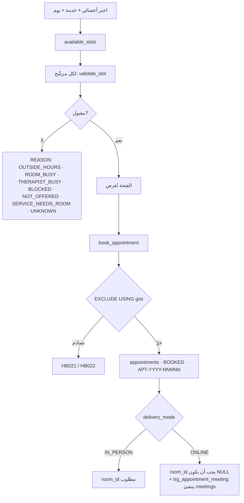

**قاعدة معمارية لا تُنقض:** **الحجز المزدوج يُمنَع بقيد استبعاد داخل جدول واحد.**
جدولٌ ثانٍ للاستشارات يمنح وقت الأخصائي **مصدرين** ولا شيء في المحرّك يستطيع أن
يمنع استشارةً وجلسةَ علاج في نفس الدقيقة. **ولهذا الاستشارة الأونلاين موعدٌ في
نفس الجدول** (`D-13` · `0117`).

**Exception Flow:** `ALLOW_BACKDATED_BOOKING_DAYS` يحكم الحجز بأثر رجعي ·
`SLOT_GRANULARITY_MIN` (١٥) يحكم دقّة الفتحة · `block_conflicts` يحترم
`schedule_blocks`.

---

## FL-05 · Appointment Status Flow

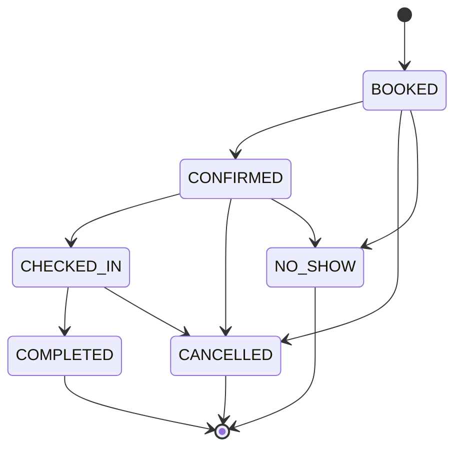

| الحقل | القيمة |
|---|---|
| **Backend** | `PATCH /api/v1/appointments/{id}/status` |
| **Enforcement** | `trg_appointment_status` (BEFORE) + `legal_appointment_transition` — الرفض `HB020` |
| **History** | `trg_appointment_history` (AFTER) — **الآلة تعمل قبل التاريخ، فانتقالٌ غير قانوني لا يخلّف أثرًا على الصفّ** |
| **Permissions** | `APPOINTMENT.BOOK` للتأكيد والحضور · `APPOINTMENT.CANCEL` للإلغاء |
| **Notifications** | `APPOINTMENT_CANCELLED` · `STAFF_APPOINTMENT_CANCELLED` (**معرَّف وغير مُرسَل**) |

> 🔴 **درس محرّك:** جملةٌ تنقل موعدًا من `BOOKED` إلى `CONFIRMED` ثم إلى `CHECKED_IN`
> **تتركه عند `CONFIRMED`** — الصفّ لا يُحدَّث إلّا مرّة واحدة في الجملة الواحدة،
> والثاني يُهمَل **بصمت**. فيُرفض الاختبار التالي بـ`HB024` بدل `HB023`: **رفضٌ
> للسبب الخطأ لا يثبت شيئًا. كل انتقال حالة جملة مستقلّة.**

---

## FL-06 · Session Flow (الجلسة)

| الحقل | القيمة |
|---|---|
| **Starting Point** | `/my-day` (الأخصائي) أو `/sessions` |
| **Actors** | THERAPIST (`SESSION.START` · `SESSION.COMPLETE`) |
| **Preconditions** | الموعد `CHECKED_IN` · الخدمة `creates_session_flg` · وصفّ `caseload` إن `needs_caseload_flg` |
| **Backend** | `POST /appointments/{id}/session` → `PUT /sessions/{id}/note` → `PATCH /sessions/{id}/close` |
| **Entities** | `therapy_sessions` · `session_status_history` · `session_notes` · `stream_tokens` |
| **Statuses** | `IN_PROGRESS → COMPLETED` \| `ABORTED` |
| **Final Result** | جلسة مغلقة · موعد `COMPLETED` · ملاحظة `INTERNAL` |

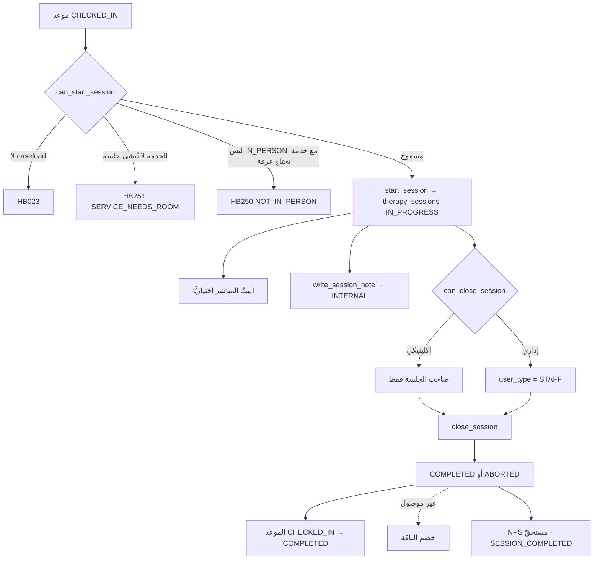

**Exception Flow:** `HB026` ليست جلستك · انتقال غير قانوني `HB025`.
> **الجلسة تُولد عند البدء، لا قبله.** لا صفّ في `therapy_sessions` قبل ضغط
> «ابدأ» — راجع 17.

---

## FL-07 · Live Viewing Flow (البثّ)

| الحقل | القيمة |
|---|---|
| **Starting Point** | بوّابة `/live` · كونسول `/sessions/:id/live` |
| **Actors** | GUARDIAN (بموافقة `LIVE_VIEW`) · THERAPIST · CENTER_ADMIN |
| **Preconditions** | جلسة `IN_PROGRESS` · كاميرا مربوطة بغرفة الموعد · موافقة مسجَّلة · `LIVE.VIEW` |
| **Backend** | `POST /sessions/{id}/stream` → كوكي `HttpOnly` → ترحيل البايتات → `POST /stream/close` |
| **Entities** | `cameras` · `stream_tokens` · `stream_views` · `consents` |

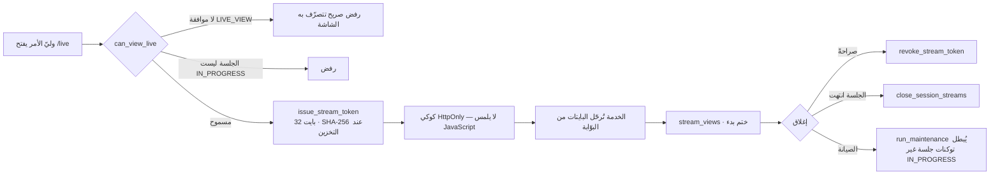

**لا يظهر في أي ردّ:** توكن · مسار كاميرا · عنوان IP · اعتماد. ١٨ فحصًا تثبت ذلك.

---

## FL-08 · Clinical Record Flow (الخطة والقياس والملاحظة والتقرير)

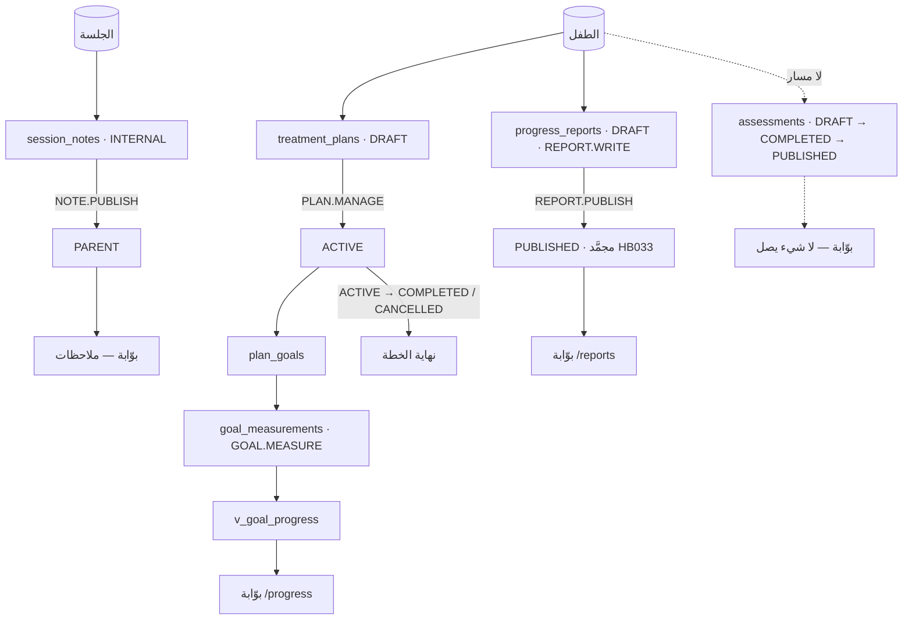

**سلّم الرؤية — ١١ فحصًا في مجموعة الـAPI:**

| الأثر | ما تراه الأسرة |
|---|---|
| ملاحظة جلسة | `visibility = PARENT` **و** ليست مسودّة **و** لها معتمِد — **وكل ملاحظة تُولد `INTERNAL`** |
| تقرير تقدّم | `PUBLISHED` وحده |
| تقييم | `PUBLISHED` وحده — ولا مسار يصنعه |

> **الملاحظة الداخلية لا تصل، ومسودّة التقرير عن طفله هو تُجيب `404`** — وليس `403`،
> لأن `403` تخبر بوجود ما لا يجوز له معرفته.

---

## FL-09 · Home Programme Flow (البرنامج المنزلي)

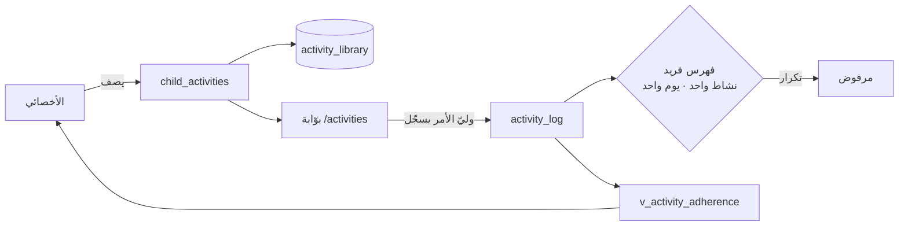

**الخطّ:** الأهل **يسجّلون** ولا **يصفون**. وليّ أمر يستطيع تعديل الوصفة يستطيع
أن يعيد كتابة البرنامج بهدوء ثم يبلّغ التزامًا كاملًا به.

---

## FL-10 · Billing Flow (الفاتورة)

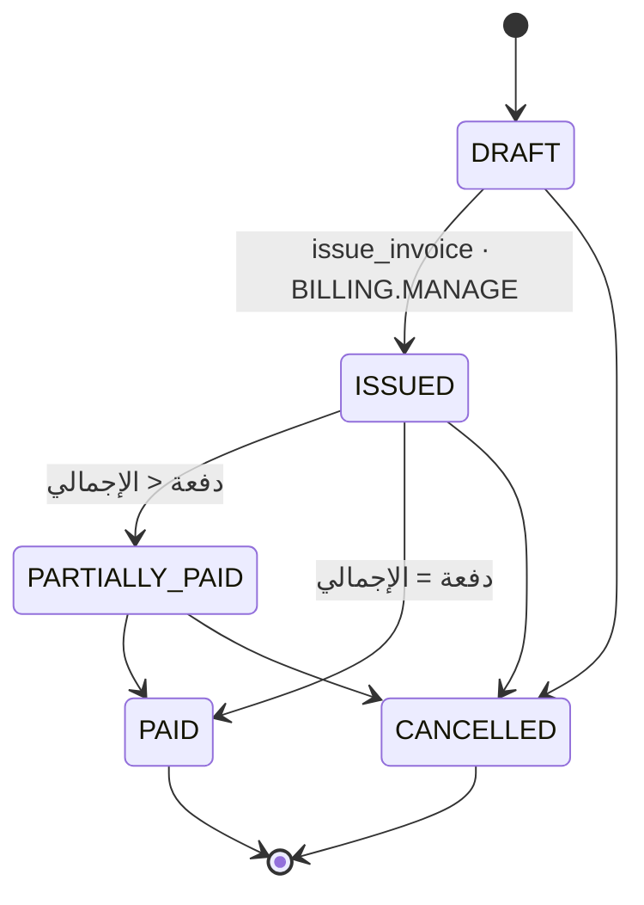

| الحقل | القيمة |
|---|---|
| **Screens** | `billing-overview.ts` · `billing-ledger.ts` · `INVOICES_SPEC` · بوّابة `/billing` |
| **Backend** | `POST /invoices` → `POST .../lines` → `POST .../issue` → `POST .../payments` |
| **Entities** | `invoices` · `invoice_lines` · `payments` · `v_child_balance` |
| **Notifications** | `INVOICE_ISSUED` |

**قواعد:** **الإجمالي مشتقّ ولا يُدخَل** — مشغّل من البنود، و`paid_amt` من الدفعات.
`trg_line_guard` يمنع تعديل بنود فاتورة صادرة. `trg_payment_guard` يمنع دفعة على
مسوّدة (`HB052`). والفاتورة `PAID` لا تعود.
**والباقة:** `sell_package` تكتب رصيدًا و`package_ledger` مضاف-فقط — **ولا شيء
يخصم**. راجع 18 · C-01.

---

## FL-11 · Parent Request Flow (الطلبات)

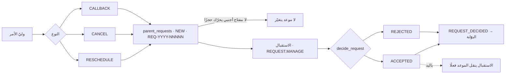

**«الطلب ليس فعلًا»** — والبتّ **لا ينقل الموعد تلقائيًّا**؛ الاستقبال ينقله بيده
بعد القبول. راجع `OQ-08` أدناه.

---

## FL-12 · Online Consultation Flow (الاستشارة)

| الحقل | القيمة |
|---|---|
| **Starting Point** | الاستقبال يحجز موعدًا `delivery_mode = 'ONLINE'` |
| **Actors** | **وليّ الأمر هو الحاضر، لا الطفل** — وهذه وحدها تكسر ثلاثة افتراضات |
| **Preconditions** | خدمة بـ`creates_session_flg = false` · موعد `CONFIRMED` · نافذة الوقت فُتحت |
| **Backend** | `POST /appointments/{id}/consultation` |
| **Entities** | `appointments` · `meetings` · `meeting_tokens` |

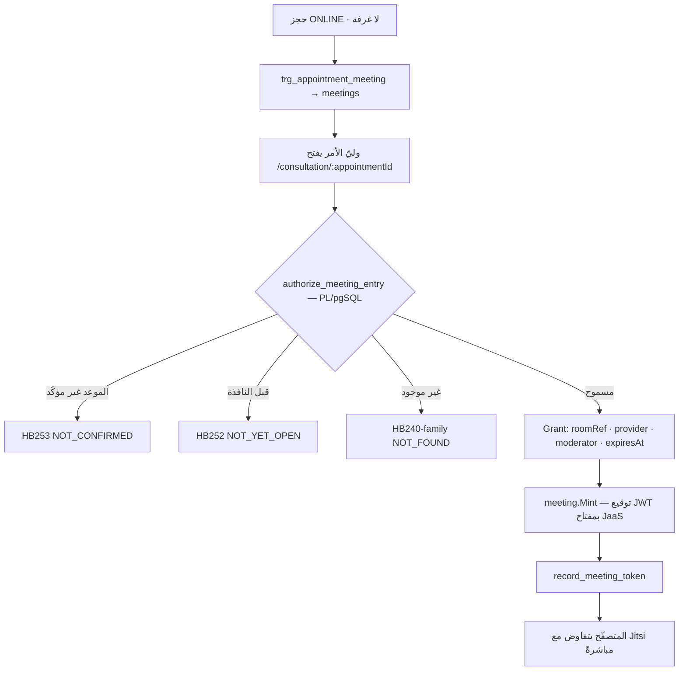

**الحدّ المعماري:** `meeting.Mint` **لا تأخذ إلّا `Grant`**، والشيء الوحيد الذي
يبنيه هو دالّة المخزن التي تنادي القاعدة. **لا طريق مُصدَّر لقول «أعطني توكنًا
للغرفة X»** — ذلك بابٌ ثانٍ بجوار الباب الذي عليه كل الفحوص.
**والحزمة لا تعرف ما هو الطفل** — القاعدة ٢.

**الناقص:** لا شاشة كونسول يدخل منها الأخصائي · لا جدول `consultation_requests` ·
ولا طريق يجعل `registration_source = 'ONLINE_CONSULTATION'` قيمةً يكتبها أحد.

---

## FL-13 · Staff Onboarding & Access Flow

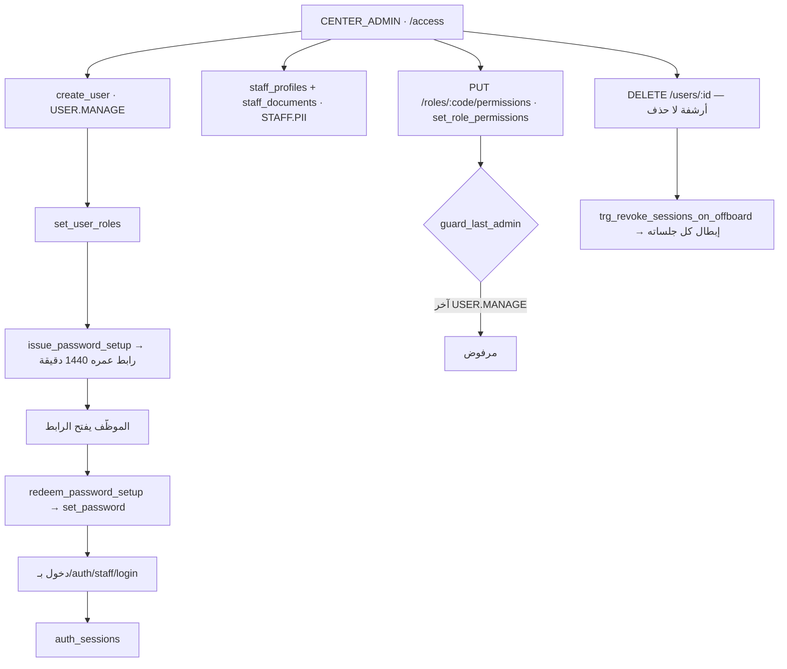

---

## FL-14 · Site Content & Publish Flow

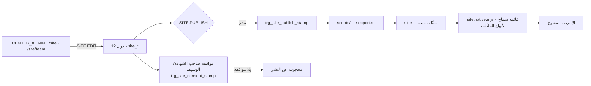

**الأمان هنا سلبيّ لا إيجابيّ:** لا شيء في هذا السطح يمرّر إلى الخدمة — و
**بندُ بطاقة النشر الأوّل ليس تصميمًا بل `grep` مسجَّل على `proxy_pass`.**
> **واختبار النشر يسأل عمّا يجب ألّا يُجاب، لا عمّا يجب أن يُجاب:** `/` بـ`200` لا
> يثبت شيئًا، و`/api/v1/...` بغير `404` يثبت كل شيء.

---

## الفلوهات المقطوعة — ملخَّص

| الفلو | القطع | الدليل |
|---|---|---|
| **قائمة الانتظار** | صفر مسار فوق ٧ دوالّ | `grep add_to_waiting_list api/ web/` = ٠ |
| **الحجز المتكرّر** | صفر مسار فوق `book_recurring` | كذلك |
| **التقييمات** | صفر مسار فوق ٤ جداول و٦ دوالّ | كذلك |
| **المرفقات** | صفر مسار عامّ (عدا صورة الطفل) | كذلك |
| **خصم الباقة** | صفر منادٍ لـ`consume_package_session` في أي طبقة | `grep` على db و api و web |
| **إغلاق الجدول** | `schedule_blocks` تُقرأ ولا تُكتب | ليست في `store.Resources()` |
| **حساب بوّابة لأسرة من المركز** | لا مسار لـ`grant_portal_access` | يُنادى من `convert_enrolment` وحده |
| **الخطّ الزمني للحالة** | `v_case_timeline` بلا قارئ | `HBH-045` |
| **تنبيه التوقّف الصامت** | `v_backup_health` · `v_maintenance_health` · `v_sms_health` بلا قارئ | `HBH-008` |

---

## OPEN QUESTIONS

| # | السؤال | الأثر |
|---|---|---|
| **OQ-08** | قبول طلب `RESCHEDULE` — هل يُنقل الموعد تلقائيًّا أم يبقى نقلًا يدويًّا؟ ومن يتحمّل لو نُسي؟ | FL-11 · FL-04 · الإشعار · ثقة الأسرة |
| **OQ-09** | هل يجوز إلغاء موعد **مؤكَّد** بعد الدفع؟ وما أثره على الفاتورة والباقة والاسترداد؟ | FL-05 · FL-10 · F-35 |
| **OQ-10** | من يملك بدء الاستشارة الأونلاين من جهة المركز، ومن أي شاشة؟ | FL-12 · F-36 |
| **OQ-11** | جلسة `ABORTED` — هل تُحتسَب على الأسرة (باقةً أو فاتورةً)؟ | FL-06 · FL-10 |
