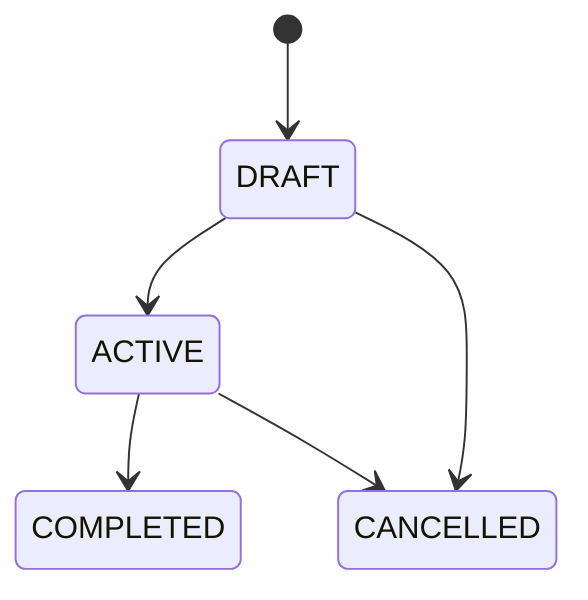
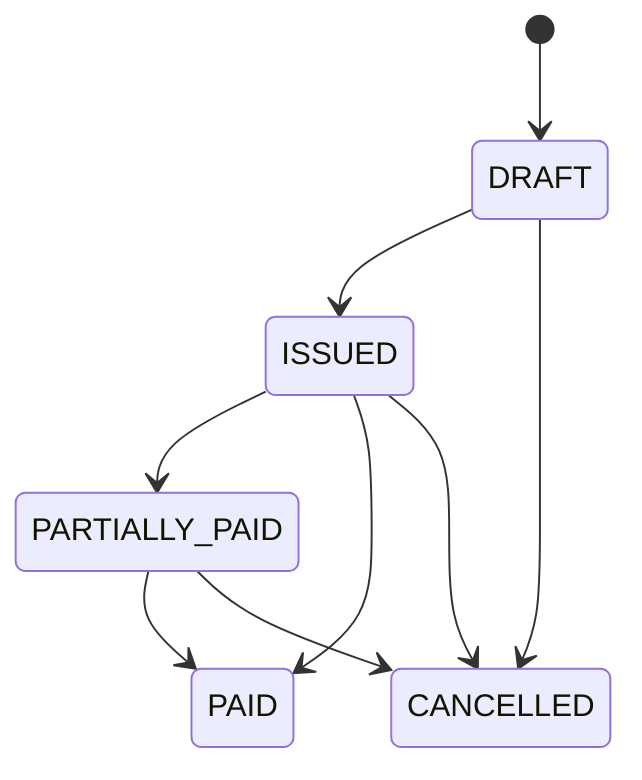
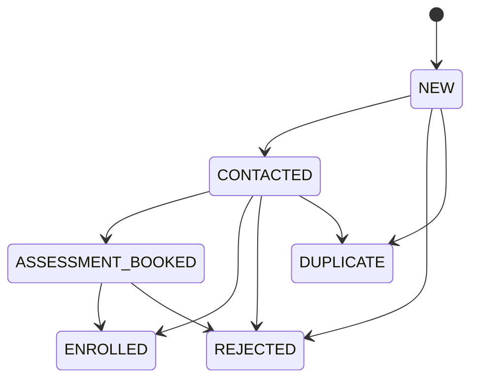
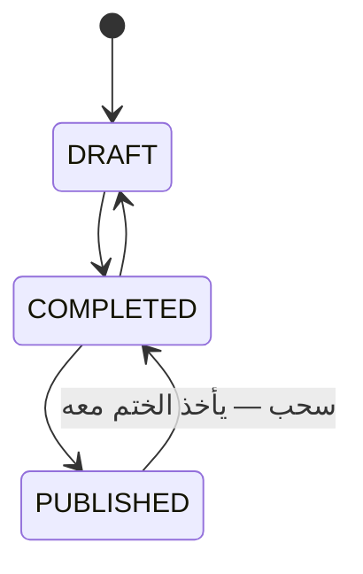
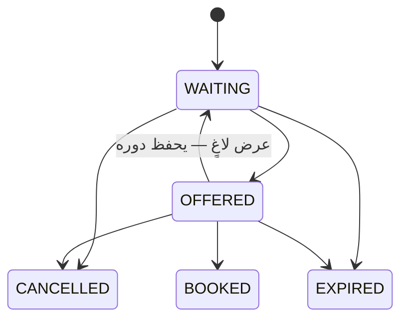
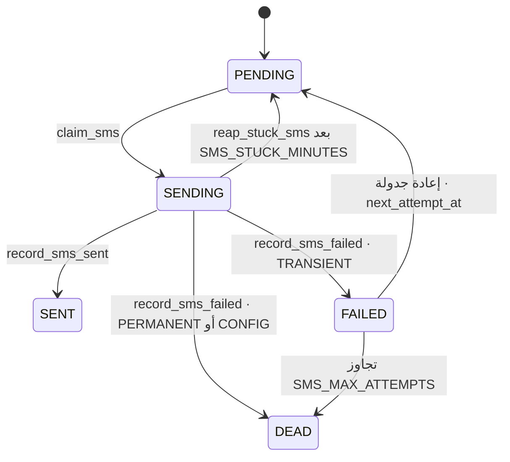

# 05 — STATUS INVENTORY

**كل عمود حالة في السكيما، بقيمه من `CHECK` وبانتقالاته من `legal_*_transition`.**
القاعدة ٥: **الحالات آلات حالة — لا تحديث حرّ لعمود حالة، ولا من مدير المركز.**

---

## جدول القيادة

| الكيان | العمود | القيم | الآلة مفروضة؟ | جدول تاريخ؟ | رمز الرفض |
|---|---|---|:--:|:--:|---|
| `appointments` | `status` | ٦ | ✅ `trg_appointment_status` | ✅ `appointment_status_history` | `HB020` |
| `therapy_sessions` | `status` | ٣ | ✅ `trg_session_status` | ✅ `session_status_history` | `HB025` |
| `treatment_plans` | `status` | ٤ | ✅ `trg_plan_status` | ❌ (تدقيق عامّ) | `HB030` |
| `plan_goals` | `status` | ٣ | ❌ **بلا آلة** | ❌ | — |
| `invoices` | `status` | ٥ | ✅ `trg_invoice_status` | ❌ | `HB050` |
| `parent_requests` | `status` | ٣ | ✅ `trg_request_status` | ❌ | `HB040` |
| `enrolment_applications` | `status` | ٦ | ✅ `trg_enrolment_status` | ❌ | `HB090` |
| `assessments` | `status` | ٣ | ✅ `trg_assessment_guard` | ❌ | `HB140`-family |
| `waiting_list` | `status` | ٥ | ✅ `trg_wait_status` | ❌ | `HB130`-family |
| `child_packages` | `status` | ٤ | ❌ **بلا آلة** | ✅ `package_ledger` | — |
| `session_notes` | `visibility` | ٢ | ✅ `trg_note_publish_guard` | ❌ | `HB031`-family |
| `attachments` | `visibility` | ٢ | ✅ `trg_attachment_publish_guard` | ❌ | — |
| `progress_reports` | `status` | ٢ | ✅ `trg_report_guard` | ❌ | `HB033` |
| `users` | `status` | ٣ | ❌ **بلا آلة** | ❌ | — |
| `children` | `status` | ٤ | ❌ **بلا آلة** | ❌ | — |
| `therapists` | `status` | ٣ | ❌ **بلا آلة** | ❌ | — |
| `therapists` | `profile_status` | ٣ | ✅ `trg_therapist_profile_status` | ❌ | — |
| `site_texts` | `status` | ٢ | ✅ `trg_site_publish_guard` | ❌ | — |
| `sms_outbox` | `status` | ٥ | ❌ (دوالّ مقيَّدة) | ❌ | — |
| `meetings` | `status` | ٤ | ❌ **بلا آلة ولا تاريخ** | ❌ | — |
| `cameras` | `status` | ٤ | ❌ | ❌ | — |

> ⚠️ **ملاحظة على القاعدة ٥:** جدولا تاريخٍ فقط موجودان (`appointment_status_history`
> و`session_status_history`). بقيّة الآلات تعتمد على `audit_log` العامّ لسجلّ
> الانتقال، وهو **ليس نفس الشيء**: التدقيق يحمل الصفّ كاملًا لا `from_status →
> to_status` باسمه، ولا يحمل `reason`. راجع 18 · C-18.

---

## ١ · APPOINTMENT — `hbh.appointments.status`

| Status | المعنى | من يضعها | من | إلى |
|---|---|---|---|---|
| `BOOKED` | حُجز ولم يُؤكَّد | `book_appointment` (ولادة) | — | `CONFIRMED` · `CANCELLED` · `NO_SHOW` |
| `CONFIRMED` | الأسرة أكّدت | `APPOINTMENT.BOOK` | `BOOKED` | `CHECKED_IN` · `CANCELLED` · `NO_SHOW` |
| `CHECKED_IN` | حضر فعلًا | `APPOINTMENT.BOOK` | `CONFIRMED` | `COMPLETED` · `CANCELLED` |
| `COMPLETED` | انتهى | `close_session` أو يدويًّا | `CHECKED_IN` | **نهائي** |
| `CANCELLED` | أُلغي — **وبسبب إلزامي** (`ck_appointments_cancel`) | `APPOINTMENT.CANCEL` | `BOOKED` · `CONFIRMED` · `CHECKED_IN` | **نهائي** |
| `NO_SHOW` | لم يحضر | `APPOINTMENT.BOOK` | `BOOKED` · `CONFIRMED` | **نهائي** |

**Frontend:** `ops/features/day/day-screen.ts` · `portal/shared/ui/status-badge.ts`
**Backend:** `PATCH /api/v1/appointments/{id}/status`
**قيد موثَّق:** «إلغاءٌ بلا سبب مذكور صفٌّ لا يستطيع أحد أن يشرحه لوليّ أمر بعد
ستّة أسابيع.»

> 🔴 **كل انتقال جملة مستقلّة.** جملةٌ واحدة تنقل `BOOKED → CONFIRMED → CHECKED_IN`
> تترك الصفّ عند `CONFIRMED` — الصفّ لا يُحدَّث إلّا مرّة في الجملة، والثاني يُهمَل
> بلا خطأ ولا تحذير.

---

## ٢ · SESSION — `hbh.therapy_sessions.status`

| Status | المعنى | من يضعها | من | إلى |
|---|---|---|---|---|
| `IN_PROGRESS` | مفتوحة الآن | `start_session` (ولادة) | — | `COMPLETED` · `ABORTED` |
| `COMPLETED` | أُغلقت طبيعيًّا | `close_session` (`SESSION.COMPLETE`) | `IN_PROGRESS` | **نهائي** |
| `ABORTED` | أُوقفت — و`abort_reason` يُكتب | `close_session` | `IN_PROGRESS` | **نهائي** |

**الجلسة تُولد `IN_PROGRESS` عند البدء — لا صفّ قبله.**
`is_billable_flg` عمود مستقلّ عن الحالة (فالمُوقفة قد تُحتسب أو لا — راجع `OQ-11`).

---

## ٣ · TREATMENT PLAN — `hbh.treatment_plans.status`

الرفض `HB030`. الصلاحية `PLAN.MANAGE`.
> 🔴 `0088` أضاف `HB210` («لا تُنشَّط خطة بلا هوية تُنسَب إليها») و`0090`
> **أسقطها** لأنها رفضت انتقالًا كان يعمل قبلها. **`HB210` متقاعد ولا يُعاد
> استعماله، والقاعدة نفسها غير مفروضة اليوم** (`HBH-044`).

## ٤ · PLAN GOAL — `hbh.plan_goals.status`

`OPEN` · `MET` · `DROPPED` — **بلا آلة حالة ولا رمز رفض.** أي انتقال مسموح،
و`MET → OPEN` ممكن. راجع 18 · C-17.

---

## ٥ · INVOICE — `hbh.invoices.status`

الرفض `HB050`. `PAID` نهائية. `trg_payment_recalc` هو من يحرّك
`ISSUED → PARTIALLY_PAID → PAID` من مجموع الدفعات، لا يد بشرية.
`trg_payment_guard` يرفض دفعةً على `DRAFT` بـ`HB052`.
> **ومشغّل `BEFORE` يعمل قبل `WITH CHECK` في RLS**: فدفعةٌ على مسوّدة تُرفض `HB052`
> **لأي أحد**، والاستقبال لا يصل إلى السياسة أصلًا. اختبار الصلاحية يحتاج صفًّا
> **تقبله قاعدة العمل** أوّلًا.

## ٦ · CHILD PACKAGE — `hbh.child_packages.status`

`ACTIVE` · `EXHAUSTED` · `EXPIRED` · `CANCELLED` — **بلا آلة حالة.**
- `EXPIRED` يضعها `expire_packages` (في `run_maintenance`).
- `EXHAUSTED` **يضعها `consume_package_session` — وهي بلا منادٍ.** أي أن
  **`EXHAUSTED` حالةٌ لا تُبلغ أبدًا في التشغيل.** راجع 18 · C-01.
- `CANCELLED` لا كاتب لها في أي طبقة.

---

## ٧ · PARENT REQUEST — `hbh.parent_requests.status`

`NEW → ACCEPTED` \| `NEW → REJECTED` · الرفض `HB040` · الصلاحية `REQUEST.MANAGE`.
**لا رجوع من `ACCEPTED`.** وأنواع الطلب `RESCHEDULE` · `CANCEL` · `CALLBACK` في
`lookup_values` تحت `REQUEST_KIND`.

> ⚠️ **قيمة الحالة مكرَّرة في مكانين:** `ck_req_status` على الجدول، **و**
> `lookup_values` تحت `REQUEST_STATUS` (`NEW` · `ACCEPTED` · `REJECTED`). مصدران
> لنفس المفردات، والثاني لا يقيّد شيئًا. راجع 19 · D-06.

---

## ٨ · ENROLMENT APPLICATION — `hbh.enrolment_applications.status`

| Status | المعنى | ملاحظة |
|---|---|---|
| `NEW` | وصل من الفورم | الولادة الوحيدة |
| `CONTACTED` | الاستقبال هاتف الأسرة | **الحدّ الأدنى لجواز التحويل** |
| `ASSESSMENT_BOOKED` | موعد تقييم محدَّد | يُرسل SMS `ENROLMENT_ASSESSMENT` (`0110`) |
| `ENROLLED` | صار سجلًّا حقيقيًّا | يضعها `convert_enrolment` · مختومة (`0026`) |
| `REJECTED` | مرفوض | نهائي |
| `DUPLICATE` | مكرَّر | نهائي · **ولا يمكن الوصول إليه من `ASSESSMENT_BOOKED`** |

الرفض `HB090` للانتقال · `HB091` للتحويل من حالة غير مسموحة.

> ⚠️ **مفردات مصدر ثانية على نفس الجدول:** `ck_enr_source CHECK (source_code IN
> ('WEB','PHONE','WALK_IN','REFERRAL'))` — وهي **مفردات مختلفة تمامًا** عن
> `guardians.registration_source IN ('CENTER','ENROLMENT_REQUEST','ONLINE_CONSULTATION')`
> التي أضافها `0129`. مفهومان اسمهما «المصدر» ولا يترجم أحدهما إلى الآخر.
> راجع 19 · D-01.

---

## ٩ · ASSESSMENT — `hbh.assessments.status`

**السحب مسموح ويأخذ الختم معه، كما تفعل الملاحظة: صفٌّ لا يجوز أن يبقي توقيعًا
على شيء لم يعد يقوله.** والمنشور **مجمَّد** (الملخّص والدرجات معًا).
🔴 **ولا مسار يصل أيًّا من هذه الانتقالات** — راجع F-31.

## ١٠ · WAITING LIST — `hbh.waiting_list.status`

`release_expired_offers` (في `run_maintenance`) هو **الشيء الوحيد الموصول** من
هذه الميزة. الباقي `DB-ONLY`.

---

## ١١ · VISIBILITY — `session_notes` · `attachments`

| القيمة | المعنى |
|---|---|
| `INTERNAL` | **كل ملاحظة وكل مرفق يُولد هكذا** (`trg_note_born_internal` · `trg_attachment_born_internal`) |
| `PARENT` | الأسرة ترى — يحتاج `NOTE.PUBLISH` / `ATTACHMENT.PUBLISH` وختم ناشر |

**سلّم الرؤية للملاحظة ثلاثيّ**: `visibility = PARENT` **و** ليست مسودّة **و**
لها معتمِد. وأيّ واحد ناقص = لا تظهر.
**ومسودّة التقرير عن طفله هو تُجيب `404` لا `403`** — لأن `403` تخبر بوجود ما لا
يجوز له معرفته.

## ١٢ · REPORT · SITE TEXT — `DRAFT` → `PUBLISHED`

- `progress_reports`: `HB033` يرفض تعديل المنشور — **تاريخٌ قرأته أسرة.** «أسرة
  قرأت نتيجةً في مارس يجب أن تجدها نفسها في سبتمبر.»
- `site_texts`: `SITE.EDIT` للمسودّة · `SITE.PUBLISH` للنشر · `guard_site_text_locked`
  يمنع تعديل نصّ مقفول.

---

## ١٣ · SMS OUTBOX — `hbh.sms_outbox.status`

**`error_class`:** `TRANSIENT` يعيد · `PERMANENT` لا · `CONFIG` يعني أن هذا النشر
لا يستطيع الإرسال أصلًا وإعادة المحاولة ستفشل بنفس الشكل.
**غير مفروضة بآلة** — لكن كل انتقال داخل دالّة واحدة مقيَّدة، وهو ما يحلّ محلّها.

## ١٤ · MEETING — `hbh.meetings.status`

| القيمة | كاتبها |
|---|---|
| `READY` | **الافتراضي** — `trg_appointment_meeting` |
| `CLOSED` | تحديث في `0121` · و`ck_meetings_closed` يربطها بـ`closed_at` |
| `PENDING` | **لا كاتب** ⚫ |
| `FAILED` | **لا كاتب** ⚫ |

> ⚠️ `meetings` **بلا مشغّل آلة حالة وبلا جدول تاريخ** — خرقٌ للقاعدة ٥ على
> الجدول الأحدث في السكيما. راجع 18 · C-11.
> و`ck_meetings_provider` يسمح بـ`'DAILY'` **ولا يعرفه Go** (`meeting.go` يعرّف
> `JITSI_JAAS` و`JITSI_PUBLIC` وحدهما) — قيمةٌ لو كُتبت لصار التوقيع مستحيلًا.
> راجع 18 · C-12.

---

## ١٥ · حالات الكيانات الأساسية — بلا آلة، وهي قرار

| الجدول | العمود | القيم | من يحرّكها |
|---|---|---|---|
| `users` | `status` | `ACTIVE` · `SUSPENDED` · `LOCKED` | `update_user` · `archive_user` |
| `children` | `status` | `ACTIVE` · `INACTIVE` · `GRADUATED` · `WITHDRAWN` | CRUD `PATCH /children/{id}` |
| `therapists` | `status` | `ACTIVE` · `ON_LEAVE` · `RESIGNED` | CRUD |
| `cameras` | `status` | `ONLINE` · `OFFLINE` · `FAULT` · `DISABLED` | CRUD |

**هذه تُحدَّث حرًّا داخل `CHECK` وحده.** ولا شيء يمنع `GRADUATED → ACTIVE`، ولا
`RESIGNED → ACTIVE`، ولا `LOCKED → ACTIVE` بلا سبب مسجَّل.
راجع 18 · C-17 — **هذا انطباقٌ ناقص للقاعدة ٥ على الكيانات الأساسية نفسها.**

---

## ١٦ · تحليل التداخل والتعارض بين الحالات

**الفحص المطلوب في §8: هل حالاتٌ مختلفة تُستعمل لنفس المعنى؟**

| المعنى | القيم المستعملة | الكيانات | الحكم |
|---|---|---|---|
| «مؤكَّد / جاهز» | `CONFIRMED` (موعد) · `READY` (لقاء) · `ACTIVE` (خطة · طفل · أخصائي · باقة · مستخدم) | ٦ | ✅ **مقبول** — كلّ في محور مختلف، ولا جدول يستعمل اثنتين |
| «منشور» | `PUBLISHED` (تقرير · تقييم · نصّ موقع · ملفّ أخصائي) · `PARENT` (ملاحظة · مرفق) | ٦ | ⚠️ **مفردتان لنفس القرار** — راجع 19 · D-02 |
| «انتهى» | `COMPLETED` (موعد · جلسة · خطة · تقييم) | ٤ | ✅ متّسق |
| «مُلغى» | `CANCELLED` (موعد · خطة · فاتورة · باقة · انتظار) | ٥ | ✅ متّسق |
| «انتهت صلاحيته» | `EXPIRED` (باقة · انتظار) · `DEAD` (SMS) · `WITHDRAWN` (طفل · ملفّ أخصائي) | ٥ | ⚠️ `WITHDRAWN` تعني «الأسرة انسحبت» على الطفل و«أُنزل عن الموقع» على الأخصائي — **معنيان لكلمة واحدة** · راجع 19 · D-03 |
| «مسودّة» | `DRAFT` (خطة · فاتورة · تقييم · تقرير · نصّ موقع · ملفّ أخصائي) · `INTERNAL` (ملاحظة · مرفق) · `NEW` (طلب · التحاق) | ١٠ | ⚠️ ثلاث مفردات لـ«لم يصل صاحبه بعد» |

**حالات لا يمكن الوصول إليها (مُثبَتة بغياب الكاتب):**

| الحالة | الكيان | لماذا |
|---|---|---|
| `EXHAUSTED` | `child_packages` | `consume_package_session` بلا منادٍ |
| `CANCELLED` | `child_packages` | لا كاتب في أي طبقة |
| `PENDING` | `meetings` | الافتراضي `READY` ولا مسار يضعها |
| `FAILED` | `meetings` | لا كاتب |
| `DUPLICATE` من `ASSESSMENT_BOOKED` | `enrolment_applications` | الآلة لا تسمح (وهذا **مقصود** على الأرجح — راجع `OQ-15`) |
| كل حالات `waiting_list` عدا `WAITING`/`EXPIRED` | `waiting_list` | صفر مسار |
| كل حالات `assessments` | `assessments` | صفر مسار |

> **حالةٌ لا يمكن الوصول إليها ليست خطرًا بذاتها** — خطرها أنها تقرأ كقدرة قائمة
> في أي تخطيط، فتُبنى شاشةٌ عليها ثم لا يصلها شيء. وهو بالضبط ما وقع مع
> `available_slots` والاستشارة الأونلاين: **الميزة كاملة وغير قابلة للوصول، و١١٥٠
> فحصًا خضراء، ولم يسأل أحد: هل يستطيع أحد إنشاء الصفّ؟**

---

## OPEN QUESTIONS

| # | السؤال | الأثر |
|---|---|---|
| **OQ-15** | هل يجوز وسم طلب `ASSESSMENT_BOOKED` بأنه `DUPLICATE`؟ الآلة اليوم تمنعه | FL-01 · 05 |
| **OQ-16** | `children.status = 'GRADUATED'` أو `'WITHDRAWN'` — هل تُغلق البوّابة؟ وهل تُلغى مواعيده القائمة؟ لا شيء اليوم يفعل أيًّا منهما | F-10 · FL-04 · FL-02 |
| **OQ-17** | `therapists.status = 'RESIGNED'` — هل تُلغى مواعيده المستقبلية وما مصير `caseload`؟ | F-16 · F-18 · FL-04 |
| **OQ-18** | جلسة `ABORTED` — `is_billable_flg` يبقى `true` افتراضيًّا. من يقلبه ومتى؟ | FL-06 · FL-10 |
