# 08 — DATABASE ENTITY MAP

**سكيما واحدة: `hbh`.** ٨٦ جدولًا · ١٥ عرضًا · ~١٧٠ دالّة · ١٩٥ سياسة RLS ·
٢١٢ مشغّلًا · ١٢٩ هجرة.

---

## ١ · قواعد السكيما الملزمة

| القاعدة | الفرض |
|---|---|
| `snake_case` · جمعٌ للجداول · **بلا بادئة `hbh_`** | البادئة كانت ضرورية في أوراكل لأن السكيما مشتركة مع تطبيق ليس لنا. **هذه القاعدة لا تنتقل.** |
| **كل جدول له أعمدة تدقيق** (`created_at` · `created_by` · `updated_at` · `updated_by`) | `tests/db/p00_verify.sql` — **والاستثناء يُسجَّل في `hbh.convention_exemptions` بسبب مكتوب**، لا في ملفّ الاختبار |
| **حذف ناعم** (`active_flg` · `deleted_at`) | كذلك · **ولا منحة `DELETE` على أي جدول** |
| **كل مفتاح أجنبي له فهرس** | كذلك |
| **`timestamptz` دائمًا** | فحص القبول يفشل على عمود واحد بلا منطقة |
| **كل عرض `WITH (security_invoker = true)`** | العرض يعمل بصلاحيات مالكه ما لم يُقَل غير ذلك — **والمالك يتجاوز RLS على كل جدول**، فعرضٌ بلا هذا **يسلّم وليَّ الأمر كل أطفال المركز** بصمت |
| **كل `SECURITY DEFINER` تحمل `SET search_path = hbh, pg_catalog`** | بدونها **تصعيد صلاحيات ينتظر** |
| **كل جدول `ENABLE ROW LEVEL SECURITY`** | ٨٧ إعلانًا · و`FORCE ROW LEVEL SECURITY` على الحسّاس |
| **كل سياسة تبدأ بـ`current_center_id() IS NOT NULL`** | سياسةٌ تسمح بصفوف `center_id IS NULL` **تسرّبها لاتصال غير مصادَق** — والصفوف العامّة (بارامتر · قيمة بحث) تحقّق الشرط بصرف النظر عمّن يسأل. **فحص المركز وحده لا يكفي؛ فحص الهوية هو ما يقفل الباب.** |

### الاستثناءات المسجَّلة — `hbh.convention_exemptions`

`rule_code ∈ {AUDIT_COLUMNS · SOFT_DELETE · NO_RECORDING · NO_PERSONAL_LINK}`

| الجدول | الاستثناء | السبب |
|---|---|---|
| `schema_migrations` · `convention_exemptions` | AUDIT · SOFT | دفتر البنية نفسه |
| `otp_codes` · `auth_sessions` · `password_setups` | AUDIT · SOFT | اعتمادات قصيرة العمر — تُستهلَك وتنتهي |
| `stream_tokens` · `stream_views` · `meeting_tokens` | AUDIT · SOFT | كذلك |
| `appointment_status_history` · `session_status_history` | AUDIT · SOFT | **مضاف-فقط** — التاريخ لا يُعدَّل |
| `consent_events` · `package_ledger` | AUDIT · SOFT | **مضاف-فقط** |
| `audit_log` (AUDIT) · `audit_log_archive` | AUDIT · SOFT | سجلّ التدقيق نفسه |
| `request_log` | AUDIT · SOFT | telemetry — يُحذف بسياسة احتفاظ |
| `backup_runs` · `maintenance_runs` | AUDIT · SOFT | سجلّ تشغيل |
| `sms_outbox` | SOFT | طابور — يُستهلَك |
| `family_message_reads` | SOFT | ختم قراءة |
| `site_team` | **NO_RECORDING** | يحمل فيلم تعريف — **ولا إشارة فيه إلى طفل ولا جلسة** |

> **قاعدةٌ استثناءاتها داخل اختبارها هي قاعدة تعدّلها كل مرحلة بصمت.**

---

## ٢ · الخريطة العليا

```mermaid
erDiagram
  CENTERS ||--o{ BRANCHES : has
  CENTERS ||--o{ USERS : scopes
  CENTERS ||--o{ SYS_PARAMS : configures
  USERS ||--o{ USER_ROLES : holds
  ROLES ||--o{ USER_ROLES : granted
  ROLES ||--o{ ROLE_PERMISSIONS : maps
  PERMISSIONS ||--o{ ROLE_PERMISSIONS : in

  GUARDIANS }o--|| USERS : "user_id (portal login)"
  GUARDIANS ||--o{ GUARDIAN_CHILDREN : links
  CHILDREN ||--o{ GUARDIAN_CHILDREN : links
  ENROLMENT_APPLICATIONS ||..o| GUARDIANS : "converted_guardian_id"
  ENROLMENT_APPLICATIONS ||..o| CHILDREN : "converted_child_id"

  THERAPISTS }o--|| USERS : "user_id (staff login)"
  THERAPISTS ||--o{ THERAPIST_SERVICES : offers
  THERAPISTS ||--o{ THERAPIST_WORKING_HOURS : works
  SERVICES ||--o{ THERAPIST_SERVICES : offered_by
  CHILDREN ||--o{ CASELOAD : assigned
  THERAPISTS ||--o{ CASELOAD : responsible
  SERVICES ||--o{ CASELOAD : for

  CHILDREN ||--o{ APPOINTMENTS : booked
  THERAPISTS ||--o{ APPOINTMENTS : delivers
  ROOMS ||--o{ APPOINTMENTS : "in (IN_PERSON only)"
  APPOINTMENTS ||--o| MEETINGS : "ONLINE only"
  MEETINGS ||--o{ MEETING_TOKENS : issues
  APPOINTMENTS ||--o{ APPOINTMENT_STATUS_HISTORY : logs
  APPOINTMENTS ||--o| THERAPY_SESSIONS : opens
  THERAPY_SESSIONS ||--o{ SESSION_STATUS_HISTORY : logs
  THERAPY_SESSIONS ||--o{ SESSION_NOTES : documents
  THERAPY_SESSIONS ||--o{ STREAM_TOKENS : "live only"
  ROOMS ||--o{ CAMERAS : holds

  CHILDREN ||--o{ TREATMENT_PLANS : has
  TREATMENT_PLANS ||--o{ PLAN_GOALS : contains
  PLAN_GOALS ||--o{ GOAL_MEASUREMENTS : measured
  CHILDREN ||--o{ CHILD_ACTIVITIES : prescribed
  ACTIVITY_LIBRARY ||--o{ CHILD_ACTIVITIES : from
  CHILD_ACTIVITIES ||--o{ ACTIVITY_LOG : "logged by family"
  CHILDREN ||--o{ ASSESSMENTS : assessed
  ASSESSMENT_INSTRUMENTS ||--o{ ASSESSMENT_ITEMS : defines
  ASSESSMENTS ||--o{ ASSESSMENT_ITEM_SCORES : scores
  CHILDREN ||--o{ PROGRESS_REPORTS : reported
  CHILDREN ||--o{ ATTACHMENTS : "owner_id (polymorphic)"

  CHILDREN ||--o{ INVOICES : billed
  INVOICES ||--o{ INVOICE_LINES : lines
  INVOICES ||--o{ PAYMENTS : paid
  SERVICE_PACKAGES ||--o{ CHILD_PACKAGES : sold_as
  CHILD_PACKAGES ||--o{ PACKAGE_LEDGER : movements

  GUARDIANS ||--o{ CONSENTS : grants
  CONSENTS ||--o{ CONSENT_EVENTS : "append-only"
  CHILDREN ||--o{ PARENT_REQUESTS : about
  USERS ||--o{ NOTIFICATIONS : receives
  NOTIFICATIONS ||--o| SMS_OUTBOX : "sms_pending_flg"
  GUARDIANS ||--o{ FAMILY_MESSAGES : thread
  NPS_SURVEYS ||--o{ NPS_RESPONSES : answered
  CHILDREN ||--o{ WAITING_LIST : waits
```

---

## ٣ · الكيانات الأساسية

| Entity | Table | PK | علاقات مهمّة | مصدر الإنشاء | حالة | تدقيق |
|---|---|---|---|---|---|---|
| **المركز** | `centers` | `center_id` | يجذر كل شيء | بذور | — | ✅ |
| **الفرع** | `branches` | `branch_id` | → centers | بذور | — | ✅ |
| **المستخدم** | `users` | `user_id` | ← user_roles · guardians · therapists | `create_user` · `grant_portal_access` · بذور | `ACTIVE`/`SUSPENDED`/`LOCKED` | ✅ |
| **الدور** | `roles` | `role_id` | `UNIQUE(center_id, code)` | بذور · `is_system_flg` | — | ✅ |
| **الصلاحية** | `permissions` | `permission_id` | عالمية بلا مركز | بذور + `0091` | — | ✅ |
| **وليّ الأمر** | `guardians` | `guardian_id` | → users · ← guardian_children · consents · family_messages | `convert_enrolment` · CRUD | — · و`registration_source` ⚫ | ✅ |
| **الطفل** | `children` | `child_id` | ← كل السجلّ السريري والمالي | `convert_enrolment` · CRUD | ٤ حالات | ✅ |
| **الرابط** | `guardian_children` | — | guardian × child + `is_primary_flg` | مع الطفل | — | ✅ |
| **الأخصائي** | `therapists` | `therapist_id` | → users · ← services · hours · caseload | CRUD | `status` + `profile_status` | ✅ |
| **الخدمة** | `services` | `service_id` | ← ٥ جداول · و`needs_caseload_flg` · `creates_session_flg` | CRUD | `ACTIVE` | ✅ |
| **الغرفة** | `rooms` | `room_id` | ← appointments · cameras | CRUD | — | ✅ |
| **الموعد** | `appointments` | `appointment_id` | → child · therapist · service · room? · ← session · meeting | `book_appointment` | ٦ حالات + تاريخ | ✅ |
| **الجلسة** | `therapy_sessions` | `session_id` | → appointment · ← notes · streams | `start_session` | ٣ حالات + تاريخ | ✅ |
| **الخطة** | `treatment_plans` | `plan_id` | → child · ← goals | CRUD | ٤ حالات | ✅ |
| **الفاتورة** | `invoices` | `invoice_id` | → child · ← lines · payments | `create_invoice` | ٥ حالات | ✅ |
| **التقييم** | `assessments` | `assessment_id` | → child · instrument · ← scores | `record_assessment` ⚫ | ٣ حالات | ✅ |
| **التقرير** | `progress_reports` | `report_id` | → child | `create_report` | `DRAFT`/`PUBLISHED` | ✅ |
| **الطلب** | `parent_requests` | `request_id` | → child · **بلا مفتاح ينقل حجزًا** | `submit_request` | ٣ حالات | ✅ |
| **طلب الالتحاق** | `enrolment_applications` | `application_id` | ..→ guardian · child (بعد التحويل) | `submit_enrolment` (**مجهول**) | ٦ حالات | ✅ |
| **الإشعار** | `notifications` | `notification_id` | → user · child? | `notify_*` | `read_at` | ✅ |
| **التدقيق** | `audit_log` | `log_id` | مضاف-فقط · ← archive | `trg_audit` · `audit_attempt` | — | مستثنى |
| **اللقاء** | `meetings` | `meeting_id` | `UNIQUE(appointment_id)` · ← tokens | `trg_appointment_meeting` | ٤ حالات · ٢ بلا كاتب | ✅ |

## ٤ · الجداول مجموعة بالوحدة

<b>الأساس والتهيئة — ٩</b>

`centers` · `branches` · `sys_params` · `lookup_types` · `lookup_values` ·
`number_series` · `country_dial_codes` · `schema_migrations` · `convention_exemptions`

<b>الهوية والوصول — ٩</b>

`users` · `roles` · `permissions` · `role_permissions` · `user_roles` ·
`auth_sessions` · `otp_codes` · `password_setups` · `staff_profiles`
(+ `staff_documents`)

<b>الأسرة والطفل — ٥</b>

`guardians` · `children` · `guardian_children` · `enrolment_applications` ·
`waiting_list`

<b>الفريق والكتالوج — ١١</b>

`therapists` · `therapist_services` · `therapist_working_hours` ·
`therapist_languages` · `therapist_certificates` · `therapist_qualifications` ·
`services` · `service_packages` · `rooms` · `cameras` · `activity_library`

<b>الجدولة — ٦</b>

`appointments` · `appointment_status_history` · `therapy_sessions` ·
`session_status_history` · `schedule_blocks` · `caseload`

<b>السجلّ السريري — ١١</b>

`session_notes` · `treatment_plans` · `plan_goals` · `goal_measurements` ·
`child_activities` · `activity_log` · `assessments` · `assessment_instruments` ·
`assessment_items` · `assessment_item_scores` · `progress_reports`
(+ `attachments`)

<b>المال — ٦</b>

`invoices` · `invoice_lines` · `payments` · `child_packages` · `package_ledger`
(+ `service_packages`)

<b>البثّ واللقاء — ٤</b>

`stream_tokens` · `stream_views` · `meetings` · `meeting_tokens`

<b>الموافقات والتواصل — ٨</b>

`consents` · `consent_events` · `notifications` · `sms_outbox` ·
`family_messages` · `family_message_reads` · `parent_requests` (+ `nps_*`)

<b>الرضا — ٢</b>

`nps_surveys` · `nps_responses`

<b>الموقع التعريفي — ١٢</b>

`site_sections` · `site_texts` · `site_faq` · `site_services` · `site_programs` ·
`site_reviews` · `site_contact` · `site_team` · `site_team_media` ·
`site_team_specialties` · `site_team_certificates` · `site_team_facts`

<b>التشغيل والتدقيق — ٦</b>

`audit_log` · `audit_log_archive` · `request_log` · `backup_runs` ·
`maintenance_runs` · `activity_log`

---

## ٥ · العروض — ١٥، وسبعة بلا قارئ

| View | ماذا يجيب | قارئه |
|---|---|---|
| `v_goal_progress` | تقدّم الأهداف | بوّابة `/progress` + كونسول ✅ |
| `v_activity_adherence` | التزام البرنامج المنزلي | ✅ |
| `v_child_balance` | رصيد الطفل | ✅ |
| `v_nps_summary` | ملخّص الرضا | `/satisfaction` ✅ |
| `v_api_health` | صحّة المسارات | `/ops-log` ✅ |
| `v_recent_errors` | الأخطاء الأخيرة | `/ops-log` ✅ |
| `v_user_activity` | نشاط المستخدمين | `/ops-log` ✅ |
| `v_sms_delivery` | تسليم الرسائل | `store/sms.go` ✅ |
| `v_case_timeline` | **الخطّ الزمني للحالة** | ❌ (`HBH-045`) |
| `v_audit_trail` | سجلّ التدقيق الحالي + المؤرشف | ❌ |
| `v_backup_health` | صحّة النسخ الاحتياطي | ❌ (`HBH-008`) |
| `v_maintenance_health` | صحّة الصيانة | ❌ (`HBH-008`) |
| `v_sms_health` | صحّة صندوق الصادر | ❌ (`HBH-008`) |
| `v_guardian_portal_status` | **هل هذه الأسرة تملك حسابًا؟** | ❌ |
| `v_attachment_index` | فهرس المرفقات | ❌ |

> **`v_guardian_portal_status` بلا قارئ هو نصف الحلقة المقطوعة في F-07 حرفيًّا:**
> القاعدة تعرف الجواب، ولا شاشة تسأله.

---

## ٦ · الدوالّ — ١٧٠، و٦٨ يبلغها Go

| الصنف | العدد | أمثلة |
|---|---|---|
| **هوية وسياق** | ٦ | `current_center_id` · `current_user_id` · `current_portal_user` · `current_app_user` · `current_user_is_staff` · `param` |
| **حرّاس تخويل** | ١٠ | `has_permission` · `can_access_child` · `can_close_session` · `can_start_session` · `can_edit_session` · `can_edit_therapist` · `can_view_live` · `has_consent` · `assert_same_center` · `assert_center_argument` |
| **آلات حالة** | ٨ | `legal_*_transition` |
| **مشغّلات** | ~٥٠ | `trg_*` |
| **أفعال عمل** | ~٦٠ | `book_appointment` · `start_session` · `close_session` · `issue_invoice` … |
| **صيانة** | ٧ | `run_maintenance` · `expire_packages` · `archive_audit` · `release_expired_offers` · `queue_appointment_reminders` · `reap_stuck_sms` · `close_session_streams` |
| **أدوات** | ~٨ | `next_number` · `random_digits` · `normalize_arabic` · `canonical_mobile` · `canonical_mobile_or_raw` · `migration_applied` |

### دوالّ عمل بلا منادٍ في أي طبقة — مُثبَتة بـ`grep`

| الدالّة | الميزة | العاقبة |
|---|---|---|
| **`consume_package_session`** | F-35 | ⛔ **رصيد الباقة لا يُخصم أبدًا** |
| `record_assessment` · `publish_assessment` | F-31 | التقييمات غير قابلة للاستعمال |
| `attach_file` · `publish_attachment` | F-33 | المرفقات العامّة كذلك |
| `add_to_waiting_list` · `offer_slot` · `accept_offer` · `waiting_candidates` | F-23 | قائمة الانتظار كذلك |
| `book_recurring` · `cancel_recurrence` | F-22 | الحجز المتكرّر كذلك |
| `backup_health` · `record_backup` | F-44 | صحّة النسخ لا تُقرأ |
| `notify_role` | F-37 | لم يُستعمل قطّ |
| `grant_portal_access` | F-07 | يُنادى من `convert_enrolment` فقط — **لا مسار مستقلّ** |

---

## ٧ · أسماء مختلفة لنفس المعنى · وتكرار محتمل

| الملاحظة | التفصيل | الحكم |
|---|---|---|
| **مفهوم «المصدر» مرّتين** | `enrolment_applications.source_code ∈ {WEB · PHONE · WALK_IN · REFERRAL}` مقابل `guardians.registration_source ∈ {CENTER · ENROLMENT_REQUEST · ONLINE_CONSULTATION}` | 🔴 **مفردتان لا تترجم إحداهما للأخرى** — راجع 19 · D-01 |
| **`status` مرّتين على `therapists`** | `status` (توظيف) · `profile_status` (نشر على الموقع) | ✅ مقصود وموثَّق في `0129` |
| **«منشور» بمفردتين** | `PUBLISHED` (تقرير · تقييم · نصّ · ملفّ) مقابل `PARENT` (ملاحظة · مرفق) | ⚠️ راجع 19 · D-02 |
| **`WITHDRAWN` بمعنيين** | على الطفل: الأسرة انسحبت · على ملفّ الأخصائي: أُنزل عن الموقع | ⚠️ راجع 19 · D-03 |
| **الجوال في أربعة جداول** | `users` · `guardians` · `therapists` · `enrolment_applications` — وكلّها يقيّسها `trg_canonical_mobile` | ✅ ضروري · **والمشغّل هو ما يمنع التباعد** |
| **حالة الطلب في مكانين** | `ck_req_status` **و** `lookup_values.REQUEST_STATUS` | ⚠️ راجع 19 · D-06 |
| `attachments.owner_id` · `children.origin_reference_id` | **مرجعان متعدّدا الشكل بلا مفتاح أجنبي** — بقصد | ✅ مسجَّل بسببه في `0129`: عمودٌ واحد لا يستطيع أن يشير إلى جدولين، وقيدٌ يشير إلى الأوّل وحده **يحرّم الثاني يوم يأتي** |

**لا جداول مكرَّرة فعليًّا. لا جداول legacy.** كل جدول له منشئ واحد في هجرة واحدة،
ولم يُحذف جدول في أي هجرة `up`.

## ٨ · جداول بلا قارئ في Go — ١٢

`assessments` · `assessment_items` · `assessment_item_scores` ·
`assessment_instruments` · `waiting_list` · `schedule_blocks` · `package_ledger` ·
`consents` · `consent_events` · `stream_views` · `meetings` · `branches` ·
`backup_runs` · `maintenance_runs` · `audit_log_archive` · `convention_exemptions`

**والتمييز مهمّ:**
- `package_ledger` · `stream_views` · `consent_events` — **تُكتب من القاعدة ولا
  تُقرأ من الواجهة**: بيانات موجودة ولا نافذة عليها.
- `backup_runs` · `maintenance_runs` · `convention_exemptions` — **أدوات تشغيل**،
  يُسألن بـ`psql`، وغيابها من الـAPI ليس عيبًا بذاته — **لكن `v_*_health` فوقها
  بلا قارئ هو العيب** (`HBH-008`).
- `assessments` وعائلتها · `waiting_list` · `schedule_blocks` — **قدرات كاملة
  محجوبة**.
- `meetings` — تُكتب بمشغّل وتُقرأ من داخل `authorize_meeting_entry` وحدها.

---

## ٩ · الترقيم — `hbh.number_series`

| Code | Prefix | سنة؟ | العرض | المستعمل |
|---|---|---|---|---|
| `CHILD` | `CH-` | لا | ٥ | `convert_enrolment` |
| `INVOICE` | `INV-` | نعم | ٥ | `create_invoice` |
| `APPT` | `APT-` | نعم | ٥ | `book_appointment` |
| `REQUEST` | `REQ-` | نعم | ٥ | `submit_request` |
| `REPORT` | `RPT-` | نعم | ٥ | `create_report` |
| `ENROL` | `ENR-` | نعم | ٥ | `submit_enrolment` |

**ستّة، وكلّها مستعملة.** ولا سلسلة لـ`SESSION` ولا `ASSESSMENT` ولا `GUARDIAN`.
> **والسلاسل مبذورة لا مُهاجَرة** — لأن الهجرة وقت تشغيلها تجد `hbh.centers`
> **فارغة** على قاعدة معاد بناؤها، والـ`INSERT ... SELECT` الذي يقرأ منها **لا
> يطابق شيئًا ولا يُدرج شيئًا ويُبلغ عن النجاح**. ثلاثة عشر فحصًا في P4 فشلت بلا
> إشارة إلى السبب، **ومجموعة المعايير صارت تفحص أن البذور نزلت فعلًا.**
> **ومركزٌ ثانٍ في الاختبار يحتاج سلاسل ترقيمه كما يحتاج صفوفه.**

---

## ١٠ · فخاخ المحرّك المسجَّلة — تخصّ كل من يكتب SQL هنا

| الفخّ | العلاج |
|---|---|
| **RLS يُتجاوَز لمالك الجدول ولـsuperuser افتراضيًّا** — API يتّصل بالمالك يجعل كل سياسة **ديكورًا** بلا خطأ وبلا أثر في لوج | دور `hbh_app`: `NOSUPERUSER` · `NOBYPASSRLS` · **ولا يملك جدولًا**. ومجموعة القبول تتأكّد من الثلاث **بالاسم** |
| **`SET LOCAL` لا `SET` لهوية الطلب** | مسبح Go يعيد استخدام الجلسات، فهويةٌ على مستوى الجلسة **تتسرّب من طلب إلى الذي بعده** |
| **`set_config(..., true)` معاملة-محلّية وكل `CALL` في psql معاملة مستقلّة** | مجموعة الاختبار تضبط الهوية على مستوى الجلسة؛ **الـAPI يفعل العكس عن قصد** |
| **CTE يُعدِّل البيانات غير مرئي لبقيّة جملته** | الإدراج والتأكيد **جملتان** |
| **CTE قرائيّ لا يشير إليه أحد لا يُنفَّذ إطلاقًا** — بلا خطأ وبلا تحذير | **إمّا أن يُشار إلى الـCTE، وإمّا نداءٌ مباشر** |
| **الصفّ لا يُحدَّث إلّا مرّة في الجملة الواحدة** — الثاني يُهمَل بصمت | **كل انتقال حالة جملة مستقلّة** |
| **تحديث صفّ ثم نداء دالّة تحدّثه في جملة واحدة يرفع `27000`** | جملتان — حدٌّ حقيقي في المحرّك لا عيب في القاعدة |
| **`UNIQUE` عادي يعتبر كل NULL مختلفًا** | NULL **قيمة** ← `UNIQUE NULLS NOT DISTINCT` · NULL **غياب** ← **فهرس جزئي**. **واختبره بصفّين على نفس جانب القاعدة** |
| **`WHEN OTHERS` يلفّ الجسم كله يبتلع أخطاءك أنت** | المعالج يلفّ **الشيء الوحيد الذي قد يفشل فعلًا** |
| **المقارنة الثلاثية القيم تفشل مفتوحةً** — `IF UNKNOWN THEN` لا تُنفَّذ | كل مقارنة تقرّر سماحًا تُكتب `IS DISTINCT FROM`، **والمدخل الفارغ يُرفض صراحةً مع احتساب المحاولة** |
| **لا معاملات مستقلّة** — `UPDATE` يليه `RAISE` **يضيع** | **الدالّة إمّا تغيّر حالة وإمّا ترفض، لا الاثنين** — راجع `D-1` |
| **دالّة تُنادى من داخل سياسة على جدول تقرأه هي recursion** | `SECURITY DEFINER` يكسر الحلقة |
| **`down` يحذف الجداول قبل الدوال** والسياسة تعتمد على دالّتها | **حذف الجدول يأخذ سياساته معه** — والمهاجرة كلّها في معاملة، فلا يُحذف **شيء** ويعيد البناءُ استعمال التعريفات القديمة **بصمت** |
| **`LIKE` بلا `ESCAPE` يُطيع ما كتبه المستخدم** — `%` تعني «كل شيء» | تهريبٌ عند الربط **و**`ESCAPE` على كل نمط. **و`ESCAPE` فوق مصطلح لم يهرّبه أحد زينة تسمّي حرفًا غير موجود** |
| **مشغّل يعيد كتابة قيمة عند الدخول يُعمي كل مقارنة بالقيمة كما وصلت** | **تُمشَّط كل مقارنة على العمود قبل تطبيق الهجرة** — وفي السكيما بسطر واحد على `pg_proc` |
| **`SECURITY DEFINER` هو المكان الذي لا تُطبَّق فيه RLS** | الترتيب الملزم: **اقرأ ← موجود ← لي ← يحقّ لي ← الحالة ← اكتب** |

---

## ١١ · الهجرات — حالتها

| البند | القيمة |
|---|---|
| العدد | **١٢٩** (`0001`…`0129`) |
| أرقام مكرَّرة | **صفر** ✅ (و`db.sh migrate` **يرفض ويقف** عند أي تكرار قبل أن يشغّل شيئًا) |
| هجرات بلا تسجيل في الدفتر | **صفر** ✅ (كانت اثنتان: `0079` · `0080` — رُقِّعتا) |
| هجرات بلا `.down.sql` | **اثنتان:** `0122_enrolment_mobile_limit` · `0126_portal_mobile_conflict` ⚠️ |
| هجرات تُدرج صفوفًا تقرأ جدولًا تملؤه البذور | **واحدة:** `0091_report_authoring` 🔴 راجع 18 · C-02 |
| الترتيب | `db.sh migrate` = **كل** الهجرات ثم **كل** ملفّات البذور |
| الأرضية المثبَّتة للتشغيلة | **معرّف الصورة** (لا وسمها) **و** `count(*)` **مع** `max(version)` من الدفتر |

**قواعد إلزامية للهجرات:**
- **المهاجرة تُنشئ البنية.** وأي `INSERT` يقرأ جدولًا تملؤه البذور **مكانه ملفّ
  البذور**.
- **احجز رقمك قبل أن تكتب الملفّ** حين يعمل أكثر من شخص على السكيما — ولهذا تحمل
  رؤوس `0117`–`0127` سطر «NUMBER RESERVED BEFORE WRITING».
- **والسكيما والكود لا يتحرّكان في نفس الخطوة، والذي ينتظر هو الذي يقع إن تحرّك
  أوّلًا.** ولهذا يحمل رأس كل هجرة تضيف `SQLSTATE` أو تحذف عمودًا سطر **ORDER OF
  DEPLOYMENT** — و`0053` و`0058` و`0059` تقول «الـAPI ينزل أوّلًا»، و`0077`→`0078`
  حذفت عمودًا **على خطوتين، القارئ أوّلًا**.
- **`db.sh reset` ممنوع على قاعدة يشاركك فيها أحد** — على قاعدة مشتركة: `migrate`
  فقط.
- **الكتل التي تحوي `$q$` تُعدَّل بأداة الكتابة المباشرة، لا بالصدفة** — `perl -0pi`
  و`sed` يأكلانها، والملفّ يمرّ بلا خطأ نحوي ظاهر ثم يموت عند التشغيل.

---

## OPEN QUESTIONS

| # | السؤال | الأثر |
|---|---|---|
| **OQ-23** | `0122` و`0126` بلا `.down.sql` — هل بقصد (لأن تراجعهما يعيد ثغرة) أم سهوًا؟ | 08 · 21 |
| **OQ-24** | `hbh.branches` مبذور بفرع ولا شاشة ولا مسار — يُجمَّد أم يُبنى؟ (راجع `OQ-01`) | 08 · 01 |
| **OQ-25** | `consents` · `consent_events` · `package_ledger` · `stream_views` تُكتب ولا تُقرأ من أي واجهة. من يحتاج أن يراها ومن أي شاشة؟ | 08 · 20 |
