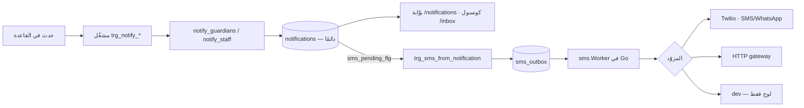

# 10 — NOTIFICATION INVENTORY

**قناتان:** صفّ في البوّابة (`hbh.notifications`) · ورسالة نصّية/واتساب عبر
`hbh.sms_outbox`.
**القاعدة:** **صفّ البوّابة يُكتب دائمًا، والرسالة النصّية اختيارية** — والعلم الذي
يربطهما هو `notifications.sms_pending_flg`، ويرفعه `trg_sms_from_notification`.

---

## ١ · الأنواع الستّة عشر — والخمسة الميّتة

### إلى الأسرة — ١٠ أنواع

| Kind | Trigger | من يُشعَر | القناة | الدالّة التي تُرسله |
|---|---|---|---|---|
| `REPORT_PUBLISHED` | نشر تقرير تقدّم | أولياء أمور الطفل | بوّابة (+SMS) | `trg_notify_report` · `publish_report` |
| `NOTE_PUBLISHED` | نشر ملاحظة جلسة | كذلك | بوّابة (+SMS) | `trg_notify_note` · `publish_session_note` |
| `ASSESSMENT_PUBLISHED` | نشر تقييم | كذلك | بوّابة + **SMS بقالب** | `publish_assessment` ⚠️ **بلا مسار — راجع §4** |
| `INVOICE_ISSUED` | إصدار فاتورة | كذلك | بوّابة (+SMS) | `trg_notify_invoice` |
| `REQUEST_DECIDED` | بتّ طلب وليّ الأمر | مُرسِل الطلب | بوّابة (+SMS) | `trg_notify_request` |
| `APPOINTMENT_BOOKED` | حجز موعد | أولياء أمور الطفل | بوّابة + **SMS `APPOINTMENT_BOOKED`** | `trg_notify_booked` |
| `APPOINTMENT_RESCHEDULED` | نقل موعد (`l_moved`) | كذلك | بوّابة (+SMS) | `trg_notify_booked` (فرع) |
| `APPOINTMENT_CANCELLED` | إلغاء موعد | كذلك | بوّابة (+SMS) | `trg_notify_cancelled` |
| `APPOINTMENT_REMINDER` | **الساعة، لا حدث** | كذلك | **SMS `APPOINTMENT_REMINDER`** | `queue_appointment_reminders` في `run_maintenance` |
| `SESSION_STARTED` | — | — | — | ⚫ **لا مُرسِل — ميّت منذ `0015`** |

### إلى موظّفي المركز — ٦ أنواع

| Kind | Trigger | من يُشعَر | الدالّة |
|---|---|---|---|
| `STAFF_CHILD_ASSIGNED` | إسناد طفل إلى أخصائي | الأخصائي | `notify_staff` ✅ |
| `STAFF_APPOINTMENT_BOOKED` | حجز موعد له | الأخصائي | `notify_staff` ✅ |
| `STAFF_APPOINTMENT_CANCELLED` | — | — | ⚫ **لا مُرسِل** |
| `STAFF_ENROLMENT_NEW` | — | — | ⚫ **لا مُرسِل** |
| `STAFF_REQUEST_NEW` | — | — | ⚫ **لا مُرسِل** |
| `STAFF_PLAN_APPROVED` | — | — | ⚫ **لا مُرسِل** |

> 🔴 **خمسة أنواع من ستّة عشر معرَّفة في `ck_ntf_kind` ولا يرسلها شيء.**
> وأربعةٌ منها هي **كل** ما يُفترض أن يصل الموظّف عن عملٍ جديد وصل:
> - طلب التحاق جديد وصل الاستقبال ← **لا إشعار**
> - طلب وليّ أمر جديد وصل ← **لا إشعار**
> - موعد أُلغي على أخصائي ← **لا إشعار**
> - خطة اعتُمدت ← **لا إشعار**
>
> أي أن الميزة الموصوفة في رأس `0089` بأنها «الوصول إلى زميل» **مبنيّة ثلثًا**.
> راجع 20 · M-07.

## ٢ · قواعد الإشعار

| القاعدة | الفرض |
|---|---|
| **الأنواع مسمَّاة بالجمهور** | `STAFF_*` بادئة، «فقارئٌ لا يحتاج أن يعرف القائمة ليفرّق بينهما» |
| **`ck_ntf_audience`** | `kind_code NOT LIKE 'STAFF\_%' OR child_id IS NOT NULL OR link_kind IS NOT NULL` — إشعار الموظّف قد يسمّي طفلًا لكنه مُوجَّه لزميل |
| **`HB220`: إشعارٌ إلى لا أحد ليس نجاحًا** | `notify_guardians`/`notify_staff` ترفعان إن لم يوجد مستقبِل |
| **`notify_staff` لأنواع `STAFF_*` وحدها** | `HB220` |
| **`fk_ntf_child ON DELETE SET NULL`** | **الإشعار مُوجَّه إلى شخص، والطفل سياق.** فمحوٌ امتثاليٌّ موثَّق لطفل **لا يُحجب برسالةٍ أُرسلت مرّة**، ولا يترك مرجعًا معلَّقًا |
| **نصّ رمز الدخول لا يُكتب في أي مكان** | `ck_sms_body`: `body_ar` يكون `NULL` لـOTP. النصّ في الذاكرة طول طلب واحد **ولا يُكتب لا هنا ولا في لوج ولا في الردّ خارج التطوير** |
| **رمز الدخول ليس حدثًا في تغذية أحد** | `sms_outbox.notification_id` يكون `NULL` لـOTP |

## ٣ · قوالب الرسائل النصّية

| Template | المناسبة | المتغيّرات | الحالة |
|---|---|---|---|
| `OTP_LOGIN` | رمز الدخول | الرمز (لا يُخزَّن) | ✅ |
| `APPOINTMENT_BOOKED` | حجز موعد | الطفل · التاريخ · الوقت | ✅ |
| `APPOINTMENT_REMINDER` | تذكير قبل الموعد | كذلك | ⚠️ **`APPOINTMENT_REMINDER_HOURS` غير مبذور — ومعه غائبًا لا يُرسَل شيء** |
| `ENROLMENT_SUBMITTED` | وصول طلب التحاق | الرقم المرجعي | ✅ |
| `ENROLMENT_PENDING` | الطلب قيد المراجعة | كذلك | ✅ (`0083`) |
| `ENROLMENT_ASSESSMENT` | موعد التقييم حُدِّد | الموعد | ✅ (`0110`) |
| `ASSESSMENT_PUBLISHED` | نتيجة تقييم نُشرت | الطفل | ⚠️ **القالب موجود والمسار غائب** |

`0109` أضاف **متغيّرات القوالب** (`sms_template_vars`) — فالنصّ لا يُبنى في Go.
و`TWILIO_CONTENT_SIDS` يربط `template_code` بـ`ContentSid` عند مزوّد واتساب.

> 🔴 **و`template_code` واحد لم يُربَط قطّ** بحسب تعليق في `0094` — أي أن قالبًا
> يُنتظر وصوله سيُبلغ فشلًا يسمّي القالب لا الربط الناقص.

## ٤ · الإشعار الذي علّم القاعدة كلّها

`publish_assessment` **تُشعر الأسرة**، و**لم يكن لها مسار قطّ** — وكانت **ستسلّم
رسالةً عن طفل مركز آخر** في اليوم الذي يُضاف فيه مركز ثانٍ، لأنها كانت من الدوالّ
الثماني التي تأخذ معرّفًا خامًّا بلا فحص مركز.

> **«لا مسار يصل إليها» خاصيّةُ الموجّه لا الدالّة. والموجّه يتغيّر أسرع من
> السكيما بكثير.**

و`decide_request` — وهي التي تُرسل `REQUEST_DECIDED` — **أرسلت فعلًا إشعارًا بنصّ
المهاجم إلى أسرة مركز آخر**، مُثبتًا بالاختبار لا مستنتَجًا.

## ٥ · الموافقة على القناة

| Consent type | ماذا يحكم | الحالة |
|---|---|---|
| `SMS_NOTIFY` | إرسال رسائل نصّية | معرَّف في `ck_con_type` |
| `WHATSAPP_NOTIFY` | إرسال واتساب | معرَّف (`0111`) |
| `LIVE_VIEW` | مشاهدة البثّ | يحكمه `can_view_live` ✅ |
| `PHOTO_USE` | صورة الطفل | يحكمه `trg_child_photo_needs_consent` ✅ |

**والبوّابة مفروضة فعلًا، وبتصميم يستحقّ التسجيل** (`0111` · `D-38`):
`notify_guardians` تقرأ بارامتر `NOTIFY_CHANNEL` للمركز، تترجمه إلى نوع الموافقة
(`WHATSAPP` → `WHATSAPP_NOTIFY` · وأي شيء آخر → `SMS_NOTIFY`)، ثم تضبط
`sms_pending_flg` من `hbh.has_consent(guardian_id, l_consent)` **لكلّ وليّ أمر على
حِدة**. و`notify_staff` تتركه `false` دائمًا.

> **والعاقبة المقصودة مكتوبة صراحةً:** يوم يُبدَّل `NOTIFY_CHANNEL` إلى
> `WHATSAPP`، **كل وليّ أمر منح `SMS_NOTIFY` ولم يمنح `WHATSAPP_NOTIFY` يتوقّف عن
> تلقّي الرسائل — وذلك صحيح**، لأنه لم يوافق على القناة الجديدة.
> والتهجئة محروسة: `"Whatsapp"` و`"whats_app"` **لا يجوز أن تسقط بهدوء إلى
> `SMS_NOTIFY`** — قناةٌ يقرّرها إملاءٌ خاطئ هي موافقةٌ لم تُعطَ.

**ونطاق الموافقة مقيَّد بمعناها** (`0111` · `ck_con_scope`):
`LIVE_VIEW` و`PHOTO_USE` **عن طفل** (`child_id IS NOT NULL`)، و`SMS_NOTIFY` و
`WHATSAPP_NOTIFY` **عن وليّ الأمر نفسه** (`child_id IS NULL`) — لأن مشاهدة طفل
وتلقّي رسالة سؤالان مختلفان. والرفض `HB080`.

## ٦ · القراءة والوصول

| البند | التفصيل |
|---|---|
| قراءة التغذية | `GET /api/v1/notifications?limit=` — السياسة: صاحب الصفّ · و`PORTAL.VIEW` للكونسول |
| وسم مقروء | `POST /api/v1/notifications/{id}/read` → `mark_notification_read` |
| شاشة الأسرة | `portal/features/notifications/notifications.ts` |
| شاشة الموظّف | `ops/features/inbox/inbox.ts` |
| شارة العدد | في `shell` في التطبيقين |

## ٧ · رسائل الأسرة — قناة مستقلّة

`family_messages` **ليست إشعارًا**: خيط ثنائيّ الاتجاه بين الأسرة والمركز،
`4000` حرفًا للرسالة، `request_id` (uuid) للتكرار (`UNIQUE(sender_id, request_id)`)،
و`family_message_reads` لختم القراءة.
**ولا يُرسل لها SMS ولا إشعار بوّابة** — فرسالةٌ يكتبها المركز لا يعلم بها وليّ
الأمر إلّا إن فتح الشاشة. راجع 20 · M-09.

## ٨ · إشعارات مطلوبة وغائبة

| المناسبة | يُشعَر أحد؟ |
|---|---|
| طلب التحاق جديد وصل | ❌ (`STAFF_ENROLMENT_NEW` ميّت) |
| طلب وليّ أمر جديد وصل | ❌ (`STAFF_REQUEST_NEW` ميّت) |
| موعد أُلغي على أخصائي | ❌ (`STAFF_APPOINTMENT_CANCELLED` ميّت) |
| خطة اعتُمدت | ❌ (`STAFF_PLAN_APPROVED` ميّت) |
| الجلسة بدأت — «تفضّلوا للمشاهدة» | ❌ (`SESSION_STARTED` ميّت) |
| رسالة أسرة جديدة | ❌ لا قناة |
| فاتورة قاربت الاستحقاق | ❌ لا نوع ولا مهمّة |
| **رصيد الباقة قارب النهاية** | ❌ ولا يمكن، لأن الرصيد لا يُخصم أصلًا (C-01) |
| حساب البوّابة جاهز — «تفضّلوا بالدخول» | ❌ `grant_portal_access` لا تُشعر |
| موافقة أوشكت على الانتهاء | ❌ لا انتهاء للموافقات أصلًا |
| **صندوق الصادر متوقّف** | ❌ `v_sms_health` بلا قارئ |
| **النسخ الاحتياطي متأخّر** | ❌ `v_backup_health` بلا قارئ |
| **الصيانة متوقّفة** | ❌ `v_maintenance_health` بلا قارئ |

> **الثلاثة الأخيرة هي «تنبيه التوقّف الصامت»** — `HBH-008`. والقاعدة تعرف الجواب
> في ثلاثة عروض، **ولا شيء يسألها.**

---

## OPEN QUESTIONS

| # | السؤال | الأثر |
|---|---|---|
| **OQ-30** | الأنواع الخمسة الميّتة: تُوصَل أم تُحذف من `ck_ntf_kind`؟ (تركها يعني أن كل تخطيط يقرؤها كقدرة قائمة) | 10 · F-37 |
| **OQ-31** | أسرةٌ لم تمنح موافقة القناة تحصل على **صفّ البوّابة وحده**. هل ذلك مقبول تشغيليًّا، ومن يطلب الموافقة ومن أي شاشة؟ (لا شاشة تجمع موافقات الأسرة — راجع F-14) | 10 · F-14 · F-39 |
| **OQ-32** | رسالة أسرة جديدة — هل تُرسل إشعارًا (وSMS)؟ وما تهدئتها حتى لا يصير كل سطر رسالةً نصّية؟ | F-38 · 10 |
| **OQ-33** | القناة المطلوبة للأسرة: SMS أم واتساب أم Push؟ (`BL-08` — محجوب على المالك · و`HBH-027` دراسة جدوى واتساب) | 10 · 11 |
