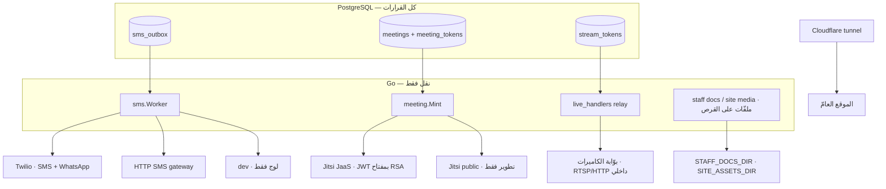

# 11 — INTEGRATION INVENTORY

**ستّة تكاملات خارجية، وكلّها خلف حدٍّ واحد في Go.** لا شيء منها يقرّر قاعدة عمل.

---

## ١ · Twilio — رسائل نصّية وواتساب

| البند | القيمة |
|---|---|
| **Purpose** | تسليم رمز الدخول وإشعارات الأسرة |
| **Used By** | F-01 (OTP) · F-37 (الإشعارات) · F-08 (الالتحاق) |
| **Code** | `api/internal/sms/twilio.go` (+ `twilio_test.go`) |
| **Config** | `SMS_PROVIDER=twilio` · `TWILIO_ACCOUNT_SID` · `TWILIO_AUTH_TOKEN` · `TWILIO_MESSAGING_SERVICE_SID` · `TWILIO_WHATSAPP_FROM` · `TWILIO_CONTENT_SIDS` · `TWILIO_STATUS_CALLBACK` · `TWILIO_ALLOW_FREEFORM` |
| **Failure Handling** | `error_class ∈ {TRANSIENT · PERMANENT · CONFIG}` → `record_sms_failed` · إعادة أُسّية بـ`SMS_RETRY_BASE_SECONDS` حتى `SMS_MAX_ATTEMPTS` ثم `DEAD` |
| **Related** | F-39 · F-01 · F-37 |

**قواعد مثبتة:**
- `TWILIO_CONTENT_SIDS` يربط `template_code` من `sms_outbox` بـ`ContentSid` عند
  واتساب — **فالنصّ لا يُبنى في Go**، وقالبٌ غير مربوط يُبلغ فشلًا.
- **`TWILIO_ALLOW_FREEFORM` أداة تطوير فقط، والخدمة ترفض الإقلاع بها في الإنتاج.**
  السبب مكتوب: رسالة واتساب **يبدأها المركز** تُرفض كنصّ حرّ بالخطأ `63016` خارج
  نافذة ٢٤ ساعة، **وكل رسالة يبدأها هذا المركز خارج واحدة**. فالإعداد في الإنتاج
  **لا يرسل الرسالة بطريقة أخرى — يرسل لا شيء، خمس مرّات، ويكتب فشولًا تسمّي قالبًا
  بدل الاعتماد الذي لم يطلبه أحد.**
- **اعتماد واتساب وقوالبه أسابيع وقد يُرفض** — فالباكلوج يصنّفه **دراسة جدوى لا
  بناء** (`HBH-027`)، **ويُكتب الساحب بقناة قابلة للاستبدال من اليوم**.

## ٢ · بوّابة SMS عبر HTTP — مزوّد محلّي

| البند | القيمة |
|---|---|
| **Purpose** | مزوّد مصري بحقول نموذج بسيطة |
| **Code** | `api/internal/sms/http.go` |
| **Config** | `SMS_PROVIDER=http` · `SMS_HTTP_URL` · `SMS_HTTP_USERNAME` · `SMS_HTTP_PASSWORD` · `SMS_HTTP_SENDER_ID` · و**أسماء الحقول بارامترات**: `SMS_HTTP_FIELD_{TO,BODY,USERNAME,PASSWORD,SENDER}` |
| **Failure Handling** | نفس تصنيف `error_class` |

**أسماء الحقول قابلة للتهيئة** — أي أن تبديل المزوّد **لا يحتاج بناءً**.

## ٣ · مزوّد التطوير

| البند | القيمة |
|---|---|
| **Code** | `api/internal/sms/dev.go` |
| **Config** | `SMS_PROVIDER=dev` (+ `OTP_ECHO` لإرجاع الرمز في الردّ) |
| **الحارس** | الخدمة **ترفض الإقلاع** إن كان `OTP_ECHO` مضبوطًا و`APP_ENV != development` · **وترفض الإقلاع في الإنتاج بلا قناة تسليم حقيقية** |

> **والنصف الثاني هو الذي كان ناقصًا:** «إطفاء `OTP_ECHO` بلا مزوّد لا يجعل الإنتاج
> آمنًا — **يجعله غير قابل للاستعمال، بهدوء**. كل دخول يُقبَل، وكل رمز يُولَّد ويُطرح،
> والخدمة تبلّغ عن صحّتها ولا وليَّ أمر يستطيع الدخول. **ولا رسالة في أي لوج تقول
> ”لا أحد يستطيع المصادقة“؛ هناك صمتٌ ومكالمة دعمٍ بعد أسابيع.**»
> والقاعدتان معًا هما الضمان: **عمليّةُ إنتاجٍ لها قناة تسليم حقيقية، أو لا تقلع.
> ولا تُستوفى أيٌّ منهما بتذكّر ضبط شيء.**

## ٤ · Jitsi — فيديو الاستشارة الأونلاين

| البند | القيمة |
|---|---|
| **Purpose** | الغرفة التي تجري فيها استشارة أونلاين مدفوعة |
| **Used By** | F-36 |
| **Code** | `api/internal/meeting/meeting.go` (+ `meeting_test.go`) |
| **Config** | `MEETING_PROVIDER ∈ {JITSI_JAAS · JITSI_PUBLIC}` · `MEETING_JAAS_APP_ID` · `MEETING_JAAS_KEY_ID` · `MEETING_JAAS_PRIVATE_KEY` |
| **Failure Handling** | `HB063` «بوّابة الوسائط غير مهيَّأة» · `meeting.New` **ترفض `JITSI_PUBLIC` خارج التطوير** — «لا ضبط وصول فيها إطلاقًا: اسم الغرفة هو الاعتماد الوحيد ولا شيء ينتهي» |
| **Related** | F-20 · F-36 |

**الحدّ المعماري — أهمّ ما في هذا التكامل:**
- الحزمة تأخذ `Grant` **فقط**، والشيء الوحيد الذي يبنيه هو دالّة المخزن التي تنادي
  `hbh.authorize_meeting_entry`. **لا طريق مُصدَّر لقول «أعطني توكنًا للغرفة X»** —
  ذلك بابٌ ثانٍ بجوار الباب الذي عليه كل الفحوص.
- **ولا شيء فيها يعرف ما هو الطفل.** «من يدخل» و«لمن الموعد» و«هل دُفع» و«متى
  يُفتح الباب» — كلّها في PL/pgSQL.
- لا حقل في `Grant` يأتي من جسم الطلب: **«منادٍ يستطيع تسمية الغرفة لا يحتاج
  الباب.»**
- `room_ref` سلسلة عشوائية ٢٤–٦٤ حرفًا (`ck_meetings_room_ref`) — **الغرفة لا
  تُسمّى بمعرّف عمل.**

**القرار المسجَّل لأنه يصطدم بقاعدة** (رأس `0120`): `CLAUDE.md` يقول «لا بيانات
اعتماد في أي مكان يبلغه عميل»، ومسار البثّ يحترمه حرفيًّا (كوكي `HttpOnly` وترحيل
بايتات). **لكن الوسائط الحيّة ليست HTTP**: متصفّح الأسرة يتفاوض مع المزوّد مباشرةً،
فلا شيء يُرحَّل. القرار مسجَّل بأسبابه **وبموافقة المالك**.

> ⚠️ `ck_meetings_provider` يسمح بـ`'DAILY'` **ولا تعرفه حزمة `meeting`** — قيمةٌ
> لو كُتبت لصار توليد التوكن مستحيلًا. راجع 18 · C-12.

## ٥ · الكاميرات — البثّ المباشر

| البند | القيمة |
|---|---|
| **Purpose** | مشاهدة الأسرة لجلسة طفلها |
| **Used By** | F-27 |
| **Code** | `api/internal/http/live_handlers.go` · `store/live.go` |
| **Config** | **في القاعدة**: `hbh.cameras` تحمل **مسار بوّابة ومرجع اعتماد وحدهما** |
| **Failure Handling** | `HB060` لا صلاحية · `HB061` الجلسة ليست جارية · `cameras.status ∈ {ONLINE · OFFLINE · FAULT · DISABLED}` |

**خمس قواعد ليست تفضيلات:**
1. **مباشر فقط، ولا تسجيل أبدًا** — لا جدول ولا عمود ولا شيء يمكن أن يصير واحدًا،
   ومجموعة المعايير تفشل على أي عمود فيه `recording`/`clip`/`video`.
2. **القاعدة لا تحمل سرّ كاميرا** — لا RTSP ولا IP ولا اسم مستخدم ولا كلمة مرور،
   **ولا مشفَّرة: عمودٌ يستطيع أن يحمل واحدة يحملها في النهاية.**
3. **المتصفّح يأخذ توكنًا معتِمًا لا عنوانًا** — ٣٢ بايتًا، SHA-256 عند التخزين،
   لا يسمّي البوّابة ولا الكاميرا. **رابطٌ لا يُخمَّن ليس وصولًا مضبوطًا.**
4. **`D-24`: التوكن لا يلمس JavaScript** — كوكي `HttpOnly` والخدمة تُرحّل البايتات.
5. **لا توكن ولا مسار كاميرا ولا عنوان IP في أي ردّ** — ١٨ فحصًا تثبته.

`CATALOG.MANAGE` **و**`LIVE.VIEW` معًا لتعديل كاميرا — فمحرّر الكتالوج لا يستطيع
توجيه كاميرا إلى غرفة أخرى.

## ٦ · تخزين الملفّات — القرص المحلّي، لا سحابة

| الوجهة | Config | من يكتب | كيف يُقرأ |
|---|---|---|---|
| مستندات الموظّفين | `STAFF_DOCS_DIR` | `POST /users/{id}/documents` | `GET /staff-documents/{id}/file` — **يُعنوَن بالصفّ لا بالملفّ**، فـRLS تقرّر ولا مسار يبنيه عميل |
| أصول الموقع | `SITE_ASSETS_DIR` | `POST /site-media` | `GET /site-media/{name}` — **غير مصادَق بقرار**، والاسم هو SHA-256 للمحتوى |
| صورة الطفل · المرفقات | — | `attachments.content` **داخل القاعدة** (`storage_kind ∈ {DB · OBJECT}`) | `GET /children/{id}/photo` |

**قاعدة مثبتة:** مشغّل التدقيق العامّ ينسخ الصفّ كاملًا (`to_jsonb(NEW)`) —
**وعلى جدول مرفقات يضع كل بايت من كل ملفّ داخل `audit_log`، مرّتين عند التعديل،
وبـbase64.** فللمرفقات مشغّل تدقيق خاصّ يطرح `content`. **وأي جدول يحمل `bytea`
كبيرًا يحتاج نفس المعالجة قبل أن يُربط بالتدقيق العامّ.**

> 🔴 **ودرس وجهة الملفّات:** كانت النسخ الاحتياطية تنزل في `backups/` **داخل
> المشروع**، والمشروع تحت «سطح المكتب» المُعاد توجيهه إلى OneDrive — **فكل dump
> فيه السجلّ السريري الكامل لكل طفل كان يُرفَع إلى حساب سحابي شخصي تلقائيًّا.** لا
> خطأ، ولا سؤال، ولا سطر في أي لوج.
> **أي ملفّ يكتبه سكربت داخل شجرة المشروع يرث مصير المجلّد الأب** — والمصير هنا
> كان المزامنة. الوجهة الآن `~/hbh-backups`، و`backup.sh` **يقف** عند أي مجلّد
> مزامنة بدل أن يحذّر.
>
> ⚠️ **و`STAFF_DOCS_DIR` و`SITE_ASSETS_DIR` تخضعان لنفس القاعدة** — راجع 18 · C-06.

## ٧ · النشر والنفق

| البند | القيمة |
|---|---|
| **Cloudflare tunnel** | `deploy/server/tunnel.sh` · `named-tunnel.sh` · `tunnel-start.sh` — التوجيه يسمّي **الموقع وحده** |
| **الخوادم الثابتة** | `web.native.mjs` (البوّابة + الكونسول) · `site.native.mjs` (الموقع) |
| **nginx** | `deploy/server/hbh.nginx.conf` — ⚠️ **ليس ما يعمل في النشر الحالي** |
| **Docker compose** | `deploy/compose/docker-compose.yml` — db · api · maintenance · خادما Angular |
| **cron** | `deploy/server/cron-install.sh` — `@reboot` + الصيانة كل `MAINTENANCE_INTERVAL_SECONDS` |
| **CI** | `deploy/ci/run.sh` — **«بوّابة واحدة لا تستطيع أن تبلّغ نجاحًا عن عمل لم تفعله»** (`HBH-006` يطلب ثلاث وظائف) |

> 🔴 **وثلاثة أشياء صحيحة لم تمنع حادثة النشر:** البوّابة نفسها لم تُنشر قطّ، والمنافذ
> كلّها على `127.0.0.1`، وتوجيه النفق يسمّي الموقع وحده. **المرور جاء من داخل
> الأصل المسموح به، ولا شيء في طبقة النشر يستطيع رؤيته.**

## ٨ · تكاملات **غير** موجودة — وقد يُفترَض وجودها

| المتوقَّع | الحقيقة |
|---|---|
| **بوّابة دفع** (InstaPay · Fawry · بطاقة) | ❌ لا شيء. `payments.method_code ∈ {CASH · CARD · TRANSFER · WALLET · OTHER}` **سجلٌّ يدويّ لا تحصيل** |
| **بريد إلكتروني** | ❌ لا مزوّد ولا قالب. `guardians.email` يُخزَّن ولا يُرسَل إليه شيء |
| **Push notifications** | ❌ |
| **Google Meet / Teams** | ❌ — Jitsi وحده (وقيمة `DAILY` معرَّفة بلا تنفيذ) |
| **ZATCA / فاتورة إلكترونية** | ❌ **بقرار**: «لا ZATCA ولا حمولة فاتورة إلكترونية ولا افتراض أن النسبة شيء بعينه» |
| **تخزين سحابي** | ❌ بقرار — و`storage_kind = 'OBJECT'` عمودٌ معدٌّ لذلك ولا منفّذ له |
| **SSO / OAuth** | ❌ |
| **تصدير محاسبي** | ❌ |

> **«الأب يدفع أونلاين» ليس ميزةً ناقصة بل تكاملًا غير موجود** — وأي تخطيط يفترض
> وجوده يبني على لا شيء. راجع `OQ-34`.

## ٩ · جدول التكامل الموحَّد

| # | التكامل | الغرض | Config | معالجة الفشل | الحالة |
|---|---|---|---|---|---|
| I-01 | Twilio SMS/WhatsApp | تسليم الرسائل | ٨ متغيّرات | ٣ أصناف خطأ + إعادة أُسّية | ✅ مبنيّ · **الاعتماد غير محصَّل** |
| I-02 | HTTP SMS gateway | مزوّد محلّي | ٩ متغيّرات | كذلك | ✅ مبنيّ |
| I-03 | dev SMS | تطوير | `OTP_ECHO` | لوج | ✅ + حارسان يمنعان تسرّبه |
| I-04 | Jitsi JaaS | فيديو الاستشارة | ٤ متغيّرات | `HB063` | ✅ مبنيّ · **الحساب غير مهيَّأ** |
| I-05 | Jitsi public | تطوير | — | رفض الإقلاع في الإنتاج | ✅ |
| I-06 | بوّابة الكاميرات | البثّ | **في القاعدة** | `HB060`/`HB061` + `cameras.status` | ✅ مبنيّ |
| I-07 | القرص المحلّي | الملفّات | `STAFF_DOCS_DIR` · `SITE_ASSETS_DIR` | — | ✅ · ⚠️ راجع C-06 |
| I-08 | Cloudflare tunnel | نشر الموقع | سكربتات | — | ✅ |

---

## OPEN QUESTIONS

| # | السؤال | الأثر |
|---|---|---|
| **OQ-34** | هل يُدفَع أونلاين؟ لا بوّابة دفع في الشجرة، و`payments` سجلٌّ يدويّ. والاستشارة الأونلاين **مدفوعة** بحسب الوصف — فمن يحصّل ومتى وكيف يعرف النظام؟ | F-34 · F-36 · FL-12 |
| **OQ-35** | القناة: SMS أم واتساب؟ (`BL-08`) — واعتماد واتساب أسابيع وقد يُرفض | I-01 · 10 |
| **OQ-36** | حساب Jitsi JaaS — من يهيّئه ومتى؟ بدونه `MEETING_PROVIDER` لا يقلع في الإنتاج | I-04 · F-36 |
| **OQ-37** | `guardians.email` يُخزَّن ولا يُستعمل — قناة قادمة أم عمودٌ يُجمَّد؟ | 08 · 10 |
