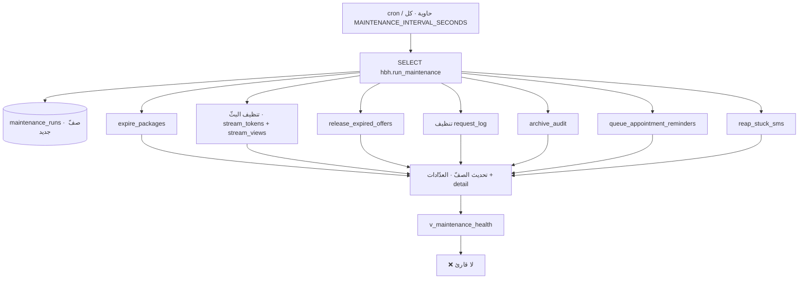

# 12 — BACKGROUND JOB INVENTORY

**عمليّتان خلفيّتان فقط، وهذا مقصود:**

1. **`hbh.run_maintenance()`** — SQL خالص · يناديه `cron` على المضيف (أو حاوية
   `hbh-maintenance` في compose).
2. **`sms.Worker`** — goroutine في `api/cmd/hbhd` · يسحب صندوق الصادر.

**لا `pg_cron`** — بقرار مسجَّل: يحتاج `shared_preload_libraries`، أي بناء وصيانة
صورة قاعدة خاصّة **لأجل نداء مجدول واحد**. فالمُستعمل هو نفس `psql` المسحوب
أصلًا، في حلقة.

---

## ١ · `hbh.run_maintenance()` — سبع مهامّ



| # | المهمّة | الدالّة | الكيان | الميزة | الجدولة |
|---|---|---|---|---|---|
| J-01 | **انتهاء الباقات** | `expire_packages` | `child_packages` · `package_ledger` | F-35 | كل تشغيلة |
| J-02 | **تنظيف البثّ** | داخل `run_maintenance` | `stream_tokens` · `stream_views` | F-27 | كل تشغيلة |
| J-03 | **إطلاق العروض المنتهية** | `release_expired_offers` | `waiting_list` | F-23 | كل تشغيلة |
| J-04 | **تنظيف سجلّ الطلبات** | داخل `run_maintenance` | `request_log` | F-44 | `REQUEST_LOG_RETENTION_DAYS` (٣٠) |
| J-05 | **أرشفة التدقيق** | `archive_audit` | `audit_log` → `audit_log_archive` | F-44 | `AUDIT_ARCHIVE_AFTER_DAYS` |
| J-06 | **تذكير المواعيد** | `queue_appointment_reminders` | `notifications` · `sms_outbox` | F-37 · F-39 | `APPOINTMENT_REMINDER_HOURS` ⚠️ |
| J-07 | **حصد رسائل عالقة** | `reap_stuck_sms` | `sms_outbox` | F-39 | `SMS_STUCK_MINUTES` |

### تفصيل كل مهمّة

**J-01 · `expire_packages`** — **«الشيء الذي كان ناقصًا».** الدالّة كُتبت
واختُبرت وكانت صحيحة **ولا شيء يناديها**: باقةٌ تبقى `ACTIVE` بعد انتهائها حتى
يحاول أحدٌ استعمال واحدة، **وقيد الدفتر الذي يشرح الجلسات المفقودة لم يُكتب قطّ.**
وهذا هو السبب الذي وُلدت له حاوية الصيانة كلّها.

> **والدرس المعماري داخل الدالّة:** كانت `consume_package_session` تعلّم الباقة
> `EXPIRED` **ثم ترفع** استثناءً — فلا تُعلَّم أبدًا، لأن الاستثناء يفكّ المعاملة
> ويأخذ التغيير معه. **الدالّة التي تعدّ أو تعلّم ترجع حالة، والتعليم نداءٌ مستقلّ
> لا يرفع شيئًا.** راجع `D-1`.

**J-02 · تنظيف البثّ** — يسحب `stream_tokens.revoked_at` ويغلق `stream_views`
لكل جلسة لم تبقَ `IN_PROGRESS`. **شبكةُ أمانٍ لا الطريق الأساسي** (الطريق
`close_session_streams` و`revoke_stream_token`).

**J-04 مقابل J-05 — والفرق قاعدة:**
> **الtelemetry يُحذف، والسجلّ السريري يُنقَل.**
> أي «سياسة احتفاظ» تُقترح على `hbh.audit_log` **تُرفض**: الصفوف تنتقل إلى
> `audit_log_archive` وتبقى قابلة للسؤال عبر `v_audit_trail`.
> **ودالّة تعطّل مشغّل حماية لتفعل ذلك تتحقّق من إعادته قبل أن تعود** — وإلّا فقد
> تركت سجلّ التدقيق قابلًا للكتابة **وسكتت**. والرفض `HB130`.

**J-06 · `queue_appointment_reminders`** — **تعمل بالساعة لا بحدث، وهذا هو كلّ
سبب وجودها هنا:** `run_maintenance` هي **الشيء الوحيد في هذه السكيما الذي يفعل
ذلك**.
> ⚠️ **`APPOINTMENT_REMINDER_HOURS` غير مبذور** — ومع غيابه **لا تُرسَل تذكيرات
> إطلاقًا**، وذلك مكتوب صراحةً في `0094`. راجع `OQ-28`.

**J-07 · `reap_stuck_sms`** — صفٌّ بقي `SENDING` أكثر من `SMS_STUCK_MINUTES`
يُعاد إلى `PENDING`. `0116` صحّح حسبة «العالق» في `v_sms_health`.

### عزل الأخطاء — قاعدة مبنيّة في الدالّة

```
BEGIN … EXCEPTION WHEN OTHERS THEN l_detail := l_detail || 'task: ' || SQLSTATE …
```
**كل مهمّة في معالجها الخاصّ.** «مهمّةٌ تفشل يجب ألّا توقف الباقي، **ويجب ألّا
تختفي أيضًا**» — فالفشل يُجمَع في `maintenance_runs.detail`.

> **وهذا بخلاف قاعدة `WHEN OTHERS` العامّة**: هناك المعالج يلفّ «الشيء الوحيد
> الذي قد يفشل فعلًا». وهنا الغرض **عزلٌ متعمَّد** بين سبع مهامّ مستقلّة، والفشل
> **مسجَّل لا مبتلَع** — والفرق بينهما هو أن هذا يكتب السبب.

## ٢ · `sms.Worker` — ساحب صندوق الصادر

| البند | القيمة |
|---|---|
| **Code** | `api/internal/sms/worker.go` (+ `worker_test.go`) |
| **Start** | `go sms.NewWorker(...).Run(ctx)` في `api/cmd/hbhd/main.go:174` |
| **Schedule** | كل `SMS_WORKER_SECONDS` · دفعة `SMS_WORKER_BATCH` |
| **Entity** | `sms_outbox` |
| **Functions** | `claim_sms` (٣ نسخ) → `record_sms_sent` / `record_sms_failed` |
| **Guard** | `assert_sms_worker` + `HB230` — **«الطابور غير قابل للتشغيل من جلسة مستخدم»** |
| **Kill switch** | `SMS_SENDING_ENABLED` في `sys_params` (`0115`) |
| **Feature** | F-39 |

**لماذا الساحب في Go والصيانة في SQL:** `run_maintenance` **SQL خالص فلا يحتاج
عمليّة**، وهذا هو سبب جدولته على المضيف. والساحب يحتاج **عميل HTTP** لمخاطبة
المزوّد، فمكانه الخدمة.

**`claim_sms` تنتزع الصفّ بقفل** (`FOR UPDATE SKIP LOCKED` في المعنى) — فنسختان
من الخدمة لا ترسلان نفس الرسالة مرّتين. و`dedupe_key` هو الحارس الثاني.

> ⚠️ الباكلوج `HBH-007` يسمّي «ساحب صندوق الصادر» بندًا مفتوحًا بحجم ٢ —
> والساحب **مبنيّ ويعمل**. البند على الأرجح يقصد **تشغيله مقابل مزوّد حقيقي**
> (اعتماد Twilio أو بوّابة محلّية)، لا كتابته — والبطاقة لا تقول ذلك صراحةً.

## ٣ · ما لا توجد له مهمّة خلفيّة — وقد يُفترَض

| المتوقَّع | الحقيقة | الأثر |
|---|---|---|
| **خصم رصيد الباقة عند إغلاق الجلسة** | ❌ لا مهمّة ولا مشغّل ولا نداء | ⛔ C-01 |
| **تنبيه التوقّف الصامت** | ❌ `v_backup_health` · `v_maintenance_health` · `v_sms_health` **بلا قارئ** | `HBH-008` |
| **نسخ احتياطي مجدول** | `backup.sh` موجود · **ولا استعادة فعلية مجدولة** | `HBH-009` |
| **انتهاء المواعيد غير المؤكَّدة** | ❌ موعد `BOOKED` يبقى `BOOKED` للأبد | `OQ-38` |
| **وسم `NO_SHOW` تلقائيًّا** | ❌ يدويّ | `OQ-38` |
| **تذكير الفاتورة المستحقّة** | ❌ | `OQ-39` |
| **انتهاء الموافقات** | ❌ الموافقة أبديّة حتى تُسحَب | `OQ-40` |
| **تنظيف `otp_codes` · `auth_sessions` · `password_setups` المنتهية** | ❌ **الصفوف تتراكم** — تُقرأ منتهيةً ولا تُحذف | `OQ-41` |
| **إغلاق `meetings` المنتهية** | جزئيًّا في `0121` · **ولا مهمّة دورية** | 05 |
| **تصدير الموقع بعد النشر** | `site-export-watch.sh` — **سكربت مراقبة لا مهمّة مجدولة** | 11 |

## ٤ · الجدولة الفعليّة

### على المضيف — `cron-install.sh`

```
@reboot  sleep 30 && stack.native.sh start
<SCHED>  maintenance.native.sh
```
`<SCHED>` مشتقٌّ من `MAINTENANCE_INTERVAL_SECONDS` (افتراضي **٣٦٠٠** = كل ساعة):
- ≥ ٦٠ دقيقة → `0 */N * * *` (وN مقصوصة عند ٢٣)
- < ٦٠ دقيقة → `*/N * * * *` (وN لا تقلّ عن ١)

### في compose — حاوية `hbh-maintenance`

```sh
while true; do
  psql -h db -U hbh_owner -d hbh -v ON_ERROR_STOP=1 -c "SELECT hbh.run_maintenance();" \
    || echo "maintenance run failed - see hbh.maintenance_runs"
  sleep "$INTERVAL_SECONDS"
done
```

> **`run_maintenance` تسجّل كل تشغيلة، فمُجدولٌ يموت يظهر في
> `hbh.v_maintenance_health` بدل أن يُلاحَظ بعد شهر.**
> ⚠️ **وذلك صحيحٌ في القاعدة وغير مُحقَّق في المنتج:** لا شيء يقرأ هذا العرض،
> فالمُجدول الميّت **يظهر في مكان لا يفتحه أحد**.

### طريقان للشيء الواحد

الصيانة تُجدَّل **مرّتين**: `cron` على المضيف **و**حاوية في compose. أيّهما
الحقيقي يعتمد على شكل النشر.
> ⚠️ وإن عملا معًا، **تتزاحم تشغيلتان** — و`run_maintenance` ليس فيها قفل يمنع
> ذلك. راجع 18 · C-15 و`OQ-42`.
> وهذا من عائلة درسٍ مسجَّل: **«وهذا يكشف التزاحم ولا يمنعه. المنع قفلٌ، وهو
> قرار المالك.»**

## ٥ · فحوص التشغيل على المهامّ

| الفحص | الموضع |
|---|---|
| `maintenance_runs` **تُلتقط بمعرّفها ويُؤكَّد عليها بالاسم** | `tests/db/p8_verify.sql` |
| `v_maintenance_health` · `v_backup_health` | معرَّفان ومختبَران |
| ساحب الـSMS | `api/internal/sms/worker_test.go` |
| `reap_stuck_sms` | `tests/db/p13_verify.sql` |

> 🔴 **ودرسٌ في الاختبار يخصّ هذه المهامّ بعينها:** فحوص `maintenance_runs` كانت
> تقرأ **«آخر تشغيلة»**، وحاوية الصيانة تعمل بجدولها الخاصّ — **فأوّل تقاطع بينهما
> يفشل ويبدو عيبًا وليس كذلك**. التشغيلة تُلتقط بمعرّفها ويُؤكَّد عليها بالاسم.
> **وكل تأكيد على صفّ يسمّي الصفّ.**
>
> **وفحصٌ يعدّ صفوفًا في جدول مضاف-فقط ينجح مرّة ويفشل للأبد بعدها** — الجدول
> يحتفظ بصفوف التشغيلة السابقة، **وهذا هو الغرض منه**. فكل عدّ يُقيَّد بوقت بدء
> التشغيلة.

---

## OPEN QUESTIONS

| # | السؤال | الأثر |
|---|---|---|
| **OQ-38** | موعد `BOOKED` لم يُؤكَّد ومضى وقته — يُوسَم `NO_SHOW` تلقائيًّا؟ يُلغى؟ يبقى؟ (اليوم: يبقى `BOOKED` للأبد) | F-21 · 12 |
| **OQ-39** | فاتورة مستحقّة — تذكير للأسرة؟ وبأي تهدئة؟ | F-34 · 10 · 12 |
| **OQ-40** | هل تنتهي الموافقات (`LIVE_VIEW` · `PHOTO_USE`) بمدّة، أم تبقى حتى تُسحَب؟ | F-14 · 12 |
| **OQ-41** | `otp_codes` · `auth_sessions` · `password_setups` المنتهية تتراكم بلا تنظيف. مطلوب، أم يُترك للنموّ؟ | 08 · 12 |
| **OQ-42** | أي مُجدول هو الحقيقي في الإنتاج: `cron` على المضيف أم حاوية compose؟ (وإن عملا معًا، لا قفل يمنع التزاحم) | 12 · 21 |
