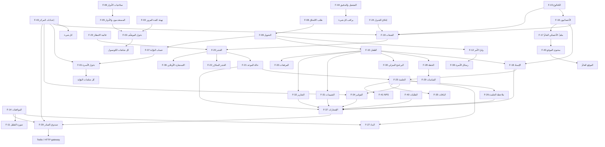
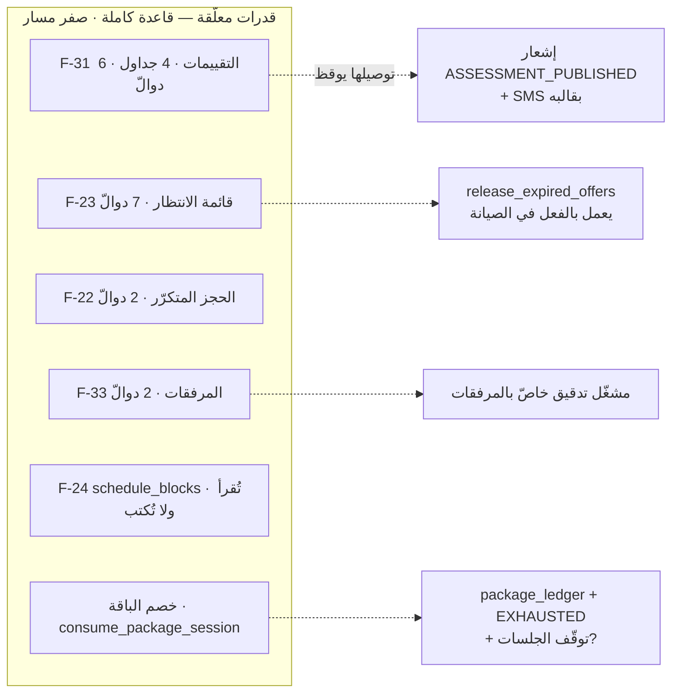

# 13 — FEATURE DEPENDENCY MAP

**الغرض:** قبل تعديل أي ميزة، يُعرَف ما قد يتأثّر.

---

## ١ · الخريطة الكاملة

---

## ٢ · الجدول — Depends On / Used By

| Feature | Depends On | Used By |
|---|---|---|
| **F-01** دخول الأسرة | F-07 · F-39 · F-43 | كل البوّابة |
| **F-02** دخول الموظّف | F-03 · F-05 · F-43 | كل الكونسول |
| **F-03** تهيئة كلمة المرور | F-05 | F-02 |
| **F-04** تغيير كلمة المرور | F-02 | — |
| **F-05** المستخدمون والأدوار | F-06 · F-43 | F-02 · F-03 · **كل صلاحية في النظام** |
| **F-06** صلاحيات الأدوار | — | F-05 · **كل حارس** |
| **F-07** حساب البوّابة | F-09 · F-12 | F-01 |
| **F-08** طلب الالتحاق | F-39 · F-43 · F-42 (الرابط) | F-09 |
| **F-09** التحويل | F-08 · F-07 | F-10 · F-12 · F-18 |
| **F-10** الطفل | F-09 أو F-12 | F-18 · F-20 · F-28 · F-30 · F-31 · F-32 · F-33 · F-34 · F-35 |
| **F-11** صورة الطفل | F-10 · F-14 · F-33 | F-10 (الكارت) |
| **F-12** وليّ الأمر | F-09 أو إدخال مباشر | F-07 · F-10 · F-14 · F-38 · F-40 |
| **F-13** التواصل الذاتي | F-12 · F-01 | F-39 |
| **F-14** الموافقات | F-12 · F-10 | **F-11 · F-27 · F-39** |
| **F-15** الكتالوج | F-43 | **F-16 · F-19 · F-20 · F-25 · F-34 · F-35 · F-18** |
| **F-16** الأخصائيون | F-05 · F-15 | F-17 · F-18 · F-19 · F-20 |
| **F-17** ملفّ الأخصائي العامّ | F-16 · F-14 | F-42 |
| **F-18** الإسناد | F-10 · F-16 · F-15 | **F-25** · F-37 |
| **F-19** الفتحات | F-15 · F-16 · F-24 · F-43 | **F-20 · F-22 · F-23** |
| **F-20** الحجز | F-19 · F-10 | **F-21 · F-25 · F-36 · F-34 · F-37** |
| **F-21** حالة الموعد | F-20 | F-25 · F-37 |
| **F-22** الحجز المتكرّر 🔴 | F-19 · F-20 | — |
| **F-23** قائمة الانتظار 🔴 | F-19 · F-10 | F-20 |
| **F-24** إغلاق الجدول 🟡 | F-43 | F-19 |
| **F-25** الجلسة | **F-18 · F-21 · F-15** | **F-26 · F-27 · F-34 · F-35 · F-41 · F-29** |
| **F-26** ملاحظة الجلسة | F-25 | F-37 · البوّابة |
| **F-27** البثّ | **F-25 · F-14 · F-15 (الكاميرات)** | البوّابة · الكونسول |
| **F-28** الخطة | F-10 | F-29 · F-32 |
| **F-29** القياسات | F-28 | البوّابة (`/progress`) · F-32 |
| **F-30** البرنامج المنزلي | F-10 · F-15 (المكتبة) | البوّابة |
| **F-31** التقييمات 🔴 | F-10 | F-37 · البوّابة |
| **F-32** التقارير | F-10 · F-28 · F-29 | F-37 · البوّابة |
| **F-33** المرفقات 🔴 | F-10 | F-11 |
| **F-34** الفواتير | F-10 · F-15 · F-25 | F-35 · F-37 · البوّابة |
| **F-35** الباقات 🟡 | F-15 · F-34 | **F-25 (يجب)** |
| **F-36** الاستشارة | **F-20 · F-15 · Jitsi** | البوّابة |
| **F-37** الإشعارات | F-05 (المستقبِلون) | **F-39** |
| **F-38** رسائل الأسرة | F-12 · F-01 · F-02 | — |
| **F-39** صندوق الصادر | F-14 · F-43 · Twilio/HTTP | F-01 · F-08 · F-37 |
| **F-40** الطلبات | F-10 · F-12 | F-37 · F-20 (يدويًّا) |
| **F-41** NPS | F-25 · F-01 | تقارير المدير |
| **F-42** محتوى الموقع | F-17 · F-14 | الموقع العامّ · F-08 (الرابط) |
| **F-43** إعدادات المركز | — | **كل شيء** |
| **F-44** التشغيل والتدقيق | كل شيء | المدير |

---

## ٣ · العقد الحرجة — أكثر ما يُستعمَل

| # | Feature | من يعتمد عليها | لماذا حرجة |
|---|---|---|---|
| ١ | **F-43 · إعدادات المركز** | **٤٤ ميزة** | العطلة تقرّر أي الأيام تُحجز في **كل** شاشة · والعملة تُلبس **كل مبلغ خُزِّن** · و`MOBILE_PATTERN` يقرّر من يستطيع الدخول |
| ٢ | **F-06 · صلاحيات الأدوار** | كل حارس وكل سياسة | `set_role_permissions` تغيّر سلوك النظام كلّه بلا نشر |
| ٣ | **F-10 · الطفل** | ٩ ميزات | الكيان الجامع للسجلّ السريري والمالي |
| ٤ | **F-15 · الكتالوج** | ٧ ميزات | **بلا خدمة لا يُحجز موعد** — و`needs_caseload_flg`/`creates_session_flg` يقرّران إن كانت الجلسة تُفتح |
| ٥ | **F-20 · الحجز** | ٥ ميزات | يجذر الجلسة والاستشارة والفاتورة |
| ٦ | **F-25 · الجلسة** | ٦ ميزات | نقطة الالتقاء بين الإكلينيكي والمالي |
| ٧ | **F-14 · الموافقات** | ٣ بوّابات حقيقية | **تقرّر من يشاهد طفلًا أثناء جلسته** |
| ٨ | **F-39 · صندوق الصادر** | ٣ ميزات | **بلا قناة تسليم لا دخول للأسرة** |
| ٩ | **F-05 · المستخدمون** | كل الكونسول | ومنها يُولَد كل حساب |
| ١٠ | **F-19 · الفتحات** | ٣ ميزات | **و`validate_slot` هي القاعدة الوحيدة** — والفتحات تسألها ولا تنسخها |

---

## ٤ · الأوراق — ما لا يعتمد عليه شيء

| Feature | لماذا يهمّ |
|---|---|
| F-04 تغيير كلمة المرور | تعديله لا يكسر شيئًا |
| F-13 التواصل الذاتي | كذلك |
| F-22 الحجز المتكرّر 🔴 | **لا شيء يستعمله ولا شيء يصله** |
| F-38 رسائل الأسرة | معزولة تمامًا — لا مفتاح أجنبي إلى موعد ولا جلسة |
| F-41 NPS | تقارير فقط |
| F-44 التشغيل | يراقب ولا يُراقَب |

## ٥ · الأوراق الميّتة — القدرات المعلَّقة

هذه **لا يعتمد عليها شيء ولا تصلها نقطة دخول**: تعديلها اليوم **لا يكسر شيئًا**،
وتوصيلها غدًا **يوقظ كل ما تحتها دفعةً واحدة**.

> ⚠️ **وتوصيلُ قدرةٍ معلَّقة ليس «إضافة مسار».** `publish_assessment` **تُشعر
> الأسرة** — ويوم يُضاف مسارها، يبدأ إشعارٌ حقيقيّ وقالب SMS حقيقيّ بالعمل.
> **وهي بالضبط الدالّة التي كانت ستسلّم رسالةً عن طفل مركز آخر في اليوم الذي
> يُضاف فيه واحد.**

## ٦ · اعتماديّات دائرية — لا يوجد

فُحصت ولم تُعثَر على دورة اعتماد بين الميزات. العلاقة الأقرب إلى الدورة:
`F-20 الحجز → F-25 الجلسة → F-21 حالة الموعد` — و`close_session` تُكمل الموعد.
**وهو تدفّقُ حالةٍ في اتجاه واحد لا دورة اعتماد**، والتصميم يقوله صراحةً:
«الموعد سؤالٌ منفصل وله جوابه: **الزيارة حدثت إمّا كان أو لم يكن، فتكتمل حتى لو
لم يكتمل العمل السريري**.»

## ٧ · اعتماديّات على الخارج

| Feature | التبعيّة الخارجية | إن سقطت |
|---|---|---|
| F-01 · F-08 · F-37 | Twilio / بوّابة SMS | **لا دخول للأسرة إطلاقًا** · والخدمة **ترفض الإقلاع** في الإنتاج بلا قناة |
| F-36 | Jitsi JaaS | `HB063` · لا استشارة |
| F-27 | بوّابة الكاميرات | `cameras.status = 'FAULT'` · لا بثّ |
| F-42 | Cloudflare tunnel | الموقع غير متاح |
| كل شيء | PostgreSQL | `/readyz` يفشل · و`migration_applied` تُفحَص عند الإقلاع |

---

## ٨ · كيف يُستعمَل هذا الجدول

عند أي تعديل، اقرأ **Used By** ثم اذهب إلى
[14-feature-impact-matrix](14-feature-impact-matrix.md) لتعرف أي طبقة تتأثّر وأي
مجموعة اختبار تُعاد.

**مثال ملزم:** تعديل **F-15 (الكتالوج)** — إضافة عمود إلى `services` أو تغيير
`creates_session_flg` — يمسّ **F-16 · F-18 · F-19 · F-20 · F-25 · F-34 · F-35**،
أي: الفتحات · الحجز · بدء الجلسة · الفاتورة · الباقة.
ومجموعات الاختبار: `p3` (المواعيد والجلسات) · `p6` (الفواتير والباقات) ·
`p16` · `a4` · `a5` · `a6`.
