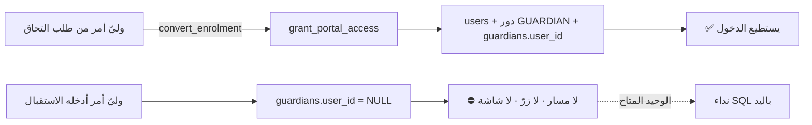

# 15 — PARENT (GUARDIAN) LIFECYCLE

**الكيان:** `hbh.guardians` · و`hbh.users` هو حسابه · و`hbh.guardian_children` هو
ربطه بأطفاله.

> **تنبيه تسمية:** الكيان اسمه `guardian` (وليّ أمر) لا `parent`. **والفرق ليس
> لفظيًّا:** `relationship_code ∈ {FATHER · MOTHER · GUARDIAN}` — فقد يكون جدًّا أو
> وصيًّا. أي كود يبحث عن `parents` **لن يطابق شيئًا**.

---

## ١ · مصادر إنشاء وليّ الأمر — اثنان فعليًّا

| Source | الطريق | الدالّة | مسجَّل في `registration_source`؟ |
|---|---|---|---|
| **`ENROLMENT_REQUEST`** | نموذج الالتحاق → تحويل | `convert_enrolment` | ⚫ **لا — البناء بأثر رجعي فقط** |
| **`CENTER`** | إدخال مباشر في الكونسول | `POST /api/v1/guardians` (CRUD) | ⚫ **لا** |
| **`ONLINE_CONSULTATION`** | — | ⚫ **لا وجود لها** | ⚫ قيمةٌ معرَّفة بلا كاتب |
| `PARENT_PORTAL` | ❌ **لا وجود له** — وليّ الأمر **لا يسجّل نفسه**. البوّابة للدخول لا للتسجيل | — |
| `IMPORT` | ❌ لا مسار استيراد في الشجرة | — |

**والثالث في السكيما ليس مصدرًا:** `enrolment_applications.source_code ∈
{WEB · PHONE · WALK_IN · REFERRAL}` — وهو **كيف وصل الطلب**، لا كيف وُلد الصفّ.
**مفردتان اسمهما «المصدر» ولا تترجم إحداهما للأخرى.** راجع 19 · D-01.

## ٢ · دورة الحياة

```mermaid
stateDiagram-v2
  [*] --> APPLICATION : نموذج الالتحاق (مجهول)
  [*] --> DIRECT : إدخال الاستقبال

  APPLICATION --> LOOKUP : convert_enrolment
  LOOKUP --> REUSED : وُجد بـ(center_id, mobile, active)
  LOOKUP --> CREATED : لم يوجد
  CREATED --> LINKED
  REUSED --> LINKED
  LINKED --> ACCOUNT : grant_portal_access
  ACCOUNT --> ACTIVE : يستطيع الدخول بـOTP

  DIRECT --> NO_ACCOUNT : صفّ guardians بلا user_id
  NO_ACCOUNT --> STUCK : ⛔ لا مسار ولا شاشة تمنحه حسابًا
  STUCK -.->|الطريق الوحيد| ACCOUNT

  ACTIVE --> ARCHIVED : DELETE /guardians/{id} — أرشفة
  ARCHIVED --> ACTIVE : POST .../restore
```

### الخطوة بخطوة — من `convert_enrolment`

```
1. اقرأ الطلب        ← موجود؟ HB091
2. assert_center_argument  ← فوق كل فحص · قبل الصلاحية وقبل الآلة (0101)
3. ENROLMENT.MANAGE  ← HB092
4. الحالة ليست ENROLLED  ← تحويلٌ مرّتين ينتج طفلًا ثانيًا لأسرة واحدة
5. الحالة ∈ {CONTACTED, ASSESSMENT_BOOKED}  ← HB091
6. INSERT children   ← دائمًا جديد · child_no من السلسلة
7. SELECT guardians WHERE center_id = … AND mobile = … AND active_flg
     ├─ وُجد    → أعِد استعماله
     └─ لم يوجد → INSERT guardians
8. INSERT guardian_children (is_primary_flg = true)
9. grant_portal_access(guardian)  ← جملة مستقلّة · وبلا معالج استثناء
10. UPDATE الطلب → ENROLLED + converted_guardian_id + converted_child_id
```

**وكلّها في معاملة واحدة:** «**ذَرّيّة: لا شيء يُثبَت إلّا إن ثبت كلّه.** فلو رُفع
المنح، ذهب التحويل معه: لا طفل، ولا وليّ أمر، ولا رقم استُهلك، والطلب ما زال
غير محوَّل.»

> **ولا معالج استثناء حول المنح، بقصد:** «معالجٌ هنا يحوّل منحًا مرفوضًا إلى أسرة
> محوَّلة بلا طريق للدخول — **بصمت** — وهي بالضبط الحالة التي وُجدت هذه الهجرة
> لتستحيل.»

---

## ٣ · كيف يُبحَث عن وليّ أمر موجود

| الطريق | الاستعلام | الحارس |
|---|---|---|
| داخل التحويل | `center_id = … AND mobile = <مقيَّس> AND active_flg` | `LIMIT 1` |
| في الكونسول | `GET /api/v1/guardians?q=` على `full_name_ar` · `mobile` · `email` | `likeEscape` + `ESCAPE '\'` + `normalize_arabic` |
| عند الدخول | `request_otp` بالجوال المقيَّس **عالميًّا قبل وجود هوية** | `uix_users_mobile_active` |

**والمقارنة تعمل لأن الجوال مقيَّس:** `trg_canonical_mobile` يكتب `+201500000063`
مكان `01500000063` على **أربعة جداول** (`users` · `guardians` · `therapists` ·
`enrolment_applications`)، و`convert_enrolment` تقارن بـ`l_app.parent_mobile`
**وهو بعد المشغّل**، فالطرفان على نفس الصيغة.

> 🔴 **وهذا بالضبط ما سقط مرّة:** حدّ الطلبات لكل جوال في `submit_enrolment` كان
> يعدّ `WHERE a.parent_mobile = p_parent_mobile` **بالرقم الخام**، فصار العدّ صفرًا
> أبدًا و`TOO_MANY_FOR_MOBILE` **لا يُبلَغ** — أي أن الحدّ على **بوّابة الكتابة
> العامّة الوحيدة** كان مطفأً بلا أثر في أي مكان (`0122`).
>
> **والقاعدة المستخلَصة:** حين يُضاف تقييسٌ عند الكتابة، **تُمشَّط كل مقارنة على
> العمود قبل أن تُطبَّق الهجرة** — وهي في السكيما بسطر واحد على `pg_proc`.

## ٤ · منع التكرار — وحدوده الحقيقية

| الطريق | الحماية | الحكم |
|---|---|---|
| **التحويل** | بحثٌ بـ`(center_id, mobile, active_flg)` ثم إعادة استعمال | ✅ **يعمل** |
| **`hbh.users`** | `uix_users_mobile_active` — فريدٌ على الصفوف **الحيّة** (`0098` · و`0128` أوضح أن الثابتة عن الصفوف الحيّة) | ✅ |
| **`hbh.guardians`** | ⛔ **لا فهرس فريد على `mobile` إطلاقًا** | 🔴 راجع أدناه |
| **إدخال مباشر في الكونسول** | ⛔ **لا بحث ولا تحذير** — `POST /guardians` يُدرج ما يُعطى | 🔴 |
| **وليّ أمر أساسي واحد لكل طفل** | فهرس فريد جزئي (`0032`) | ✅ |

> 🔴 **الثغرة:** `hbh.guardians` **بلا قيد تفرّد على الجوال**. أي أن
> `POST /api/v1/guardians` مرّتين بنفس الرقم ينتج **صفّين**، **ولا شيء يعترض**.
> ثم يمنح `grant_portal_access` أحدهما حسابًا، فيتصادم الثاني بـ`uix_users_mobile_active`
> ويُبلَّغ `HB204` (`0126`) — أي أن **التكرار يُكتشَف متأخّرًا، عند الحساب، لا عند
> الإنشاء**، وحينها يوجد صفّان وأحدهما مرتبط بأطفال.
> راجع 18 · C-07 · و`OQ-43`.
>
> **والقيد ليس بديهيًّا هنا:** الجوال `NOT NULL` بقيد صيغة، فـNULL ليس واردًا —
> والنقاش هو هل جوالٌ واحد يجوز أن يخدم وليَّي أمر (أمًّا وأبًا يتشاركان هاتفًا).
> **وهذا سؤال عمل لا قرار تقني** — ولذلك سُجِّل ولم يُقرَّر.

## ٥ · كيف تُحدَّث بياناته

| من | المسار | الحدّ |
|---|---|---|
| الاستقبال / المدير | `PATCH /api/v1/guardians/{id}` | `GUARDIAN.MANAGE` |
| **وليّ الأمر نفسه** | `PATCH /api/v1/me/contact` → `update_own_guardian_contact` (`0107`) | **سجلّه هو وحده** · وحقول التواصل وحدها |
| المشغّل | `trg_canonical_mobile` يعيد كتابة الجوال عند كل كتابة | — |

`0071` أضاف حقول تواصل، و`0107` أعطى وليَّ الأمر مسارًا لتعديل بياناته هو.

## ٦ · كيف يُربَط بالأطفال

`hbh.guardian_children` — `guardian_id` × `child_id` + `relationship_code` +
`is_primary_flg`.

| القاعدة | الفرض |
|---|---|
| **وليّ أمر أساسي واحد لكل طفل** | فهرس فريد جزئي (`0032`) |
| وليّ أمر لأكثر من طفل | مسموح — والبوّابة فيها `childSelectedGuard` وسياق طفل |
| طفل لأكثر من وليّ أمر | مسموح |
| **`can_view_live_flg` لا يُضبَط عند التحويل** | «مشاهدة طفل في العلاج تحتاج موافقة مسجَّلة (`D-24`)، **ونموذج الالتحاق ليس واحدة**» |
| **`can_view_live_flg` لا يتحرّك إلّا عبر موافقة مسجَّلة** | `HB081` |
| **وليّ أمر لا يبلغ بيانات طفل آخر بتعديل رابط** | `can_access_child` + RLS · **لا شرطٌ في الصفحة** |

> **و«وليّ أمران لنفس الطفل يفرّقهما علمٌ واحد»** فحصٌ حقيقي في مجموعة البثّ —
> أي أن الموافقة **لكل وليّ أمر** لا لكل أسرة.

## ٧ · حسابه — الحلقة المقطوعة



**المقيس قبل أي تعديل** (مسجَّل في رأس `0125`): أسرة مُشيت في الطريق الرسمي
الوحيد من أوّله إلى آخره، فكان `guardians.user_id` = `NULL`، ولا صفّ في
`hbh.users` على ذلك الجوال، **وبحث هوية وليّ الأمر لا يعرف الرقم**. ثم نُوديت
`grant_portal_access` **باليد** فتمّ كل شيء.
> **«فالنصف القاعديّ من `HBH-010` كان منتهيًا وصحيحًا في `0085`. ولا شيء فوقه
> ناداه قطّ: لا مسار API ولا ضابط في أي شاشة —
> `grep -rn grant_portal_access api/ web/` رجّع لا شيء إطلاقًا. الحلقة لم تكن
> مكسورة في السكيما. كانت مكسورة طبقةً واحدة أعلى، وهو حيث تنبّأت `0085` بأنها
> ستنتقل.»**

**وما زال النصف الآخر مقطوعًا:** وليّ أمر أُدخل من المركز مباشرةً. و`v_guardian_portal_status`
— العرض الذي يجيب «هل هذه الأسرة تملك حسابًا؟» — **بلا قارئ**.
الباكلوج: `HBH-011` (مسار التفعيل) · `HBH-012` (الشاشة والتحذير).

## ٨ · اكتمال الملفّ

`0129` أضاف `guardians.record_completeness ∈ {MINIMAL · PARTIAL · COMPLETE}` —
⚫ **ولا كاتب ولا قارئ في أي طبقة**.

> **ولم يُسمَّ `profile_status` بقصد مسجَّل:** `therapists.profile_status` قائم
> منذ `0033` بقيم `DRAFT`/`PUBLISHED`/`WITHDRAWN` ويعني **هل الملفّ منشور على
> الموقع** — محورٌ مختلف تمامًا عن «كم اكتمل السجلّ».
> **اسمٌ واحد بمعنيين على جدولين فخٌّ يكلّف أوّل من يقرأ الأوّل ويفترض الثاني، ولا
> شيء يمنعه.**

## ٩ · تسجيل الأصل — وثغرته للأمام

`0129` أضاف `guardians.registration_source` مع:
- **قيد** `ck_guardians_reg_source` (٣ قيم أو `NULL`)
- **بناء بأثر رجعي مشتقّ من دليلٍ يقول نعم لا من دليلٍ يفشل في قول لا:**
  - يظهر في `enrolment_applications.converted_guardian_id` → `ENROLMENT_REQUEST`
  - `created_by` يسمّي مستخدمًا حقيقيًّا → `CENTER`
  - لا شيء → **`NULL`** · «صفوف البذور والسكربتات لم تمرّ ببابٍ تجاريّ إطلاقًا،
    و**”لا دليل“ هو الجواب الصادق**»
- **مشغّل عدم-قابلية-التغيير** `trg_origin_immutable`: `NULL → قيمة` مسموح **مرّة**
  (ذلك **تسجيلُ** أصل لا **تغييره**) · وقيمة → غيرها **مرفوضة** بـ`HB240`

> 🔴 **والثغرة أن `convert_enrolment` لا تختمه للأمام.** أي أن **كل وليّ أمر
> يُنشأ من اليوم يحمل `NULL`** — فالعمود يشيخ من لحظة إضافته.
> ⚠️ **و`HB240` مستعمل لقاعدتين** — راجع 18 · C-03 · C-04.

**ولا يوجد `journey history` لوليّ الأمر:** لا جدول يقول «هذه الأسرة وصلت من
الموقع، ثم طلبت التحاقًا، ثم هُوتفت، ثم حُوِّلت». الأقرب `v_case_timeline`
(**بلا قارئ**) و`audit_log`/`v_audit_trail` (**بلا قارئ**).

## ١٠ · النهاية

| الحالة | الطريق |
|---|---|
| أرشفة | `DELETE /api/v1/guardians/{id}` → `active_flg = false` + `deleted_at` |
| استعادة | `POST /api/v1/guardians/{id}/restore` |
| **حذف فعليّ** | ⛔ **لا منحة `DELETE`** — وبيانات الطفل السريرية **لا تُحذف دون إجراء امتثال موثَّق** |
| حسابه | `archive_user` → `trg_revoke_sessions_on_offboard` يُبطل جلساته |

> ⚠️ **وأرشفة وليّ أمر لا تؤرشف حسابه**، ولا العكس — **عمليّتان منفصلتان بلا رابط**.
> فأسرةٌ مؤرشَفة قد تبقى قادرة على الدخول. راجع 18 · C-10 · و`OQ-44`.
>
> ⚠️ **وصفٌّ مجمَّد يجمّد كل عمود يُضاف بعده** — `0128` ترك `guardians` ٦٦٨ (جوال
> قديم من سبع خانات) قابلًا للكتابة **بالتحديث الذي يتقاعد به وحده**، فـ`0129`
> اضطرّ أن يكتب ما يستطيع **ويعدّ ما لا يستطيع** بدل أن يفشل على صفٍّ لا يستطيع
> أحدٌ إصلاحه. **والعدّ يُطبَع لا يُبتلَع.**

---

## OPEN QUESTIONS

| # | السؤال | الأثر |
|---|---|---|
| **OQ-43** | هل يجوز لجوّال واحد أن يخدم وليَّي أمر (أمًّا وأبًا بهاتف واحد)؟ إن لا → فهرس فريد على `guardians.mobile` · إن نعم → التكرار الحقيقي **غير قابل للكشف** | F-12 · 15 · 18 · C-07 |
| **OQ-44** | أرشفة وليّ أمر — هل تؤرشف حسابه وتُبطل جلساته؟ | F-12 · F-05 |
| **OQ-45** | وليّ أمر أُدخل من المركز: من يمنحه حسابًا ومن أي شاشة؟ وهل يُمنَح تلقائيًّا؟ | F-07 · `HBH-011` · `HBH-012` |
| **OQ-46** | `record_completeness` — ما يجعل ملفًّا `COMPLETE`؟ الحقول ليست محدَّدة، ولا كاتب | 15 · 08 |
| **OQ-47** | هل يُطلَب «سجلّ رحلة» ظاهر للأسرة وللمركز (من الموقع إلى التسجيل إلى أوّل جلسة)؟ `v_case_timeline` موجود بلا قارئ | 15 · 16 · `HBH-045` |
