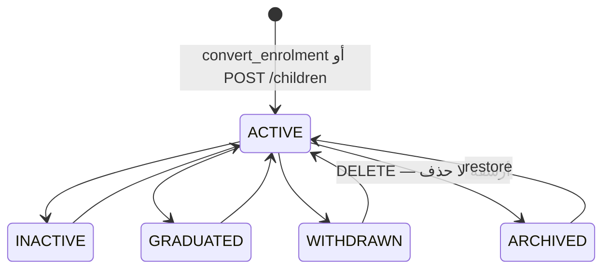
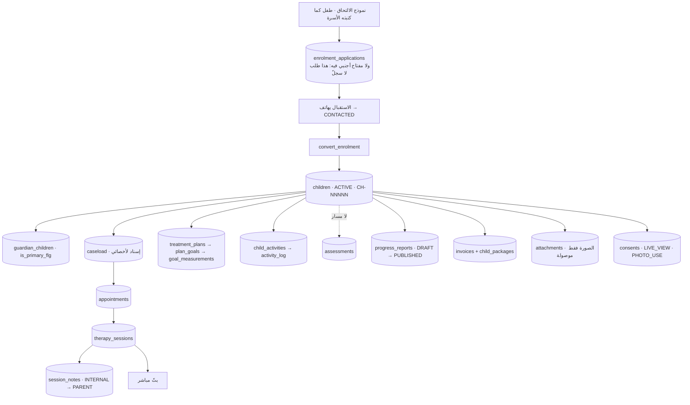

# 16 — BENEFICIARY (CHILD) LIFECYCLE

**الكيان:** `hbh.children`. **المستفيد هو الطفل**، ولا كيان «مستفيد بالغ» في هذه
السكيما.

> **حدٌّ مسجَّل في الباكلوج (`BL-28`):** «**ليس طفلًا بلا وليّ أمر — كيانٌ لا
> يعرفه سلّم `can_access_child` أصلًا**». أي أن خدمة بالغٍ ليست ميزةً ناقصة بل
> كيانًا جديدًا يمسّ كل سياسة RLS على السجلّ السريري.

---

## ١ · مصادر إنشاء الطفل — اثنان

| Source | الطريق | الدالّة | `origin_source` |
|---|---|---|---|
| **`ENROLMENT_REQUEST`** | نموذج الالتحاق → تحويل | `convert_enrolment` | ⚫ **لا يُختَم للأمام** |
| **`CENTER`** | إدخال مباشر | `POST /api/v1/children` (CRUD · `CHILD.CREATE`) | ⚫ **لا يُختَم** |
| `ONLINE_CONSULTATION` | — | ⚫ لا وجود لها | قيمةٌ معرَّفة بلا كاتب |
| استيراد | ❌ لا مسار | — |

`0129` أضاف `children.origin_source` + **`children.origin_reference_id`** —
والثاني **بلا مفتاح أجنبي بقصد مسجَّل**:
> «ما يشير إليه يعتمد على المصدر. `ENROLMENT_REQUEST` تعني صفَّ
> `enrolment_applications`، و`ONLINE_CONSULTATION` **ستعني** صفَّ
> `consultation_requests` — **وهو جدولٌ لا وجود له بعد**. **عمودٌ واحد لا يستطيع
> أن يشير إلى جدولين، وقيدٌ يشير إلى الأوّل وحده يحرّم الثاني يوم يأتي.**»
> (وهي نفس حجّة `attachments.owner_id`.)

## ٢ · دورة الحياة

> ⚠️ **`children.status` بلا آلة حالة** — `CHECK` وحده. فكل انتقال مسموح، **ومنها
> `GRADUATED → ACTIVE`** و`WITHDRAWN → ACTIVE` بلا سبب مسجَّل.
> وهذا **انطباقٌ ناقص للقاعدة ٥ على كيان أساسيّ**. راجع 18 · C-17.

### الرحلة الكاملة من الباب إلى التقرير

---

## ٣ · منع تكرار الطفل — وهذا هو الموضع الأضعف

| الطريق | الحماية | الحكم |
|---|---|---|
| **تحويل نفس الطلب مرّتين** | `status = 'ENROLLED'` يرفع رفضًا يسمّي الطفل الناتج | ✅ **«تحويلٌ مرّتين ينتج طفلًا ثانيًا لأسرة واحدة»** |
| **طلبان لنفس الطفل** | ⛔ **لا بحث ولا قيد** — `convert_enrolment` **تُدرج طفلًا جديدًا دائمًا** | 🔴 |
| **إدخال مباشر مكرَّر** | ⛔ لا شيء | 🔴 |
| **الرقم القومي** | `uix_children_national` — **فهرس جزئي** `WHERE national_id IS NOT NULL` | ✅ **حيث وُجد** |
| **`child_no`** | `uq_children_no UNIQUE (center_id, child_no)` | ✅ (لكنه مولَّد، فلا يكشف تكرارًا) |
| **حالة `DUPLICATE`** | على **الطلب** لا على الطفل · **ويضعها إنسان** | 🟡 الحماية الوحيدة العملية |

> 🔴 **النتيجة:** طفل الأسرة نفسه المُرسَل مرّتين (مرّة من الموقع ومرّة بالهاتف)
> **ينتج طفلين إن حُوِّل الطلبان** — و**وليّ الأمر يُعاد استعماله** (بحثٌ بالجوال)
> فيصير للأسرة صفّان لنفس الطفل مربوطان بنفس وليّ الأمر.
> **والحماية الوحيدة أن يلاحظ موظّف الاستقبال ويسم الثاني `DUPLICATE` قبل
> التحويل.**
> وحينها تنقسم بيانات الطفل على صفّين: مواعيده على أحدهما وخطته على الآخر.
> راجع 18 · C-09 · و`OQ-48`.

### ولماذا الفهرس الجزئي على الرقم القومي **ليس** عيبًا بل علاجًا

> **`UNIQUE` عادي يعتبر كل NULL مختلفًا عن غيره** — نفس فخّ أوراكل. **لكن العلاج
> يعتمد على معنى الـNULL، وخلطهما يصنع العيب بدل أن يمنعه:**
> - NULL **قيمة** (`sys_params.center_id`: NULL تعني «عامّ») ← `UNIQUE NULLS NOT DISTINCT`
> - NULL **غياب** (`children.national_id`: NULL تعني «غير معروف بعد») ← **فهرس جزئي**
>
> **و`NULLS NOT DISTINCT` هنا ترفض ثانيَ طفل بلا رقم قومي** — وهو بالضبط العيب
> الذي **وصل الإنتاج في أوراكل، في مركز لأطفال صغار في مصر كثيرٌ منهم بلا رقم
> قومي.**
>
> **واختبره بصفّين على نفس جانب القاعدة** — صفّ بمركز وصفّ بدونه **لا يتصادمان
> أبدًا**، وهكذا نجا العيب من ٧٣ اختبارًا.

## ٤ · كيف يُبحَث عن طفل

| الطريق | الحقول |
|---|---|
| الكونسول | `GET /api/v1/children?q=` على `full_name_ar` · `child_no` |
| البوّابة | `GET /api/v1/children` → أطفال وليّ الأمر وحدهم عبر RLS |
| الحاجز | `can_access_child(child_id)` |

**والبحث محميّ بنصفَي علاج لا بنصف:**
> `LIKE` بلا `ESCAPE` **يُطيع ما كتبه المستخدم بدل أن يبحث عنه**: `%` تعني «كل
> شيء»، و`_` تعني «أي حرف». **استقبالٌ يكتب `%` وحده يُسلَّم كل أطفال المركز.**
> فالعلاج: `likeEscape` في Go **عند الربط**، و`ESCAPE '\'` على كل نمط في SQL —
> **و`ESCAPE` فوق مصطلح لم يهرّبه أحد زينةٌ تسمّي حرفًا غير موجود.**
> **والتهريب يسبق الطيَّ العربي:** `likeEscape` ثم `normalize_arabic` فوق نتيجته،
> لأن الدالّة لا تمسّ الشرطة المائلة (تُصغّر الحروف، وتحذف التشكيل والتطويل، وتطوي
> بدائل الألف والياء والتاء المربوطة، وتضغط المسافات).

## ٥ · تحديث بياناته

| من | المسار | الصلاحية |
|---|---|---|
| الاستقبال / المدير | `PATCH /api/v1/children/{id}` | `CHILD.EDIT` |
| الصورة | `POST /api/v1/children/{id}/photo` | `CHILD.EDIT` + موافقة `PHOTO_USE` |
| الأصل | ⛔ `trg_origin_immutable` — `HB240` |
| وليّ الأمر | ⛔ **لا يعدّل بيانات طفله** |

### صورة الطفل — والقصّة التي تشرح قاعدتين

**بوّابة الصورة كانت تسأل عن `consent_type = 'PHOTO'` ولا وجود لهذا النوع**
(السكيما تحمل `PHOTO_USE` منذ بُنيت الموافقات). فكانت **بوّابةً بلا مفتاح**: كل
صورة تُرفَض، والرسالة تطلب من الاستقبال تسجيل موافقة **لا تكتبها أي دالّة في
السكيما**. والفحص الأوّل — «بلا موافقة يُرفض» — **مرّ أخضر** وبدا أن البوّابة تعمل.
> **فحصُ رفضٍ بلا فحص قبول بعده لا يثبت أن البوّابة تفتح — يثبت أنها مغلقة.**
> والرفض كان **مطلقًا لا مشروطًا**.

و`children.photo_url` حُذف على **خطوتين** (`0077` القارئ أوّلًا · ثم `0078`
العمود):
> **العمود الذي ما زال يقرؤه أحد يُحذف على خطوتين — القارئ أوّلًا — أو لا يُحذف.**
> فالترتيب المعكوس مرّةً جعل **كل** قراءة طفل `42703` — البوّابة والكونسول معًا،
> **وواحدًا وأربعين فحصًا في مجموعات الـAPI.**

## ٦ · ربطه بالأسرة

`hbh.guardian_children` — وليّ أمر أساسي واحد (`0032`)، وأكثر من وليّ أمر مسموح،
و`relationship_code` من `lookup_values.RELATIONSHIP` (`FATHER` · `MOTHER` ·
`GUARDIAN`).

**سلّم الرؤية:** `can_access_child` هو الجواب الوحيد، **و«الصلاحية تقول ماذا ولا
تقول أيّ صفّ أبدًا»**. و«وليّ أمر لا يبلغ بيانات طفل آخر بتعديل رابط — **تُفرَض
بـRLS لا بشرطٍ في الصفحة**».

## ٧ · ما يُنشأ حوله

| الكيان | الشرط | الحالة |
|---|---|---|
| `caseload` | أخصائي + خدمة | 🟡 بلا قواعد (F-18) |
| `appointments` | `caseload` للخدمات التي تطلبه · فتحة صحيحة | ✅ |
| `therapy_sessions` | موعد `CHECKED_IN` + `creates_session_flg` | ✅ |
| `treatment_plans` | `PLAN.MANAGE` | 🟡 قاعدة الاعتماد أُسقطت (`HBH-044`) |
| `child_activities` | مكتبة الأنشطة | ✅ |
| `assessments` | — | 🔴 **لا مسار** |
| `progress_reports` | `REPORT.WRITE` | ✅ (والمنحة هشّة — C-02) |
| `invoices` · `child_packages` | `BILLING.MANAGE` | 🟡 الخصم غير موصول (C-01) |
| `consents` | `GUARDIAN.MANAGE` | 🟡 لا شاشة جامعة |
| `attachments` | — | 🔴 الصورة وحدها |
| `waiting_list` | — | 🔴 لا مسار |

## ٨ · طفل واحد لكل جلسة — قرار مقفول

**قيد استبعاد على الطفل.** لا جلسات جماعية ولا جدول مشاركين.
> **و«الجماعية تحتاج عكسه»** — فهي نقضٌ لقرار لا توسيعٌ له.

## ٩ · النهاية

| الحالة | الطريق | ما يحدث لما تحته |
|---|---|---|
| `INACTIVE` / `GRADUATED` / `WITHDRAWN` | `PATCH .../children/{id}` | ⛔ **لا شيء** — مواعيده المستقبلية تبقى · بوّابة أهله تبقى مفتوحة · فواتيره تبقى |
| أرشفة | `DELETE` → `active_flg = false` | السياسات تحجب الصفّ · والصفوف تحته؟ **غير موثَّق** |
| **حذف فعليّ** | ⛔ **لا منحة `DELETE`** · و**بيانات الطفل السريرية لا تُحذف دون إجراء امتثال موثَّق** | — |

**والسكيما مُعدَّة للمحو الامتثالي في موضع واحد على الأقلّ:**
`fk_ntf_child ON DELETE SET NULL` — «**محوٌ امتثاليٌّ موثَّق لطفل لا يُحجَب برسالةٍ
أُرسلت مرّة، ولا يترك مرجعًا معلَّقًا.**»
⚠️ **ولا إجراء ولا مسار ولا وثيقة تصف ذلك المحو.** راجع `OQ-49`.

> **وقبل حذف صفّ لا تعرفه، اسأل سجلّ التدقيق** — درسٌ دُفع ثمنه: صفٌّ طُلب حذفه
> بوصفه «من فيكسترتك» لم يكن كذلك، و`v_audit_trail` أظهر أنه أُدرج في **نفس معاملة**
> تقرير تقدّم حقيقي بيد مستخدم آخر. **والعلاج لم يكن الحذف بل تصحيح النسبة
> الكاذبة — فانفكّ الحاجز والصفّ باقٍ. حذف صفّ لفكّ حاجز اختبار يوسّع الضرر ولا
> ينهيه.**

---

## ١٠ · مقارنة سريعة: وليّ الأمر مقابل الطفل

| البند | GUARDIAN | CHILD |
|---|---|---|
| مصادر الإنشاء | ٢ (التحاق · مركز) | ٢ (التحاق · مركز) |
| إعادة استعمال عند التحويل | ✅ **بالجوال** | ⛔ **دائمًا جديد** |
| قيد تفرّد | ⛔ **لا شيء على الجوال** | 🟡 الرقم القومي **حيث وُجد** |
| حالة | ⛔ لا عمود حالة | ٤ قيم · **بلا آلة** |
| آلة حالة | — | ⛔ |
| حساب دخول | ✅ عبر `users` | ⛔ لا يدخل |
| تسجيل الأصل | `registration_source` ⚫ | `origin_source` + `origin_reference_id` ⚫ |
| اكتمال الملفّ | `record_completeness` ⚫ | ⛔ لا عمود |
| عدم قابلية تغيير الأصل | ✅ `HB240` | ✅ `HB240` |
| سلّم الرؤية | يرى أطفاله | **هو الجذر** |
| الأرشفة | ✅ | ✅ |
| محو امتثالي | غير موصوف | **غير موصوف — والسكيما مُعدَّة له** |

---

## OPEN QUESTIONS

| # | السؤال | الأثر |
|---|---|---|
| **OQ-48** | طفل واحد وصل بطلبين (موقع + هاتف) وحُوِّل الطلبان → **صفّان**. هل يُضاف بحثٌ عن طفل قائم داخل `convert_enrolment` (بالاسم + تاريخ الميلاد + وليّ الأمر)؟ ومن يقرّر أنهما واحد؟ | F-09 · 16 · 18 · C-09 |
| **OQ-49** | **إجراء المحو الامتثالي**: من يطلبه، ومن يوافق، وما يُحذف فعليًّا، وما يبقى في `audit_log_archive`؟ (السكيما مُعدَّة والإجراء غير موصوف) | 16 · F-44 · القاعدة ٣ |
| **OQ-50** | `children.status = 'GRADUATED'`/`'WITHDRAWN'` — هل تُلغى المواعيد المستقبلية؟ تُغلق بوّابة الأهل؟ تُوقَف الفواتير؟ (اليوم: لا شيء من الثلاثة) | F-10 · FL-04 · FL-02 · FL-10 |
| **OQ-51** | خدمة **البالغين** (`BL-28`) — إن طُلبت، فهي كيانٌ جديد لا توسيعٌ لـ`children`. تُدرَس قبل أي كود | 16 · كل سياسة على السجلّ السريري |
| **OQ-52** | «دراسة الحالة» → أعمدة الملفّ (`HBH-019`): ما الحقول التي يحتاجها ملفّ الطفل ولا توجد؟ | F-10 |
