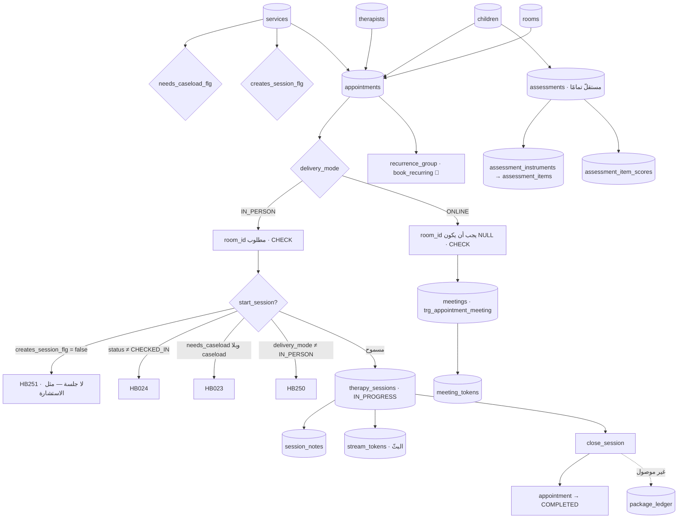
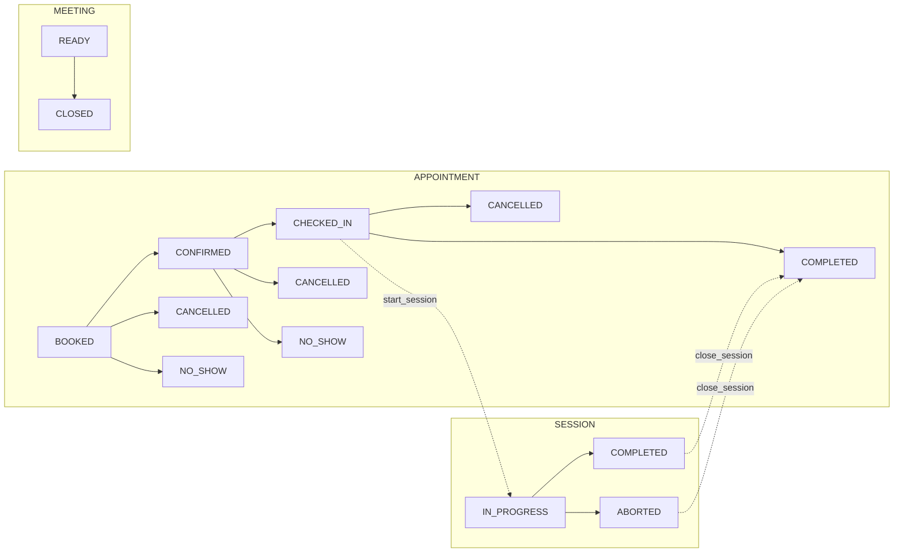

# 17 — APPOINTMENT / SESSION LIFECYCLE

**الوثيقة التي تجيب السؤال الأكثر إرباكًا في هذا النظام:**
ما الفرق بين Appointment و Session و Consultation و Assessment و Course Session؟

---

## ١ · الجواب في سطر لكل واحد

| المفهوم | الجدول | ما هو بالضبط |
|---|---|---|
| **Appointment** | `hbh.appointments` | **حجزٌ للوقت.** طفل × أخصائي × خدمة × نافذة زمنية (× غرفة إن حضوريًّا). **يوجد قبل أن يحدث أي شيء.** |
| **Session** | `hbh.therapy_sessions` | **العمل الإكلينيكي الذي جرى فعلًا.** يُخلَق **عند الضغط على «ابدأ»**، ولا يوجد قبله. |
| **Consultation** | `hbh.appointments` + `hbh.meetings` | **ليست كيانًا.** هي موعدٌ بـ`delivery_mode = 'ONLINE'` لخدمة `creates_session_flg = false`. **ولا تفتح جلسة إطلاقًا.** |
| **Assessment** | `hbh.assessments` | **نتيجةُ أداةٍ قياسية** على طفل. حدثٌ سريريّ **منفصل** عن الموعد والجلسة — وقد يُحجَز له موعد بخدمة `kind_code = 'ASSESSMENT'`. |
| **Course Session** | `hbh.appointments` + `recurrence_*` | **ليست كيانًا.** «كورسٌ من ١٢ جلسة» = **١٢ صفَّ موعد** مربوطةً بمجموعة تكرار. 🔴 غير موصول. |

> **القاعدة الجامعة: الموعد يقول *ماذا اتُّفق عليه*، والجلسة تقول *ماذا حدث*.**
> وهما جدولان لأن الجوابين قد يختلفان: موعدٌ أُلغي لا جلسة له، وجلسةٌ أُوقفت
> (`ABORTED`) على موعدٍ اكتمل (`COMPLETED`).

---

## ٢ · الخريطة

---

## ٣ · متى يُخلَق كلٌّ منهما

| السؤال | الجواب |
|---|---|
| **متى يُخلَق الموعد؟** | عند ضغط «احجز» — `book_appointment`. يولد `BOOKED`. |
| **متى يُخلَق اللقاء (`meeting`)؟** | **مع الموعد نفسه** — `trg_appointment_meeting` يُنشئه للمواعيد `ONLINE`. يولد `READY`. `UNIQUE(appointment_id)`. |
| **متى تُخلَق الجلسة؟** | **عند ضغط «ابدأ» — لا قبله.** `start_session` من موعد `CHECKED_IN`. **لا صفّ `therapy_sessions` قبل ذلك.** |
| **هل الجلسة موجودة قبل البدء؟** | **لا.** وهذا سؤالٌ يُسأل كثيرًا والجواب حاسم. |
| **متى يُخلَق التقييم؟** | `record_assessment` — 🔴 **بلا مسار**. غير مربوط بموعد ولا جلسة. |
| **متى تُخلَق ملاحظة الجلسة؟** | `write_session_note` — على جلسة قائمة. تولد `INTERNAL`. |
| **متى يُخلَق توكن البثّ؟** | عند فتح المشاهدة على جلسة `IN_PROGRESS`. عمره ≤ ١٥ دقيقة. |

---

## ٤ · الأعلام التي تقرّر كل شيء — `0118`

| العلم | على | ماذا يقرّر |
|---|---|---|
| `services.creates_session_flg` | الخدمة | **هل تفتح هذه الخدمة جلسة علاج؟** — الاستشارة: `false` |
| `services.needs_caseload_flg` | الخدمة | **هل تحتاج صفَّ `caseload`؟** — الاستشارة: `false` |
| `appointments.delivery_mode` | الموعد | `IN_PERSON` \| `ONLINE` — و`room_id` مقيَّد بها **بالاتجاهين** |

### ولماذا **أعلامٌ** ولا `kind_code`

> `services.kind_code` قائم بالفعل، والوثيقة تسمّي خدمة الاستشارة `CONSULT`،
> **ومن المغري أن يُفرَّع عليه. وهو أيضًا نصٌّ حرّ: لا `CHECK` ولا `lookup`،
> والقيمتان في الجدول اليوم `OT` و`SPEECH` لأن أحدًا كتبهما.**
>
> **فسلوكٌ مُفتاحٌ عليه يكون قاعدةً مفروضةً بتهجئة.** ويوم يضيف مركزٌ `CONSULTATION`
> أو `CONSULT_ONLINE` أو يكتبها بالعربية، **تبدأ الجلسات تُفتح على الاستشارات
> ثانيةً — بصمت، لأن لا شيء في أي مكان يقول إن تلك السلاسل حمّالةُ حِمل.**
>
> **العلم قرارٌ اتّخذه أحدٌ ويمكن قراءته. و`kind_code` يبقى ما هو: لافتةٌ لشاشة.**

### والحارس الذي استبدله `0118`

`0117` جعل `start_session` ترفض كل ما ليس `IN_PERSON` — وقال في تعليقه إن ذلك
**النسخة الضيّقة من قاعدةٍ مكانها هنا**. وكان ضيّقًا **بالاتجاهين**:
- **أوسع من اللازم** — رفض موعدًا حضوريًّا لخدمةٍ لا تفتح جلسةً أيضًا، **بالمصادفة
  لا بالقاعدة**.
- **أضيق من اللازم** — لم يقل شيئًا عن خدمة علاج محجوزة `ONLINE`.

---

## ٥ · آلات الحالة — جنبًا إلى جنب

| البند | Appointment | Session | Meeting |
|---|---|---|---|
| القيم | ٦ | ٣ | ٤ (٢ بلا كاتب) |
| آلة مفروضة | ✅ `HB020` | ✅ `HB025` | ⛔ **لا شيء** |
| جدول تاريخ | ✅ | ✅ | ⛔ |
| سبب الإلغاء إلزامي | ✅ `ck_appointments_cancel` | ✅ `abort_reason` عند `ABORTED` | ✅ `ck_meetings_reason` |

> ⚠️ **`meetings` هو أحدث جدول حالة في السكيما وأقلّها التزامًا بالقاعدة ٥.**
> راجع 18 · C-11.

**والملاحظة الحاسمة:** `close_session` تُكمل الموعد **إن كان `CHECKED_IN`** —
حتى لو كانت الجلسة `ABORTED`:
> «**الموعد سؤالٌ منفصل وله جوابه: الزيارة حدثت إمّا كان أو لم يكن، فتكتمل حتى
> لو لم يكتمل العمل السريري.**»

---

## ٦ · جدول المسؤوليات

| العملية | Feature | الصلاحية | الدالّة | المسار |
|---|---|---|---|---|
| عرض الفتحات | F-19 | `APPOINTMENT.BOOK` | `available_slots` | `GET /appointments/slots` |
| التحقّق من فتحة | F-19 | `APPOINTMENT.BOOK` | `validate_slot` | `POST /appointments/validate` |
| **حجز موعد** | F-20 | `APPOINTMENT.BOOK` | `book_appointment` | `POST /appointments` |
| تأكيد · حضور | F-21 | `APPOINTMENT.BOOK` | `trg_appointment_status` | `PATCH .../status` |
| إلغاء · تخلّف | F-21 | `APPOINTMENT.CANCEL` | كذلك | كذلك |
| **بدء جلسة** | F-25 | `SESSION.START` + `caseload` | `start_session` · `can_start_session` | `POST /appointments/{id}/session` |
| كتابة ملاحظة | F-26 | `SESSION.NOTES.EDIT` + صاحب الجلسة | `write_session_note` | `PUT /sessions/{id}/note` |
| نشر الملاحظة | F-26 | `NOTE.PUBLISH` | `publish_session_note` | `POST /notes/{id}/publish` |
| **إغلاق جلسة** | F-25 | `SESSION.COMPLETE` + `can_close_session` | `close_session` | `PATCH /sessions/{id}/close` |
| مشاهدة البثّ | F-27 | `LIVE.VIEW` + موافقة | `issue_stream_token` | `POST /sessions/{id}/stream` |
| **دخول الاستشارة** | F-36 | `authorize_meeting_entry` | كذلك | `POST /appointments/{id}/consultation` |
| **تسجيل تقييم** | F-31 | `ASSESSMENT.RECORD` | `record_assessment` | 🔴 **لا مسار** |
| **نشر تقييم** | F-31 | `ASSESSMENT.PUBLISH` | `publish_assessment` | 🔴 **لا مسار** |
| **حجز كورس** | F-22 | `APPOINTMENT.BOOK` (`HB101`) | `book_recurring` | 🔴 **لا مسار** |

---

## ٧ · الصلاحية الحرجة — ومن يغلق جلسة من

| المنادي | يغلق |
|---|---|
| `THERAPIST` (`user_type = 'STAFF'` · وصاحب الجلسة) | **جلسته هو وحدها** |
| `CENTER_ADMIN` (`user_type = 'STAFF'` + `SESSION.COMPLETE`) | **أي جلسة** |
| أي أحد آخر | `HB026` |

> 🔴 **العيب الذي عُلِّم منه:** `can_close_session` سمحت بالإغلاق لمن يملك
> `CHILD.VIEW_ALL` **و**`SESSION.COMPLETE` — **ودور `THERAPIST` يملك الاثنتين**
> (الأولى ليغطّي زميلًا، والثانية ليُغلق جلساته هو) — **فصار أي أخصائي يغلق جلسة
> أي أخصائي آخر.**
>
> **والقاعدة المستخلَصة:** «تجاوزٌ إداريّ مبنيّ على الصلاحيات وحدها يُعطي الدور
> الذي يملكها لعمله **سلطةً على عمل الجميع**.» فالتجاوز مقيَّد بـ`user_type = 'STAFF'`.
> **الخط: الإكلينيكي يُغلق عمله هو، والإداري يُغلق عمل أي أحد — تبريران مختلفان،
> ففرعان مختلفان.** ومجموعة القبول هي التي وجدتها.
>
> **وتجهيزةٌ فيها أخصائية واحدة — وهي صاحبة الجلسة — لا تستطيع التفريق بين
> الرفضين أصلًا**، فتُمرّر أي رمز يرجّعه الكود. تحتاج زميلةً تملك
> `SESSION.NOTES.EDIT` **ولا تملك جلسة**، **وتُؤكَّد صلاحيتها بالاسم قبل
> الاختبارات**.

---

## ٨ · الاستشارة الأونلاين — لماذا ليست جدولًا

**الحجّة الكاملة (رأس `0117`):**

> الحجز المزدوج يُمنَع بقيود `EXCLUDE USING gist`، **وتلك تعمل داخل جدول واحد.**
> **جدولٌ ثانٍ يمنح وقت الأخصائي مصدرين، ولا شيء في المحرّك يستطيع أن يمنع
> استشارةً وجلسةَ علاج في نفس الدقيقة.** فالمشكلة التي كلّف حلُّها ما كلّف تعود
> **في الشكل الوحيد الذي لا يستطيع أي قيد أن يمسكه.**

**فالاستشارة موعدٌ، وثلاثة أشياء تتغيّر فيه:**
1. `delivery_mode = 'ONLINE'` · و`room_id` **يجب أن يكون `NULL`**
2. خدمتها `creates_session_flg = false` · `needs_caseload_flg = false`
3. `trg_appointment_meeting` ينشئ لها `meetings` + غرفةً عشوائية الاسم

**والحاضر وليّ الأمر لا الطفل** — «وهذه وحدها تكسر ثلاثة افتراضات»
([`../architect/03-online-consultation.md`](../architect/03-online-consultation.md)).

### ولماذا كانت الميزة كاملةً وغير قابلةٍ للوصول

> `hbh.available_slots` — **الشيء الوحيد الذي يخبر الكونسول أي النوافذ قابلة
> للحجز** — كانت تلفّ على `hbh.rooms` وترجّع فتحةً فقط إن كانت غرفةٌ حرّةً في تلك
> الساعة. **والاستشارة الأونلاين لا غرفة لها، فلم تُعرَض فتحةٌ قطّ، فلم يستطع
> الاستقبال حجز واحدة، فلم تصل أسرةٌ الباب أبدًا.**
>
> **والميزة كانت كاملة وغير قابلة للوصول. وهذا يستحقّ أن يُسمَّى، لأن كل ما دونها
> اختُبر أخضر: السكيما، والـAPI، وشاشة البوّابة، و١١٥٠ فحصَ قبول. ولم يسأل أحد
> السؤال الوحيد الذي يهمّ — هل يستطيع أحدٌ إنشاء الصفّ.** أُصلح في `0127`.

---

## ٩ · التقييم — كيان مستقلّ

| البند | القيمة |
|---|---|
| الجدول | `assessments` → `assessment_instruments` → `assessment_items` → `assessment_item_scores` |
| مربوط بموعد؟ | ⛔ **لا** — و`ASSESSMENT` موجود كـ`SERVICE_KIND` فيُحجَز له موعد كأي خدمة |
| مربوط بجلسة؟ | ⛔ **لا** |
| الحالة | `DRAFT → COMPLETED → PUBLISHED` · والسحب `PUBLISHED → COMPLETED` |
| المسار | 🔴 **لا شيء** |

**القرارات الأربعة (رأس `0023`):**
1. **الأداة بيانات والتقييم حدث.** مركزٌ يضيف أداةً جديدة **بإدراج صفّ لا بنشر**،
   **وحدود الدرجة الصحيحة تخصّ الأداة** — فمشغّل يفحص كل درجة مقابل الأداة
   المستعملة: «درجةٌ خامٌّ بـ٨٧ سليمةٌ على واحدة ومستحيلةٌ على أخرى».
2. **يولد مسودّةً ويصل الأسرة بقصد** — نفس سلّم الملاحظة (`D-24`).
3. **المنشور مجمَّد** — الملخّص والدرجات معًا: «أسرةٌ قرأت نتيجةً في مارس يجب أن
   تجدها نفسها في سبتمبر».
4. `ASSESSMENT` كان **نوع خدمة ولا شيء أكثر**: يُحجَز الطفل لواحدة ولا مكان لما
   تجده.

> 🔴 **والعلاقة بالالتحاق موصولة نصفًا:** الحالة `ASSESSMENT_BOOKED` موجودة على
> الطلب، و`0110` يُرسل لها قالب SMS — **ولا شيء يربطها بموعد حقيقي ولا بصفّ
> `assessments`.**

---

## ١٠ · الكورس (الحجز المتكرّر)

| البند | القيمة |
|---|---|
| الجدول | `appointments` + `recurrence_group` (`0022`) |
| الدالّة | `book_recurring` · `cancel_recurrence` |
| المسار | 🔴 **لا شيء** |

**التصميم يستحقّ الحفظ:**
> **اثنتا عشرة جلسة أسبوعية ليست حجزًا واحدًا.** احجز كورسًا يمرّ فوق عطلة رسمية،
> **والنتيجة الصادقة أحد عشر موعدًا ورفضٌ واحد بسببه.**
> **والتصميمان البديهيّان كلاهما خاطئ:** فشلُ الاثنتَي عشرة لأن واحدة تصادمت
> **يهدر الإحدى عشرة الحرّة**، وتخطّي المتصادمة **بصمت** يسلّم الاستقبال كورسًا
> **فيه ثقبٌ يعرفونه بعد ستّة أسابيع**.

---

## ١١ · أسئلة تُسأل كثيرًا — والجواب من الكود

| السؤال | الجواب |
|---|---|
| هل كل موعد له جلسة؟ | **لا.** الملغى والمتخلَّف لا جلسة لهما، والاستشارة (`creates_session_flg=false`) كذلك |
| هل كل جلسة لها موعد؟ | **نعم** — `start_session` تأخذ `appointment_id` |
| أكثر من جلسة لموعد؟ | **لا** — `HB022` |
| أكثر من لقاء لموعد؟ | **لا** — `UNIQUE(appointment_id)` |
| جلسة بلا `caseload`؟ | **فقط** إن كانت الخدمة `needs_caseload_flg = false` |
| جلسة على موعد أونلاين؟ | **لا** — `HB250` |
| استشارة على موعد حضوري؟ | ممكن نظريًّا · **لكن `room_id` سيكون مطلوبًا** و`meetings` لن يُنشأ |
| بثّ على جلسة مغلقة؟ | **لا** — `HB061` · والصيانة تُبطل التوكنات |
| تقييم مربوط بجلسة؟ | **لا** |
| موعد بأثر رجعي؟ | بحسب `ALLOW_BACKDATED_BOOKING_DAYS` |
| جلسة تبدأ قبل وقت موعدها؟ | `validate_slot` يحكم الحجز · **وبدء الجلسة يشترط `CHECKED_IN` وحده** — راجع `OQ-53` |

---

## OPEN QUESTIONS

| # | السؤال | الأثر |
|---|---|---|
| **OQ-53** | هل يجوز بدء جلسة **قبل** وقت موعدها المحدَّد؟ الشرط اليوم `CHECKED_IN` وحده ولا فحص وقت | F-25 · FL-06 |
| **OQ-54** | هل يجوز تسجيل الحضور (`CHECKED_IN`) لموعد **مضى وقته** بأيام؟ | F-21 |
| **OQ-55** | التقييم — هل يُربَط بموعد (`appointment_id`) أم يبقى مستقلًّا؟ والقرار يقرّر إن كان `ASSESSMENT_BOOKED` يصنع صفًّا أم لا | F-31 · FL-01 |
| **OQ-56** | جلسة `ABORTED` — `is_billable_flg` يبقى `true`. من يقلبه ومتى؟ وهل تُخصَم من الباقة؟ | F-25 · F-34 · F-35 |
| **OQ-57** | من يدخل غرفة الاستشارة من جهة المركز، ومن أي شاشة؟ (لا شاشة كونسول اليوم) | F-36 · 06 |
