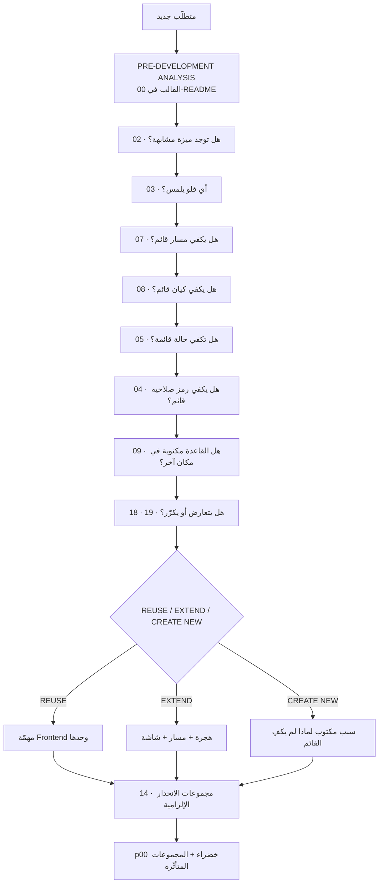

# 22 — RECOMMENDATIONS & SYSTEM HEALTH

> **لا يُبدأ إصلاح أي شيء من هذه الوثيقة قبل مراجعة المالك.**
> هذا تقريرٌ يُقرأ ويُقرَّر عليه، لا خطّة تنفيذ.

---

# ١ · SYSTEM HEALTH

| المحور | التقييم | الحكم |
|---|---|---|
| **اتّساق المعمار** | 🟢 **٩ / ١٠** | ثلاث طبقات بمسؤوليّات مفصولة بانضباط نادر. القاعدة ٢ محترَمة: **لم أجد قاعدة عمل واحدة في Go بلا نظير في القاعدة**. والاصطلاح متّسق في ٢٩٦ مسارًا و٨٦ جدولًا |
| **اتّساق الفلو** | 🟠 **٥ / ١٠** | الطرفان ممتازان والوسط مقطوع. **ستّ قدرات كاملة بصفر مسار**، وسبعة فلوهات موصولة نصفًا |
| **خطر التكرار** | 🟢 **٨ / ١٠** | لا مسار مكرَّر · لا جدول مكرَّر · لا شاشة مكرَّرة. **والبند الحادّ واحد** (صيغة الجوال) |
| **الخطر الأمنيّ** | 🟡 **٦ / ١٠** | الأساس صلب جدًّا (RLS داخل السياسة · `hbh_app` بثلاث خصائص مفحوصة بالاسم · الهوية تفشل مقفولة · حاجز المستأجر مُثبَت بـ`p14`). **والخارجيّات ناقصة:** TLS · `TRUST_PROXY` · حادثة نشرٍ غير مغلقة · ورفعٌ يكتب في تاريخ git |
| **خطر سلامة البيانات** | 🔴 **٤ / ١٠** | **رصيد الباقة لا يُخصَم** · تكرار وليّ أمر ممكن · تكرار طفل ممكن · وأعمدة أصلٍ تشيخ من يوم إضافتها |
| **توافق الواجهة/الخادم** | 🟡 **٦ / ١٠** | العقد غير مقابَل بـ١١ مسارًا · صيغة جوالٍ تحجب ميزةً مقبولة · حارسان بصلاحيةٍ خاطئة · وتعليقٌ ينقض كوده |
| **مستوى إعادة الاستعمال** | 🟢 **٩ / ١٠** | `resource-screen` لعشرين موردًا · `registerCRUD` لـ١٧٨ مسارًا · مكوّن مشترك بين تطبيقين · و`available_slots` **تسأل** `validate_slot` ولا تنسخها |
| **الدين التقني** | 🟠 **٥ / ١٠** | ٣٩ بندًا · وأثقلها **حوكميّ لا تقنيّ**: ٩٩ هجرة بلا مرحلة قبول، و`p00` حمراء، وجولة كاملة عمرها تسعة أيام |
| **جودة التوثيق** | 🟢 **١٠ / ١٠** | **استثنائية.** رؤوس الهجرات تسمّي أخطاءها بثمنها، و`CLAUDE.md` يصحّح نفسه بتاريخ، و`INDEX.md` يقول عن كل وثيقة **هل تُعتمَد** |

## الحكم العامّ

**نظامٌ مبنيّ جيّدًا وموصولٌ ناقصًا.**

القاعدة هي أقوى ما فيه: ١٩٥ سياسة، و٩٩ رمز رفض كلٌّ يسمّي قاعدة، و١٢٩ هجرةً
تحمل رؤوسُها أسبابَها وأثمانَها. والخلل ليس في ما بُني **بل في ما لم يُوصَل** —
وهو نمطٌ واحد يتكرّر بستّ صور:

> **قدرةٌ كاملة في القاعدة، مختبَرةٌ بمجموعة قبول تنادي دالّتها مباشرةً، وصفر
> منادٍ فوقها.**

والمشروع يعرف هذا النمط ويسمّيه بدقّة:
- `expire_packages` «**كُتبت واختُبرت وكانت صحيحة ولا شيء يناديها**» → أُصلحت بحاوية الصيانة
- `grant_portal_access` «**الحلقة لم تكن مكسورة في السكيما. كانت مكسورة طبقةً واحدة أعلى**» → أُصلحت في `0125`
- `available_slots` «**الميزة كانت كاملة وغير قابلة للوصول… ولم يسأل أحد السؤال الوحيد الذي يهمّ: هل يستطيع أحدٌ إنشاء الصفّ**» → أُصلحت في `0127`
- `publish_assessment` «**لا مسار يصل إليها خاصيّةُ الموجّه لا الدالّة**» → **لم تُصلَح**
- `consume_package_session` → **لم تُصلَح، ولم تُسجَّل بعد**
- `waiting_list` · `book_recurring` · `attach_file` · `schedule_blocks` → **لم تُصلَح**

**والسبب الجذري مسجَّل في الباكلوج بدقّةٍ لا تُحسَّن:**
> «**ما يُختبر هو ما يتكرّر، وما يُنسى هو ما يحدث مرّة.**»

---

# ٢ · TOP 10 RISKS

| # | الخطر | الاحتمال | الأثر | الدليل |
|---|---|---|---|---|
| **R-01** | **رصيد الباقة لا يُخصَم** — أسرةٌ تدفع ١٢ جلسة ويبقى رصيدها ١٢ للأبد، والدفتر الذي يُفترَض أن يشرح ذلك **فارغ** | **مؤكَّد** | **مالٌ وثقة** | 18 · C-01 |
| **R-02** | **الحكم على النظام مبنيٌّ على قياس عمره تسعة أيام و٩٩ هجرة** · و`p00` — الحارس الوحيد المتبقّي — **حمراء** | **مؤكَّد** | **كل حكمٍ آخر** | 21 · T-01 · T-02 |
| **R-03** | **ميزةُ صياغة التقارير تختفي على قاعدة معاد بناؤها** — والقاعدة تبدو سليمة تمامًا | **مؤكَّد على رَبنة** | **ميزة كاملة + وقتُ تشخيصٍ مضلِّل** | 18 · C-02 |
| **R-04** | **أصول مرفوعة تدخل تاريخ git ومجلّد مزامنة** — وصورةٌ لم تُنشَر بعد (فموافقتها قد لا تكون مسجَّلة) **تدخل على أي حال، ولا تُسحَب من التاريخ** | عالٍ | **خصوصيةٌ وامتثال** | 18 · C-06 |
| **R-05** | **TLS غير مثبَّت · و`TRUST_PROXY` غير مضبوط** · وحادثة نشرٍ **غير مغلقة بأدلّة** | عالٍ | **اعتمادات على السلك · وسجلٌّ يسمّي IP النفق لا العميل** | 21 · T-36 · T-37 · T-39 |
| **R-06** | **أسرةٌ أُدخلت من المركز لا تستطيع الدخول** — ولا مسار ولا زرّ، والعرض الذي يجيب السؤال بلا قارئ | **مؤكَّد** | **الفلو الأساسي** | 20 · M-07 |
| **R-07** | **صندوق الصادر يتوقّف ولا أحد يعلم** — `v_sms_health` بلا قارئ. **وبلا رسالة لا وليَّ أمر يستطيع الدخول** | متوسّط | **توقّفُ الخدمة صامتًا** | 18 · C-16 |
| **R-08** | **`HB240` يحمل قاعدتين** — رفضٌ يصل الشاشة بالكلمة الخطأ، **واللوج يقرأ محاولةً أمنيّة لا وجود لها** | **مؤكَّد** | تشخيصٌ مضلِّل · وثقةٌ في اللوج | 18 · C-04 |
| **R-09** | **تكرار وليّ أمر وتكرار طفل ممكنان** — وبيانات الطفل تنقسم على صفّين | عالٍ | **سلامة السجلّ السريري** | 18 · C-07 · C-09 |
| **R-10** | **نسخةٌ احتياطية لم تُستعَد قطّ** — ونسخةٌ لم تُستعَد ليست نسخة | متوسّط | **كارثيّ عند الحدوث** | 21 · T-38 |

---

# ٣ · TOP 10 RECOMMENDED FIXES

**مرتَّبة بـ(الأثر ÷ الكلفة)، وكلٌّ منها ينتظر مراجعة.**

| # | الإصلاح | الكلفة | يغلق |
|---|---|---|---|
| **X-01** | **أعِد جولة القبول الكاملة وأصلح `p00`** — قبل أي ميزة جديدة. **وثبّت الأرض:** معرّف الصورة + `count(*)` **مع** `max(version)`، والفحص قبل كل مجموعة **ومرّة أخيرة بعد آخر واحدة** | يوم | R-02 · وكل حكمٍ يليه |
| **X-02** | **انقل منحة `REPORT.WRITE` إلى `db/seed/0002_rbac.sql`** — سطران. وأضف فحصًا في `p00`: **لا هجرة تُدرج في `role_permissions`** | ساعة | R-03 · C-02 |
| **X-03** | **رمزٌ جديد لقاعدة الأصل، ووسّع `code-drift`** ليفشل على `SQLSTATE` يُرفَع بمعنيين — **لا بوجودٍ بل بتفرّد** | ساعتان | R-08 · C-04 |
| **X-04** | **جوال واحد في الواجهة، مقروءٌ من `GET /settings/params`** · واحذف النسختين المضمَّنتين في `apply.ts` · وحارسُ لينت يمنع رقمًا مصريًّا مضمَّنًا في `web/` | نصف يوم | C-05 · D-09 · **ويفتح ميزةً مقبولة في `p15`** |
| **X-05** | **وجهةُ رفعٍ خارج الشجرة** (`~/hbh-site-assets`) و`site-export.sh` ينسخ منها عند النشر — **فيدخل التاريخَ المنشورُ وحده**. وأضف إلى `backup.sh` نفس حارس مجلّد المزامنة على وجهات الرفع | نصف يوم | R-04 · C-06 |
| **X-06** | **اقرأ عروض الصحّة الثلاثة** في `/api/v1/ops/health` وبلاطةٍ في اللوحة — **المسار والعرض موجودان، والناقص سطران في `opslog.go`** | ساعتان | R-07 · C-16 · `HBH-008` |
| **X-07** | **اربط خصم الباقة** — بعد أن يجيب المالك `OQ-02` · وفي **جملة مستقلّة** (`27000`) · وأضف إلى `p6` فحصًا يثبت أن **إغلاق الجلسة** يحرّك الدفتر، **لا أن الدالّة تحسب صحيحًا** | يوم (وقرار المالك أوّلًا) | R-01 · C-01 |
| **X-08** | **TLS على المسارات الثلاثة + `TRUST_PROXY=true` + إغلاق الحادثة بأدلّة** — واختبار نشرٍ يسأل **عمّا يجب ألّا يُجاب**: `/api/v1/...` بغير `404` يثبت كل شيء | يومان | R-05 |
| **X-09** | **مسار وزرّ لمنح حساب البوّابة** فوق `grant_portal_access` · وشاشةٌ تقرأ `v_guardian_portal_status` فتقول «هذه الأسرة بلا حساب» | يوم | R-06 · M-07 · `HBH-011`/`012` |
| **X-10** | **استعادةٌ فعلية مجدولة** — و`record_backup` و`backup_health` موجودتان بلا قارئ، فالاستعادة والتحقّق منها معًا | يوم | R-10 |

## وبعدها — بالترتيب المقترح للتوصيل

| الرتبة | الإصلاح | لماذا هذا الترتيب |
|---|---|---|
| ١١ | **`HBH-015` — اختبار قبولٍ يمشي الطريق من الصفر بلا `INSERT` بدور المالك** | **البطاقة التي تمنع تكرار النمط كلّه** — وكل ما بعدها أرخص بها |
| ١٢ | **دالّة إسناد بقواعدها** (`HBH-049` + `HBH-013`) | شرطٌ لبدء الجلسة، وهي اليوم `POST` عامّ بلا فحص |
| ١٣ | **توصيل التقييمات** (`HBH-041`) | ٤ جداول و٦ دوالّ وإشعارٌ وقالبٌ جاهزون · **وتفتح `ASSESSMENT_BOOKED` معناها** |
| ١٤ | **قيدٌ أو بحثٌ يمنع تكرار وليّ الأمر والطفل** | بعد `OQ-43` و`OQ-48` |
| ١٥ | **إشعارات الموظّفين الأربعة الميّتة** | الدالّة `notify_staff` موجودة · والناقص أربعة مشغّلات |
| ١٦ | **آلة حالةٍ لـ`meetings`** + كاتبٌ لـ`PENDING`/`FAILED` أو حذفهما | القاعدة ٥ · وأحدثُ جدولٍ أقلُّها التزامًا |
| ١٧ | **مسارات قائمة الانتظار** (`HBH-024`) | ٧ دوالّ جاهزة |
| ١٨ | **`schedule_blocks` كمورد CRUD** | **صفّ `Spec` واحد** يعطي شاشةً كاملة — راجع 06 · §شاشة المورد |
| ١٩ | **نافذة قراءةٍ على جداول الشهادة الخمسة** | دفتر الباقة · التاريخ · الموافقات · المشاهدات · التدقيق المؤرشَف |
| ٢٠ | **اختبارات وحدة لـ`web/ops`** + `CHROME_BIN` بـ`--no-sandbox` | `HBH-046` · `HBH-047` — **واقرأ عدد ما نُفِّذ لا كود الخروج** |

---

# ٤ · ما لا يُبدأ قبل جواب المالك

**٦٥ سؤالًا مفتوحًا**، وهذه هي **الحاجزة** — لا يمكن العمل بلا جوابها:

| السؤال | لماذا حاجز | يحجب |
|---|---|---|
| **OQ-02** · متى يُخصَم رصيد الباقة؟ وهل `ABORTED` يُخصَم؟ | كل تنفيذٍ آخر يكون تخمينًا في **مال الأسرة** | X-07 · R-01 |
| **OQ-34** · هل يُدفَع أونلاين؟ | **لا بوّابة دفع في الشجرة، والاستشارة مدفوعة** | F-36 · F-34 |
| **OQ-43** · جوّالٌ واحد لوليَّي أمر؟ | يقرّر **هل يوجد قيد تفرّد أصلًا** | R-09 |
| **OQ-48** · بأي معيار طفلان واحدٌ؟ | يقرّر شكل منع التكرار | R-09 |
| **OQ-45** · من يمنح حساب البوّابة لأسرة من المركز؟ | يقرّر شكل X-09 | R-06 |
| **OQ-08** · قبول `RESCHEDULE` — نقلٌ تلقائي أم يدوي؟ | يقرّر إن كانت `parent_requests` نصفَ ميزة أم كاملة | FL-11 |
| **OQ-09** · إلغاء موعدٍ مؤكَّد بعد الدفع؟ وما أثره على الاسترداد؟ | **لا جدول أقساط ولا مفهوم استرداد** | FL-05 · FL-10 |
| **OQ-33** · القناة: SMS أم واتساب؟ (`BL-08`) | **اعتماد واتساب أسابيع وقد يُرفض** | I-01 · 10 |
| **OQ-05** · هل الأصل مطلوب لسجلّات جديدة؟ | **العمود يشيخ يوميًّا** | R-... · C-03 |
| **OQ-49** · إجراء المحو الامتثالي | **السكيما مُعدَّة له والإجراء غير موصوف** | القاعدة ٣ |
| **OQ-30** · الأنواع الخمسة الميّتة: تُوصَل أم تُحذف؟ | **تركها يجعل كل تخطيط يقرؤها كقدرة قائمة** | 10 |

**والمحجوب على المالك أصلًا** (`E4` في الباكلوج · **سبع بطاقات كلّها**): كتالوج
الخدمات ومدّتها وأسعارها (`BL-14`) — **وخمسة جداول تشير إلى `services` وهو بلا
بذور إنتاج. بلا كتالوج لا يُحجَز موعد ببيانات حقيقية، فلا يُختبر شيء بعده.**

---

# ٥ · القاعدة النافذة من الآن

## القواعد السبع التي يفرضها هذا الجرد

1. **لا ميزة قبل مراجعة `02` و`18`.**
2. **لا مسار جديد** قبل أن يُثبَت أن القائم لا يكفي — و**الاصطلاح متّسق اليوم،
   وأوّل خرقٍ له يبدأ التفكّك.**
3. **لا شاشة جديدة** قبل السؤال: **هل يكفي صفُّ `Spec`؟**
4. **لا حالة جديدة** قبل قراءة `05` — **وستّ أعمدة حالة بلا آلة أصلًا، فإضافة
   قيمةٍ إليها توسيعٌ للفوضى لا للقدرة.**
5. **لا رمز صلاحية جديد** إن كان الفرق **تسميةً لا قرارًا** — والعكس أيضًا:
   **حقّان لهما عاقبتان مختلفتان يحتاجان رمزين.**
6. **لا رمز `HBxxx` جديد** قبل `grep` على السكيما كلّها — **و`HB240` هو ما يحدث
   بغير ذلك.**
7. **كل `INSERT` يقرأ جدولًا تملؤه البذور مكانه ملفّ البذور** — و`0091` هو ما
   يحدث بغير ذلك.

## وثلاث قواعد اختبارٍ تجعل ما فوقها قابلًا للتصديق

8. **أكّد رمز الخطأ نفسه** — «السؤال ليس *هل فشل؟* بل **ما الذي رفضه؟**»
9. **كل فحص رفضٍ يسبقه `SET ROLE hbh_app`** — وإلّا فهو يختبر المالك.
10. **وفحص رفضٍ يتبعه فحص قبول** — «الرفض وحده لا يثبت أن البوّابة تعمل،
    **والقبول وحده هو ما يكشف أن الرفض صار أعمى**.»

---

# ٦ · ما يستحقّ أن يبقى كما هو

**تسجيلُ هذا جزءٌ من الجرد، لأن أوّل ما يُكسَر في «تحسينٍ» عامّ هو ما نجح:**

| البند | لا يُلمَس |
|---|---|
| **دور `hbh_app`** بـ`NOSUPERUSER` · `NOBYPASSRLS` · ولا يملك جدولًا — **والقبول يتأكّد من الثلاث بالاسم** | ✅ |
| **كل سياسة تبدأ بـ`current_center_id() IS NOT NULL`** | ✅ |
| **الهوية تفشل مقفولة: لا هوية = صفر صفوف** | ✅ |
| **`SET LOCAL` لا `SET`** لهوية الطلب | ✅ |
| **بثٌّ مباشر بلا تسجيل — بنيويًّا** (لا جدول · لا عمود · `ck_att_no_video` · وفحصُ أسماء أعمدة) | ✅ |
| **`D-24`: توكن البثّ لا يلمس JavaScript** | ✅ |
| **القاعدة لا تحمل سرّ كاميرا** | ✅ |
| **الاستشارة موعدٌ لا جدولًا ثانيًا** (`0117`) | ✅ |
| **الإجمالي مشتقٌّ لا مُدخَل** · والباقة لا تصير سالبة | ✅ |
| **`available_slots` تسأل `validate_slot` ولا تنسخها** | ✅ |
| **`convert_enrolment` تنادي `grant_portal_access` ولا تنسخها** · وذَرّيّةً بلا معالج استثناء | ✅ |
| **الترتيب داخل كل دالّة:** اقرأ ← موجود ← لي ← يحقّ لي ← الحالة ← اكتب · **وفحصٌ آلي في `p00` يمنع عودة الصنف** | ✅ |
| **الحذف ناعم · ولا منحة `DELETE`** · والاستثناء **مسجَّل بسببه** | ✅ |
| **الأرشفة نقل والحذف حذف** — و`archive_audit` **تتحقّق من إعادة المشغّل قبل أن تعود** | ✅ |
| **`businessRefusal` خاصّيةٌ لا قائمة** — و`HB000`→`HB999` تثبتها | ✅ |
| **`inlineCritical: false`** ولا `'unsafe-inline'` في `script-src` | ✅ |
| **قائمة سماحٍ لأنواع الملفّات، مشتقّة من السكيما** | ✅ |
| **الخدمة ترفض الإقلاع** مع `OTP_ECHO` في الإنتاج · أو بلا قناة تسليم · أو مع `TWILIO_ALLOW_FREEFORM` | ✅ |
| **`backup.sh` يقف عند مجلّد مزامنة** | ✅ |
| **`db.sh migrate` يرفض ويقف عند رقم مكرَّر** | ✅ |
| **رؤوس الهجرات** — «كل سطر كلّف دورة تشغيل» | ✅ **أثمن وثيقة في المشروع** |

---

# ٧ · خلاصة في ثلاث جمل

1. **القاعدة أقوى من أن تُقاس بعيبٍ فيها** — ١٩٥ سياسة و٩٩ رمز رفض و١٢٩ هجرةً
   تحمل أسبابها، ولا قاعدةَ عملٍ واحدة في Go بلا نظير.
2. **والخلل نمطٌ واحد بستّ صور: قدرةٌ كاملة بصفر منادٍ** — وقد أُصلح ثلاثٌ منها
   (`expire_packages` · `grant_portal_access` · `available_slots`) وبقيت ستّ،
   **وأخطرها أن رصيد الباقة لا يُخصَم**.
3. **وأثقلُ دينٍ حوكميّ لا تقنيّ:** ٩٩ هجرة نزلت بلا مرحلة قبول، و`p00` حمراء،
   وكل حكمٍ على النظام اليوم مبنيٌّ على قياسٍ عمره تسعة أيام —
   **فأوّل إصلاحٍ هو الذي يجعل بقيّة الإصلاحات قابلةً للتصديق.**

---

## فهرس الأسئلة المفتوحة — ٦٥ سؤالًا

| المدى | الموضوع | الوثيقة |
|---|---|---|
| `OQ-01` | الفروع | 01 |
| `OQ-02`…`OQ-07` | الباقة · الحساب · الإجازات · الأصل · الإشعارات · `plan_kind` | 02 |
| `OQ-08`…`OQ-11` | النقل التلقائي · الإلغاء بعد الدفع · الاستشارة · `ABORTED` | 03 |
| `OQ-12`…`OQ-14` | دورٌ خامس · دفعة الاستقبال · نطاق رؤية الأخصائي | 04 |
| `OQ-15`…`OQ-18` | `DUPLICATE` · تخرّج الطفل · استقالة الأخصائي · `is_billable_flg` | 05 |
| `OQ-19`…`OQ-20` | شاشة `/access` · نشر البوّابة | 06 |
| `OQ-21`…`OQ-22` | `profile` مقابل المفرد · المؤهّلات | 07 |
| `OQ-23`…`OQ-25` | `down` · الفروع · جداول الشهادة | 08 |
| `OQ-26`…`OQ-29` | `HB240` · اعتماد الخطة · التذكير · نمط الجوال | 09 |
| `OQ-30`…`OQ-33` | الأنواع الميّتة · الموافقة · رسائل الأسرة · القناة | 10 |
| `OQ-34`…`OQ-37` | الدفع · واتساب · JaaS · البريد | 11 |
| `OQ-38`…`OQ-42` | `NO_SHOW` · تذكير الفاتورة · انتهاء الموافقة · التنظيف · المُجدول | 12 |
| `OQ-43`…`OQ-47` | تفرّد الجوال · الأرشفة · الحساب · الاكتمال · سجلّ الرحلة | 15 |
| `OQ-48`…`OQ-52` | تكرار الطفل · المحو · التخرّج · البالغون · حقول الملفّ | 16 |
| `OQ-53`…`OQ-57` | البدء المبكر · الحضور المتأخّر · ربط التقييم · `ABORTED` · غرفة الأخصائي | 17 |
| `OQ-58`…`OQ-60` | «المصدر» · `website/` · `WITHDRAWN` | 19 |
| `OQ-61`…`OQ-62` | ترتيب التوصيل · جداول الشهادة | 20 |
| `OQ-63`…`OQ-65` | `html/` · الـPDF · موعد الجولة | 21 |

**ولم يُقرَّر عن أيٍّ منها في هذه الوثائق** — وهي مرفوعة كما هي.
